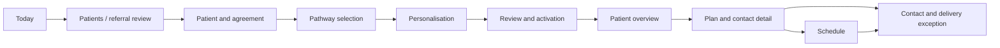

# Caring Contact linked prototype handoff

## Purpose and boundary

This prototype is a fully linked, synthetic design-validation experience at `/mockups/caring-contacts`. It demonstrates a WA Health caring-contact coordination workflow without creating a production service, patient record, plan, message, provider request or browser-persisted state.

The implementation uses the repository's Clinical White/Sky Graphite token roles and shared `Button`, `Chip`, `Sheet`, `ConfirmDialog`, announcement and responsive-shell conventions. The approved boards establish composition and hierarchy; current repository tokens and accessibility contracts remain authoritative.

## Route map

| Surface                    | Route                                                      | Primary inbound path                        |
| -------------------------- | ---------------------------------------------------------- | ------------------------------------------- |
| Today                      | `/mockups/caring-contacts`                                 | Prototype root and desktop/phone navigation |
| Patients                   | `/mockups/caring-contacts/patients`                        | Today referral, primary navigation          |
| Patient overview           | `/mockups/caring-contacts/patients/SYN-PATIENT-001`        | Patients, activation outcome, plan detail   |
| Patient and agreement      | `/mockups/caring-contacts/plans/new?stage=agreement`       | New referral/new plan                       |
| Pathway selection          | `/mockups/caring-contacts/plans/new?stage=pathway`         | Agreement gate                              |
| Personalisation            | `/mockups/caring-contacts/plans/new?stage=personalisation` | Pathway selection                           |
| Review and activation      | `/mockups/caring-contacts/plans/new?stage=review`          | Personalisation                             |
| Plan and contact detail    | `/mockups/caring-contacts/plans/SYN-PLAN-001`              | Patient overview and activation outcome     |
| Schedule                   | `/mockups/caring-contacts/schedule?date=2026-08-15`        | Primary navigation and Today                |
| Contact/delivery exception | `/mockups/caring-contacts/contacts/SYN-CONTACT-004`        | Schedule exception and plan detail          |
| Templates                  | `/mockups/caring-contacts/templates`                       | More menu                                   |
| Template detail            | `/mockups/caring-contacts/templates/SYN-PATHWAY-001`       | Template library                            |
| Team                       | `/mockups/caring-contacts/team`                            | More menu and active-team context           |
| Guidance                   | `/mockups/caring-contacts/guidance`                        | More menu                                   |
| Reports                    | `/mockups/caring-contacts/reports`                         | More menu                                   |
| Component/system-state lab | `/mockups/caring-contacts/system-states`                   | More menu                                   |

Contextual surfaces use `?overlay=<decision-id>`. Demonstration states use `?scenario=<state-id>`. The selected Schedule day uses `?date=YYYY-MM-DD`. These URLs contain only fixed synthetic identifiers and non-clinical state names.

## Primary flow

An invalid workflow stage returns to Patient and agreement and announces the reason. Direct synthetic deep links reconstruct their deterministic fixtures. Browser back/forward controls stage, overlay, scenario and selected-day history.

## State architecture

- `CaringContactPrototypeProvider` owns a reducer-backed state for the active team, synthetic patients, draft, plan, contacts, scenario guards, audit outcomes and UI feedback.
- State survives route navigation while the shared prototype layout remains mounted.
- Refresh reconstructs the fixed route fixture and resets simulated mutations.
- No `localStorage`, `sessionStorage`, cookies, IndexedDB, network request, API, analytics, Supabase, messaging provider or RAG integration is used.
- Every mutation is rechecked at commit time for connectivity, permission, authentication and governed-version currency.
- A decision opened online becomes explicitly unavailable if any guard changes before its final action.

## Interaction ownership

- Page changes use Next.js links or router navigation; no local screen switcher impersonates routing.
- Lightweight phone choices use bottom sheets; protected phone decisions use full-screen stages.
- Desktop inspections use right rails; desktop decisions use dialogs.
- Session expiry is action-only and non-dismissible. Offline status is non-modal and permits inspection outside the banner.
- Withdrawal and reassignment expose a second fresh-auth checkpoint. The prototype collects no credentials and describes the action as a local simulation.
- Closing a contextual surface removes only its `overlay` query and restores focus to its trigger. Recovery actions also clear the relevant `scenario` query.

## Data and clinical defaults

- All names, IDs, teams, contacts and numbers are synthetic.
- One Morning preference at 10:00 am AWST applies across the complete plan.
- Cadence: Day 1, Week 1, Months 1, 2, 3, 4, 6, 8, 10 and 12.
- Programme, patient-mobile, operational and crisis contact roles remain distinct.
- The exact governed message is centrally defined and measured as GSM-7, 272 septets, two segments.
- Agreement is not legal or treatment consent; imported mobile data is not described as verified.
- Delivery evidence is transport-only and never an inference about safety, wellbeing, response, engagement or message readership.

## Supporting evidence

- [Interaction matrix](interaction-matrix.md)
- [Clinical language trace](clinical-language-trace.md)
- [Accessibility acceptance](accessibility-acceptance.md)
- [Visual reference manifest](visual-reference-manifest.md)
- [Screenshot atlas manifest](screenshot-atlas-manifest.json) records all 44 inspected captures, their routes, scenarios, viewports and rendered dimensions. The captures themselves are committed under [`atlas/`](atlas) so the prototype can be reviewed without rebuilding it.
- [Verification report](verification-report.md) records the exact final gate outcomes and deliberately unrun acceptance work.

## Production exclusions

Do not promote the mockup namespace as a production route. Future production routes, provider integration, persistence, authentication, audit storage, real role enforcement, delivery reconciliation and physical-device acceptance require separate architecture, privacy, clinical-safety and operational approval.
