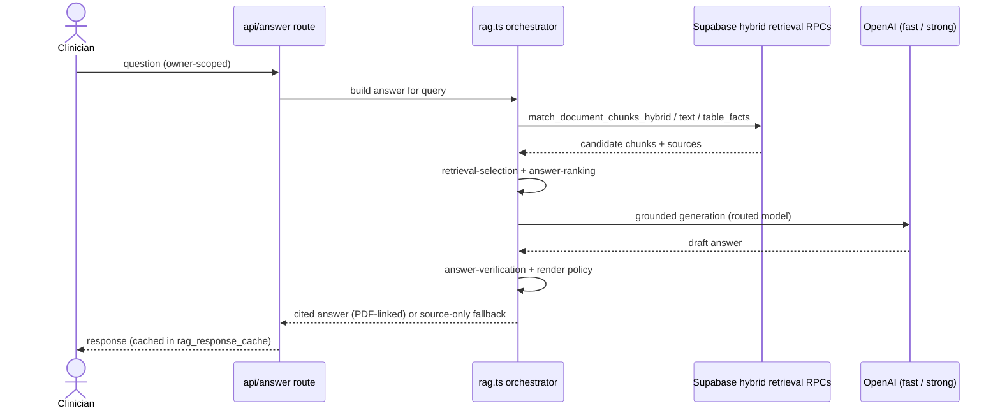

# Clinical KB — Codebase Index

Structured map for AI agents and onboarding. For live routes, see `docs/site-map.md` (`npm run sitemap:update` / `sitemap:check`). For agent rules and verification gates, see `AGENTS.md`; for test execution and flake policy, see `docs/testing.md`.

**Stack:** Next.js 16, React 19, Supabase (pgvector, Storage, Auth), OpenAI, Python OCR worker.  
**Live Supabase:** `Clinical KB Database` — ref `sjrfecxgysukkwxsowpy` (never use stale `qjgitjyhxrwxsrydablr`).

---

## Quick start

| Step                              | Command                          |
| --------------------------------- | -------------------------------- |
| Confirm Supabase target           | `npm run check:supabase-project` |
| Start app (project-specific port) | `npm run ensure`                 |
| Start ingestion worker            | `npm run worker`                 |
| Cheap verification gate           | `npm run verify:cheap`           |
| UI verification gate              | `npm run verify:ui`              |

---

## Top-level layout

| Path        | Purpose                                                          |
| ----------- | ---------------------------------------------------------------- |
| `src/`      | Next.js App Router UI, API routes, shared lib, components        |
| `supabase/` | SQL migrations, schema mirror, Edge Functions, CLI config        |
| `worker/`   | Local ingestion worker (parse, OCR, chunk, embed, DB writes)     |
| `scripts/`  | CLI ops: reindex, eval, backfill, governance, dev-server helpers |
| `tests/`    | Vitest unit (`*.test.ts`) + Playwright E2E (`ui-*.spec.ts`)      |
| `docs/`     | Runbooks, governance, search/RAG plans, generated sitemap        |
| `public/`   | Static assets (`public/llms.txt`)                                |
| `.github/`  | CI workflows, PR template (clinical governance preflight)        |

**Do not commit:** `.next/`, `node_modules/`, `coverage/`, `.env*`, `sample-documents/`, logs.

---

## Application architecture

### Shell and routing

- **Root layout:** `src/app/layout.tsx` — fonts, `AuthProvider`, global CSS
- **Shared search-app layout:** `src/app/(search-app)/layout.tsx` + `src/components/clinical-dashboard/shared-search-app-shell.tsx` — keeps `GlobalSearchShell` mounted across mode homes
- **App shell:** `src/components/clinical-dashboard/global-search-shell.tsx` — canonical route-aware shell and lazy dashboard dispatch. The mockup-named module is a compatibility re-export used only below `/mockups`.
- **PWA:** `docs/pwa.md` — install assets, privacy-first service worker/offline shell, lifecycle, security, and verification
- **Home:** `src/app/(search-app)/page.tsx` — dashboard rendered by shell
- **Dashboard:** `src/components/ClinicalDashboard.tsx` + `src/components/clinical-dashboard/`
- **Modes (13):** `src/lib/app-modes.ts` — answer, documents, services, forms, favourites, differentials, DSM-5 diagnosis, specifiers, formulation, prescribing, tools, Therapy mode, Factsheets

### Product pages (`src/app/`)

| Route                                                                                                     | File                                       |
| --------------------------------------------------------------------------------------------------------- | ------------------------------------------ |
| `/`                                                                                                       | `src/app/(search-app)/page.tsx`            |
| Shared mode-home route group (`/(search-app)`)                                                            | `src/app/(search-app)/`                    |
| Mode homes (`/services`, `/dsm`, `/documents/…`, …)                                                       | `src/app/(search-app)/` shared shell group |
| `/applications`                                                                                           | `src/app/applications/route.ts`            |
| `/differentials`, `/diagnoses`, `/presentations`                                                          | `src/app/(search-app)/differentials/`      |
| `/dsm`, `/dsm/search`, `/dsm/compare`, `/dsm/diagnoses/[slug]`                                            | `src/app/(search-app)/dsm/`                |
| `/documents/search`, `/source`, `/evidence`, `/[id]`                                                      | `src/app/(search-app)/documents/`          |
| `/factsheets`, `/factsheets/search`, `/factsheets/[slug]`                                                 | `src/app/(search-app)/factsheets/`         |
| `/favourites`                                                                                             | `src/app/(search-app)/favourites/page.tsx` |
| `/forms`, `/forms/[slug]`                                                                                 | `src/app/(search-app)/forms/`              |
| `/medications`, `/medications/[slug]`                                                                     | `src/app/(search-app)/medications/`        |
| `/privacy`                                                                                                | `src/app/privacy/page.tsx`                 |
| `/reference/colour-coding`                                                                                | `src/app/reference/`                       |
| `/safety-plan`                                                                                            | `src/app/safety-plan/page.tsx`             |
| `/services`, `/services/[slug]`                                                                           | `src/app/(search-app)/services/`           |
| `/therapy-compass`                                                                                        | `src/app/(search-app)/therapy-compass/`    |
| `/tools`                                                                                                  | `src/app/(search-app)/tools/`              |
| `/specifiers`, `/specifiers/[slug]`, `/specifiers/builder`, `/specifiers/compare`, `/specifiers/map`      | `src/app/(search-app)/specifiers/`         |
| `/formulation`, `/formulation/[slug]`, `/formulation/builder`, `/formulation/compare`, `/formulation/map` | `src/app/(search-app)/formulation/`        |
| `/mockups/*`                                                                                              | `src/app/mockups/` (404 in production)     |
| `/auth/callback`                                                                                          | `src/app/auth/callback/route.ts`           |

### API routes (`src/app/api/`)

| Area          | Routes                                                                                                              | Entry files                                                     |
| ------------- | ------------------------------------------------------------------------------------------------------------------- | --------------------------------------------------------------- |
| Account       | `/api/account/favourites`, `/api/account/preferences`                                                               | `account/`                                                      |
| Answers       | `/api/answer`, `/api/answer/stream`, `/api/answer-feedback`                                                         | `answer/route.ts`, `answer/stream/route.ts`, `answer-feedback/` |
| Search        | `/api/search`, `/api/search/interaction`, `/api/search/universal`                                                   | `search/`                                                       |
| Upload        | `/api/upload`                                                                                                       | `upload/route.ts`                                               |
| Documents     | `/api/documents`, `/api/documents/[id]`, bulk/reindex, labels, reviews, search, signed URLs, summaries, table facts | `documents/`                                                    |
| Differentials | `/api/differentials`, `/api/differentials/[slug]`, `/api/differentials/presentations/[slug]`                        | `differentials/`                                                |
| Medications   | `/api/medications`, `/api/medications/[slug]`                                                                       | `medications/`                                                  |
| Ingestion     | `/api/ingestion/batches`, `/api/ingestion/jobs`, retry, quality                                                     | `ingestion/`                                                    |
| Registry      | `/api/registry/records`, `/api/registry/records/[slug]`                                                             | `registry/records/`                                             |
| Images        | `/api/images/[id]/signed-url`                                                                                       | `images/[id]/signed-url/route.ts`                               |
| Ops           | `/api/health`, `/api/health/ready`, `/api/setup-status`, `/api/local-project-id`                                    | `health/`, `setup-status/`, `local-project-id/`                 |
| Eval / jobs   | `/api/eval-cases`, `/api/jobs`                                                                                      | `eval-cases/`, `jobs/`                                          |
| Webhooks      | `/api/webhooks/railway`, `/api/webhooks/supabase/document-change` (inbound; secret-gated — see docs/webhooks.md)    | `webhooks/`                                                     |

---

## `src/lib/` module map

### RAG, retrieval, answers

The `rag.ts` orchestrator and its `rag-*` cluster live in **`src/lib/rag/`** (the first
domain-extracted directory; imported as `@/lib/rag/rag*`). Other modules below remain flat in
`src/lib/`.

| Module                                                                                                                  | Role                                              |
| ----------------------------------------------------------------------------------------------------------------------- | ------------------------------------------------- |
| `rag.ts`                                                                                                                | Main answer pipeline orchestrator                 |
| `rag-routing.ts`, `rag-provider.ts`, `rag-answer-text.ts`, `smart-rag-api.ts`                                           | Model routing, provider modes, API surface        |
| `rag-contracts.ts`, `rag-answer-support.ts`, `rag-query-guard.ts`                                                       | Shared RAG contracts and pure answer/query policy |
| `rag-cache.ts`, `rag-retrieval-variants.ts`                                                                             | Bounded caches and retrieval variants             |
| `clinical-search.ts`, `clinical-query-mode.ts`, `retrieval-selection.ts`                                                | Query modes and retrieval selection               |
| `answer-ranking.ts`, `answer-verification.ts`, `answer-formatting.ts`, `answer-follow-up.ts`, `answer-render-policy.ts` | Answer quality and rendering                      |
| `citations.ts`, `cross-document-synthesis.ts`, `evidence-relevance.ts`                                                  | Evidence and synthesis                            |
| `ranking-config.ts`, `search-scope.ts`, `rag-eval-cases.ts`                                                             | Ranking tuning and eval fixtures                  |

### Ingestion and indexing

| Module                                                                   | Role                                                |
| ------------------------------------------------------------------------ | --------------------------------------------------- |
| `ingestion.ts`, `ingestion-recovery.ts`, `ingestion-mutation-safety.ts`  | Job queue semantics and recovery                    |
| `ingestion-enqueue.ts`, `webhooks/` (`secret-auth.ts`, `chat-notify.ts`) | Reindex enqueue + inbound webhook auth/chat forward |
| `chunking.ts`, `extractors/document.ts`                                  | Text extraction and chunking                        |
| `document-index-units.ts`, `document-enrichment.ts`, `deep-memory.ts`    | Index artifacts and enrichment                      |
| `visual-intelligence.ts`, `image-filtering.ts`                           | Image captioning and filtering                      |
| `index-quality.ts`, `indexing-coverage.ts`, `model-index-extraction.ts`  | Index quality gates                                 |
| `reindex-pipeline.ts`, `reindex-eval-gate.ts`, `bulk-import.ts`          | Atomic reindex and bulk import                      |

### Source governance and metadata

| Module                                                                         | Role                             |
| ------------------------------------------------------------------------------ | -------------------------------- |
| `source-metadata.ts`, `source-governance.ts`, `source-text-sanitizer.ts`       | Source provenance and governance |
| `document-label-governance.ts`, `document-tags.ts`, `document-organization.ts` | Labels and organization          |
| `table-review.ts`, `accessible-table-normalization.ts`                         | Table facts                      |

### Supabase, auth, env

| Module                                                                                            | Role                         |
| ------------------------------------------------------------------------------------------------- | ---------------------------- |
| `src/lib/supabase/` — `client.tsx`, `server.ts`, `admin.ts`, `auth.ts`, `health.ts`, `project.ts` | Clients and auth             |
| `src/lib/supabase/database.types.ts`                                                              | Generated DB types           |
| `env.ts`                                                                                          | Zod-validated environment    |
| `owner-scope.ts`, `query-privacy.ts`, `privacy.ts`, `audit.ts`                                    | Multi-user scope and privacy |

### Clinical product data

| Module                                                               | Role                                                    |
| -------------------------------------------------------------------- | ------------------------------------------------------- |
| `differentials.ts`, `forms.ts`, `services.ts`, `registry-records.ts` | Shared catalogue content with optional owner overrides  |
| `dsm.ts`                                                             | Local DSM diagnosis catalogue and comparison helpers    |
| `formulation.ts`                                                     | Local formulation mechanism library and builder helpers |
| `clinical-safety.ts`, `demo-data.ts`, `ui-copy.ts`                   | Safety copy and demo mode                               |

### Infra helpers

| Module                                                                                           | Role                                                          |
| ------------------------------------------------------------------------------------------------ | ------------------------------------------------------------- |
| `openai.ts`, `embedding-dimensions.ts`, `api-rate-limit.ts`                                      | External APIs and rate limits                                 |
| `observability/` — `answer-slo.ts`, `cache-metrics.ts`, `spend-metrics.ts`                       | Deep-health SLO / cache-hit / answer-spend snapshots          |
| `validation/`                                                                                    | `body.ts`, `query.ts`, `params.ts`, `http.ts`, `form-data.ts` |
| `app-modes.ts`, `document-flow-routes.ts`, `local-project-identity.ts`, `local-server-utils.mjs` | Routing and project identity                                  |

---

## Supabase

### Config and schema

- **CLI:** `supabase/config.toml` — `indexing-v3-agent` function, `verify_jwt = false`
- **Schema mirror:** `supabase/schema.sql` (reference; migrations are source of truth)
- **Migrations:** `supabase/migrations/*.sql` (chronological source of truth; do not hardcode a count)
- **Drift policy:** `docs/supabase-migration-reconciliation.md`

### Schema tables

`documents`, `document_pages`, `document_images`, `document_chunks`, `document_embedding_fields`, `document_index_units`, `document_table_facts`, `document_labels`, `document_summaries`, `document_sections`, `document_memory_cards`, `document_index_quality`, `document_title_words`, `document_publication_approvals`, `ingestion_jobs`, `ingestion_job_stages`, `indexing_v3_agent_jobs`, `import_batches`, `image_caption_cache`, `rag_queries`, `rag_query_misses`, `rag_aliases`, `rag_response_cache`, `rag_retrieval_logs`, `rag_visual_eval_cases`, `rag_visual_eval_runs`, `rag_answer_feedback`, `clinical_registry_records`, `clinical_registry_record_sources`, `medication_records`, `differential_records`, `source_review_events`, `user_favourites`, `user_preferences`, `api_rate_limits`, `api_rate_limit_subjects`, `audit_logs`, `storage_cleanup_jobs`

**Storage buckets:** `clinical-documents`, `clinical-images` (private)

### Migration themes

| Theme                             | Examples                                                                                                        |
| --------------------------------- | --------------------------------------------------------------------------------------------------------------- |
| Bulk ingestion and job queue      | `20260527000000_bulk_ingestion.sql`, `20260616001000_ingestion_job_state_rpcs.sql`                              |
| Hybrid retrieval RPCs             | `20260607183245_search_trigram_indexes_and_response_cache.sql`, `20260701140631_codify_live_retrieval_rpcs.sql` |
| Embeddings / HNSW                 | `20260623014639_finalize_embedding_fields_hnsw_health.sql`                                                      |
| Deep memory / visual intelligence | `20260528009000_deep_memory_indexing.sql`, `20260623150000_visual_intelligence_v1.sql`                          |
| Indexing v3 agent                 | `20260625000000_indexing_v3_agent_worker_hardening.sql`, `20260702190000_indexing_v3_agent_jobs_table.sql`      |
| Atomic reindex                    | `20260628000000_atomic_reindex_generation_commit.sql`                                                           |
| Clinical registry                 | `20260703020000_clinical_registry_records.sql`                                                                  |

### Key RPCs

- **Jobs:** `claim_ingestion_jobs`, `claim_indexing_v3_agent_jobs`
- **Index lifecycle:** `commit_document_index_generation`, `cleanup_abandoned_document_index_generations`
- **Retrieval:** `match_document_chunks_hybrid`, `match_document_chunks_text`, `match_documents_for_query`, `match_document_table_facts_text`, `match_document_embedding_fields_hybrid`, `match_document_memory_cards_hybrid_v2`
- **Health:** `search_schema_health`, `explain_retrieval_rpc`

### Edge Functions

| Function          | Path                                            |
| ----------------- | ----------------------------------------------- |
| indexing-v3-agent | `supabase/functions/indexing-v3-agent/index.ts` |

Cron-triggered agent for indexing v3 completion gates. Auth via `INDEXING_V3_AGENT_SECRET`. Type-checked by `npm run check:edge:functions`.

---

## Worker (`worker/`)

| File                           | Role                                                                     |
| ------------------------------ | ------------------------------------------------------------------------ |
| `index.ts`                     | Bootstrap → `main.ts`                                                    |
| `main.ts`                      | Polls `ingestion_jobs`, extracts, chunks, embeds, writes index artifacts |
| `embedding-fields.ts`          | Additional embedding field inputs                                        |
| `table-facts.ts`               | Table fact extraction                                                    |
| `prerequisites.ts`             | Python/PDF OCR checks                                                    |
| `python/extract_pdf_assets.py` | PDF asset extraction (PyMuPDF/Tesseract)                                 |

**Flow:** Upload → Storage + job queue → worker parses (PDF/DOCX/XLSX/TXT) → OCR fallback → image captioning → chunking → OpenAI embeddings → pgvector.

**Run:** `npm run worker` or `npm run worker:once`

---

## Scripts (grouped)

| Group                 | Key scripts                                                                                                                            |
| --------------------- | -------------------------------------------------------------------------------------------------------------------------------------- |
| Dev/server            | `ensure-local-server.mjs`, `dev-free-port.mjs`, `check-runtime.ts`                                                                     |
| Ingestion/indexing    | `import-documents.ts`, `reindex.ts`, `reindex-health.ts`, `check-indexing.ts`, `backfill-smart-index.ts`, `recover-ingestion-queue.ts` |
| Document intelligence | `enrich-documents.ts`, `classify-documents.ts`, `backfill-gold-document-labels.ts`                                                     |
| Governance            | `audit-source-governance.ts`, `production-readiness.ts`, `check-supabase-project.ts`                                                   |
| RAG eval              | `eval-rag.ts`, `eval-retrieval.ts`, `eval-quality.ts`, `retrieval-health.ts`                                                           |
| Maintenance           | `cleanup-storage.ts`, `generate-site-map.ts`, `seed-registry-records.ts`                                                               |

Golden retrieval fixture: `scripts/fixtures/rag-retrieval-golden.json`

---

## Tests

| Config           | Path                                          |
| ---------------- | --------------------------------------------- |
| Unit (Vitest)    | `vitest.config.mts` — `tests/**/*.test.ts`    |
| E2E (Playwright) | `playwright.config.ts` — `tests/ui-*.spec.ts` |
| Visual E2E       | `playwright.visual.config.ts`                 |

**Domain clusters in `tests/`:** RAG/answers, retrieval, ingestion/indexing, source governance, API routes, Supabase schema, shell/routing, UI formatting guards.

**Gates:** `verify:cheap` (lint + typecheck + full offline unit suite), `verify:ui` (required production Chromium journeys), `verify:release` (full build + all browsers + production readiness). Use `test:focused` only for safe source-only iteration.

---

## Domain concepts

### Indexing pipeline

1. Upload via `/api/upload` → `clinical-documents` bucket
2. Queue `ingestion_jobs` (+ optional `import_batches`)
3. **Worker** (`worker/main.ts`) or **Edge agent** (`indexing-v3-agent`) processes: extract → chunk → embed → write chunks, pages, images, embedding fields, index units, table facts
4. Quality gates: `document_index_quality`, enrichment versions, strict completion RPCs
5. Reindex: atomic generation commits (`reindex-pipeline.ts`), abandoned generation recovery

### RAG

- Hybrid retrieval: pgvector HNSW + lexical (tsvector/trigram) via Postgres RPCs
- Answer routing: fast vs strong models; `RAG_PROVIDER_MODE` (auto/openai/offline)
- Caching: `rag_response_cache`, app-layer caches in `env.ts`
- Eval: `npm run eval:quality`, `eval:retrieval`

Answer request flow (`rag.ts` orchestrates retrieval → ranking → generation →
verification; failed generation degrades to a deterministic source-only answer):

### Clinical KB surface

- 11 app modes with unified search shell
- Documents mode: upload/manage private guidelines, search, cited answers
- Answer mode: grounded Q&A with PDF-linked citations
- Registry modes: services, forms, medications, differentials; Formulation is a local mechanism and structured-draft workspace
- Demo mode: synthetic data when Supabase unavailable (`demo-data.ts`, `isDemoMode()` in `env.ts`)

### Global search composer placement rules

One shared composer (`master-search-header.tsx`) serves every mode. Placement:

- **Mode homes** (`/services`, `/forms`, `/favourites`, `/differentials`, `/formulation`, `/tools`, and dashboard homes): inline in the hero via the `mode-home-composer-slot` portal, on phone and tablet+ alike. (`/applications` is a redirect to `/tools`, not a composer surface.)
- **Result and detail views**: fixed bottom dock on phone (compact variant on submitted searches), sticky top from `sm` up.
- **Results routing**: standalone routes own their submitted searches via `?q=…&run=1` (`/services` → `ServicesNavigatorPage`, `/forms` → `FormsSearchResultsPage`, `/differentials` → `DifferentialsHome` results view, `/formulation` → local mechanism results, `/favourites` filters the command library in place). Answer, Documents, and Prescribing submitted searches render inside `ClinicalDashboard` — intentional, since they need retrieval/answer state. `/?mode=favourites` redirects to `/favourites`; `/?mode=differentials` redirects to `/differentials`; `/?mode=dsm` redirects to `/dsm`; `/?mode=specifiers` redirects to `/specifiers`; `/?mode=formulation` redirects to `/formulation`.
- **Intentionally composer-free routes**: `/differentials/presentations/*` (comparison workflow owns its chrome), `/documents/[id]` viewer (has its own in-document ask composer), `/documents/source/*` (document flow owns mobile chrome). Do not re-flag these in search-consistency audits.
- **Local filter fields** (sidebar "Search chats", document drawer "Find a document"/"Find a source PDF") are scoped filters, not global search; they share the `fieldControlWithIcon`/`fieldIcon` primitives.
- **Wiring conventions** for buttons and route navigation (and the gates that enforce them — the dead-button ESLint rule and the orphan-route reachability test) live in `docs/wiring-conventions.md`.

---

## Key config files

| File                                | Role                                        |
| ----------------------------------- | ------------------------------------------- |
| `package.json`                      | Scripts, deps, Node 24 / npm 11             |
| `.env.example`                      | Full env template                           |
| `next.config.ts`                    | CSP, security headers, build config         |
| `tsconfig.json`                     | Strict TS; excludes `supabase/functions/**` |
| `eslint.config.mjs`                 | Lint scope                                  |
| `AGENTS.md`                         | Agent rules, verification gates, shortcuts  |
| `.github/workflows/ci.yml`          | CI pipeline                                 |
| `docs/process-hardening.md`         | Verification pyramid                        |
| `docs/clinical-governance.md`       | Clinical safety governance                  |
| `docs/reindex-runbook.md`           | Reindex operations                          |
| `docs/retrieval-quality-runbook.md` | Retrieval tuning                            |

---

## Related docs

| Topic                    | Doc                                                              |
| ------------------------ | ---------------------------------------------------------------- |
| Full documentation index | `docs/README.md`                                                 |
| Routes and modes         | `docs/site-map.md`                                               |
| Search/RAG roadmap       | `docs/search-rag-master-plan.md`                                 |
| Universal task ledger    | `docs/outstanding-issues.md`                                     |
| Reindex operations       | `docs/reindex-runbook.md`                                        |
| Production readiness     | `docs/production-readiness-checklist.md`                         |
| Capacity / scale-up      | `docs/capacity-review.md`, `docs/auth-connection-cap-runbook.md` |
| Frontend architecture    | `docs/frontend-architecture.md`                                  |
| Repo audit (2026-07-01)  | `docs/audit/repo-audit-2026-07-01.md`                            |

---

_Generated for agent onboarding. Update when adding major modules, API surfaces, or migration themes._
