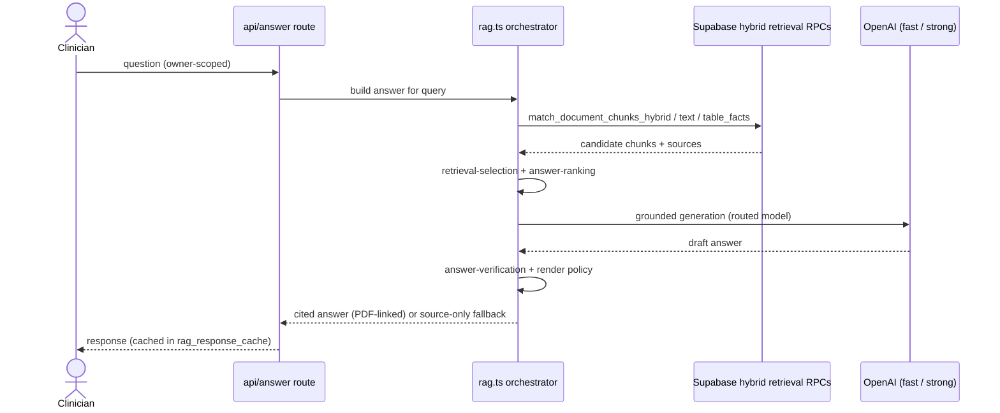

# Clinical KB — Codebase Index

Structured map for AI agents and onboarding. For live routes, see `docs/site-map.md` (`npm run docs:update` / `sitemap:check`). For agent rules and verification gates, see `AGENTS.md`; for test execution and flake policy, see `docs/testing.md`.

**Stack:** Next.js 16, React 19, Supabase (pgvector, Storage, Auth), OpenAI, Python OCR worker.  
**Live Supabase:** `Clinical KB Database` — ref `sjrfecxgysukkwxsowpy` (never use stale `qjgitjyhxrwxsrydablr`).

---

## Quick start

| Step                              | Command                                                                          |
| --------------------------------- | -------------------------------------------------------------------------------- |
| Confirm Supabase target           | `npm run check:supabase-project` (provider-backed — needs explicit confirmation) |
| Start app (project-specific port) | `npm run ensure`                                                                 |
| Start ingestion worker            | `npm run worker`                                                                 |
| Cheap verification gate           | `npm run verify:cheap`                                                           |
| UI verification gate              | `npm run verify:ui`                                                              |

---

## Top-level layout

| Path        | Purpose                                                                                                                                                |
| ----------- | ------------------------------------------------------------------------------------------------------------------------------------------------------ |
| `src/`      | Next.js App Router UI, API routes, shared lib, components                                                                                              |
| `supabase/` | SQL migrations, schema mirror, Edge Functions, CLI config                                                                                              |
| `worker/`   | Local ingestion worker (parse, OCR, chunk, embed, DB writes)                                                                                           |
| `scripts/`  | CLI ops: reindex, eval, backfill, governance, dev-server helpers                                                                                       |
| `tests/`    | Vitest unit (`*.test.ts`) + Playwright E2E (`ui-*.spec.ts`)                                                                                            |
| `docs/`     | Runbooks, governance, search/RAG plans, generated sitemap; design-system system of record is [`docs/design-system/README.md`](design-system/README.md) |
| `public/`   | Static assets (`public/llms.txt`)                                                                                                                      |
| `.github/`  | CI workflows, PR template (clinical governance preflight)                                                                                              |

Smaller top-level directories that are easy to miss:

| Path               | Purpose                                                                                                                                                                                                                                                                                                             |
| ------------------ | ------------------------------------------------------------------------------------------------------------------------------------------------------------------------------------------------------------------------------------------------------------------------------------------------------------------- |
| `caring-contacts/` | Isolated Caring Contacts module migrations and local database-test runner. These migrations are deliberately separate from `supabase/migrations/` and must never target the Clinical KB project.                                                                                                                    |
| `data/`            | Committed clinical **snapshot exports** loaded at runtime by `src/lib/` (differentials, forms, medications, services, specifiers). Regenerate via the matching `scripts/import-*-export.ts` / `build-*-index.mjs`; do not hand-edit. Distinct from `src/data/`, which holds hand-authored static content.           |
| `eval/`            | Isolated evaluation labs, outside the product/runtime dependency graph. `eval/docling/` is the sandboxed, dispatch-only Docling extraction benchmark (own hashed Python lock + venvs, egress-blocked Docker run, synthetic fixtures + hostile corpus, aggregate-only reports; `docs/rag-improvement/README.md` §B3) |
| `eslint-rules/`    | Repo-specific lint rules enforced by `npm run lint` (button wiring, hardcoded hex, type/icon scale, z-index ladder)                                                                                                                                                                                                 |
| `mockups/`         | Notes for the design-scratch routes under `src/app/mockups/` (the routes themselves 404 in production)                                                                                                                                                                                                              |
| `plugins/`         | `plugins/clinical-kb/` Codex plugin manifest and workflow skill                                                                                                                                                                                                                                                     |
| `.agents/`         | Canonical single-word skill catalogue (`npm run skills`); `npm run check:skills` also validates Claude, Cursor, and plugin skill policies                                                                                                                                                                           |
| `.claude/`         | Claude Code agents, skills, hooks, settings — plus the `.claude/worktrees/` working copies                                                                                                                                                                                                                          |
| `.codex/`          | Trusted Desktop/CLI config; tracked `config.toml` has disabled, secret-free Figma, Supabase, Railway, and Sentry MCP templates. Hosted ChatGPT/Codex apps are installed and authenticated separately; OAuth stays in the host credential store.                                                                     |
| `.cursor/`         | Cursor project rules and local-agent configuration                                                                                                                                                                                                                                                                  |
| `.design-sync/`    | Generated design-system package metadata, validation notes, and project-sync artifacts                                                                                                                                                                                                                              |
| `.githooks/`       | Installed by `npm install`; `pre-push` runs `scripts/guard-push.mjs` (user-owned auto-merge preservation, format, drift staleness, static lint+typecheck, ledger write discipline)                                                                                                                                  |
| `.vscode/`         | Shared VS Code workspace recommendations and settings                                                                                                                                                                                                                                                               |

**Do not commit:** `.next/`, `node_modules/`, `coverage/`, `.env*`, `sample-documents/`, logs.

---

## Application architecture

### Shell and routing

- **Root layout:** `src/app/layout.tsx` — fonts, `AuthProvider`, global CSS
- **Shared search-app layout:** `src/app/(search-app)/layout.tsx` + `src/components/clinical-dashboard/shared-search-app-shell.tsx` — keeps `GlobalSearchShell` mounted across mode homes
- **App shell:** `src/components/clinical-dashboard/global-search-shell.tsx` — canonical route-aware shell and lazy dashboard dispatch. The mockup-named module is a compatibility re-export used only below `/mockups`.
- **PWA:** `docs/pwa.md` — install assets, privacy-first service worker/offline shell, lifecycle, security, and verification
- **Home:** `src/app/(search-app)/page.tsx` — dashboard rendered by shell
- **Dashboard:** `src/components/ClinicalDashboard.tsx` + `src/components/clinical-dashboard/`
- **Modes (15):** `src/lib/app-modes.ts` — answer, documents, services, forms, favourites, differentials, DSM-5 diagnosis, specifiers, formulation, prescribing, tools, calculators, Therapy, Factsheets, Dictionary
  - **Therapy review disclosure.** Therapy was `devOnly` while its 205-record catalogue awaited qualified-clinician sign-off. That hid the mode from production navigation, 404'd `/therapy-compass` in the route layout, and made `therapyRecordsForEnvironment` filter every record out — so all 205 detail/brief/sheet routes and every universal-search therapy hit 404'd for real users while working locally. The owner's decision (2026-08-19) replaced the gate with disclosure: reachability is no longer conditioned on review status anywhere, and the caveat is stated instead — catalogue-wide by `TherapyReviewNotice` above the Therapy home hero (counts from the generated `THERAPY_CATALOGUE_SUMMARY.needsReviewCount`, kept in step by the index generator's check mode), and per record by the `reviewStatus` badge on every card, detail page, brief, sheet, comparison, pathway, and universal-search result. `therapyNeedsReview` survives as the label source only. Pinned by `tests/app-modes.test.ts` (reachability), `tests/therapy-review-regressions.test.ts` (the notice and the per-record badges), and `tests/therapy-pr-unblocking-contract.test.ts` (the retired `PLAYWRIGHT_OFFLINE_MODE` bypass that existed only to reach the gated route).

### Product pages (`src/app/`)

| Route                                                                                                                                                                                                                                                                           | File                                                                                                                                                                               |
| ------------------------------------------------------------------------------------------------------------------------------------------------------------------------------------------------------------------------------------------------------------------------------- | ---------------------------------------------------------------------------------------------------------------------------------------------------------------------------------- |
| `/`                                                                                                                                                                                                                                                                             | `src/app/(search-app)/page.tsx`                                                                                                                                                    |
| Shared mode-home route group (`/(search-app)`)                                                                                                                                                                                                                                  | `src/app/(search-app)/`                                                                                                                                                            |
| Mode homes (`/services`, `/dsm`, `/documents/…`, …)                                                                                                                                                                                                                             | `src/app/(search-app)/` shared shell group                                                                                                                                         |
| `/caring-contacts` (standalone workspace; own nav, entered from Tools)                                                                                                                                                                                                          | `src/app/caring-contacts/`                                                                                                                                                         |
| `/caring-contacts/patients` (permission-scoped caseload: one row per plan plus an authorised names-only projection; URL state filter and local name/identifier search)                                                                                                          | `src/app/caring-contacts/patients/page.tsx`                                                                                                                                        |
| `/caring-contacts/patients/[patientId]` (one patient's episode: identity, the plan, and its twelve-month schedule; the ONE screen that may call `getEpisode`)                                                                                                                   | `src/app/caring-contacts/patients/[patientId]/page.tsx`                                                                                                                            |
| `/caring-contacts/plans/new` (the activation wizard: agreement, pathway, personalisation, review; started for one accepted referral named by `?referral=`)                                                                                                                      | `src/app/caring-contacts/plans/new/page.tsx`                                                                                                                                       |
| `/caring-contacts/schedule` (the team's day: three approved sending windows, contacts at no approved send time, named exceptions; the day travels in `?day=`)                                                                                                                   | `src/app/caring-contacts/schedule/page.tsx`                                                                                                                                        |
| `/caring-contacts/templates` (the governed pathway versions this team holds: lifecycle, publication and retirement facts, and the approvals behind each one, qualified by the record's provenance)                                                                              | `src/app/caring-contacts/templates/page.tsx`                                                                                                                                       |
| `/caring-contacts/templates/[pathwayId]` (ONE governed version in full: its lifecycle, both approval seats with the record's provenance qualification, the wording that record holds together with that wording's approval status, and whether a new plan may be started on it) | `src/app/caring-contacts/templates/[pathwayId]/page.tsx`                                                                                                                           |
| `/caring-contacts/guidance` (programme boundaries, incident and downtime behaviour, and the language rules; fixed text, one service-state read, no record about anybody)                                                                                                        | `src/app/caring-contacts/guidance/page.tsx`                                                                                                                                        |
| `/caring-contacts/reports` (aggregate operational measures, and the §2.5 programme-reach section — which states that the field it would report on is not collected rather than showing an empty breakdown)                                                                      | `src/app/caring-contacts/reports/page.tsx`                                                                                                                                         |
| `/caring-contacts/team` (where the team's work is sitting: plans sending, plans their own state is holding, coverage, exception backlog and unclaimed work against the 60-minute escalation — operational only, and it ranks nobody)                                            | `src/app/caring-contacts/team/page.tsx`                                                                                                                                            |
| `/applications`                                                                                                                                                                                                                                                                 | `src/app/applications/route.ts`                                                                                                                                                    |
| `/differentials`, `/diagnoses`, `/presentations`, `/compare`                                                                                                                                                                                                                    | `src/app/(search-app)/differentials/`                                                                                                                                              |
| `/dsm`, `/dsm/search`, `/dsm/compare`, `/dsm/diagnoses/[slug]`                                                                                                                                                                                                                  | `src/app/(search-app)/dsm/`                                                                                                                                                        |
| `/documents/search`, `/source`, `/evidence`, `/[id]`                                                                                                                                                                                                                            | `src/app/(search-app)/documents/`                                                                                                                                                  |
| `/factsheets`, `/factsheets/search`, `/factsheets/topics`, `/factsheets/[slug]`                                                                                                                                                                                                 | `src/app/(search-app)/factsheets/`                                                                                                                                                 |
| `/dictionary`, Terms (`/search`, one catalogue — `/browse` redirects to it), Topics, Definition, Compare, Sources                                                                                                                                                               | `src/app/(search-app)/dictionary/`                                                                                                                                                 |
| `/favourites`                                                                                                                                                                                                                                                                   | `src/app/(search-app)/favourites/page.tsx`                                                                                                                                         |
| `/forms`, `/forms/[slug]`                                                                                                                                                                                                                                                       | `src/app/(search-app)/forms/`                                                                                                                                                      |
| `/medications`, `/medications/[slug]`                                                                                                                                                                                                                                           | `src/app/(search-app)/medications/`                                                                                                                                                |
| `/privacy`                                                                                                                                                                                                                                                                      | `src/app/privacy/page.tsx` → `privacy-quiet-signal-page.tsx` + `privacy-page-content.tsx`                                                                                          |
| `/reference/colour-coding`                                                                                                                                                                                                                                                      | `src/app/reference/`                                                                                                                                                               |
| `/safety-plan`                                                                                                                                                                                                                                                                  | `src/app/safety-plan/page.tsx`                                                                                                                                                     |
| `/calculators`, `/calculators/search`                                                                                                                                                                                                                                           | `src/app/(search-app)/calculators/`                                                                                                                                                |
| `/services`, `/services/[slug]`                                                                                                                                                                                                                                                 | `src/app/(search-app)/services/`                                                                                                                                                   |
| `/therapy-compass`                                                                                                                                                                                                                                                              | `src/app/(search-app)/therapy-compass/`                                                                                                                                            |
| `/tools`                                                                                                                                                                                                                                                                        | `src/app/(search-app)/tools/`                                                                                                                                                      |
| `/specifiers`, `/specifiers/[slug]`, `/specifiers/builder`, `/specifiers/compare`, `/specifiers/map`                                                                                                                                                                            | `src/app/(search-app)/specifiers/`                                                                                                                                                 |
| `/formulation`, `/formulation/[slug]`, `/formulation/builder`, `/formulation/compare`, `/formulation/map`                                                                                                                                                                       | `src/app/(search-app)/formulation/`                                                                                                                                                |
| `/mockups/*`                                                                                                                                                                                                                                                                    | `src/app/mockups/` (404 in production; `/mockups/development`, `/mockups/caring-contacts`, `/mockups/care-plan`, and `/mockups/ward-flow` are developer-gated instead — see below) |
| `/auth/callback`                                                                                                                                                                                                                                                                | `src/app/auth/callback/route.ts`                                                                                                                                                   |

### API routes (`src/app/api/`)

| Area             | Routes                                                                                                                 | Entry files                                                     |
| ---------------- | ---------------------------------------------------------------------------------------------------------------------- | --------------------------------------------------------------- |
| Account          | `/api/account/favourites`, `/api/account/preferences`                                                                  | `account/`                                                      |
| Answers          | `/api/answer`, `/api/answer/stream`, `/api/answer-feedback`                                                            | `answer/route.ts`, `answer/stream/route.ts`, `answer-feedback/` |
| Clinical Ask     | `/api/clinical-ask/stream`                                                                                             | `clinical-ask/stream/route.ts`                                  |
| Clinical quality | `/api/clinical-quality` (administrator governance aggregates and triage updates)                                       | `clinical-quality/route.ts`                                     |
| Speech           | `/api/speech/transcribe`                                                                                               | `speech/transcribe/route.ts`                                    |
| Search           | `/api/search`, `/api/search/interaction`, `/api/search/universal`                                                      | `search/`                                                       |
| Upload           | `/api/upload`                                                                                                          | `upload/route.ts`                                               |
| Documents        | `/api/documents`, `/api/documents/[id]`, bulk/reindex, labels, reviews, search, signed URLs, summaries, table facts    | `documents/`                                                    |
| Differentials    | `/api/differentials`, `/api/differentials/[slug]`, `/api/differentials/presentations/[slug]`                           | `differentials/`                                                |
| Medications      | `/api/medications`, `/api/medications/[slug]`                                                                          | `medications/`                                                  |
| Ingestion        | `/api/ingestion/batches`, `/api/ingestion/jobs`, retry, quality                                                        | `ingestion/`                                                    |
| Registry         | `/api/registry/records`, `/api/registry/records/[slug]`                                                                | `registry/records/`                                             |
| Images           | `/api/images/[id]/signed-url`                                                                                          | `images/[id]/signed-url/route.ts`                               |
| Ops              | `/api/health`, `/api/health/ready`, `/api/setup-status`, `/api/local-project-id`                                       | `health/`, `setup-status/`, `local-project-id/`                 |
| Eval / jobs      | `/api/eval-cases`; `/api/jobs` (admin/ops listing — see `docs/api-jobs-ops-surface.md`; UI uses `/api/ingestion/jobs`) | `eval-cases/`, `jobs/`                                          |
| Webhooks         | `/api/webhooks/railway`, `/api/webhooks/supabase/document-change` (inbound; secret-gated — see docs/webhooks.md)       | `webhooks/`                                                     |
| Caring Contacts  | `/api/caring-contacts/*` (synthetic demo session, team-scoped workspace, access trail and workflow actions)            | `caring-contacts/`                                              |

---

## `src/lib/` module map

### RAG, retrieval, answers

The `rag.ts` orchestrator and its `rag-*` cluster live in **`src/lib/rag/`** (the first
domain-extracted directory; imported as `@/lib/rag/rag*`). Other modules below remain flat in
`src/lib/`.

| Module                                                                                                                  | Role                                                                                          |
| ----------------------------------------------------------------------------------------------------------------------- | --------------------------------------------------------------------------------------------- |
| `rag.ts`                                                                                                                | Main answer pipeline orchestrator                                                             |
| `rag-routing.ts`, `rag-provider.ts`, `rag-answer-text.ts`, `smart-rag-api.ts`                                           | Model routing, provider modes, API surface                                                    |
| `rag-contracts.ts`, `rag-answer-support.ts`, `rag-query-guard.ts`                                                       | Shared RAG contracts and pure answer/query policy                                             |
| `rag-evidence-gates.ts`, `rag-coverage-gate.ts`, `rag-second-stage.ts`                                                  | Evidence predicates, fast-path coverage gating, and second-stage ranking                      |
| `rag-hydration.ts`                                                                                                      | Per-request hydration: document ranking metadata, cached index quality, page visual evidence  |
| `rag-cache.ts`, `rag-retrieval-variants.ts`                                                                             | Bounded caches and retrieval variants                                                         |
| `clinical-search.ts`, `clinical-query-mode.ts`, `retrieval-selection.ts`                                                | Query modes and retrieval selection                                                           |
| `answer-ranking.ts`, `answer-verification.ts`, `answer-formatting.ts`, `answer-follow-up.ts`, `answer-render-policy.ts` | Answer quality and rendering                                                                  |
| `citations.ts`, `cross-document-synthesis.ts`, `evidence-relevance.ts`                                                  | Evidence and synthesis                                                                        |
| `ranking-config.ts`, `search-scope.ts`, `rag-eval-cases.ts`                                                             | Ranking tuning and eval fixtures                                                              |
| `clinical-ask/`                                                                                                         | Mode-aware Clinical Ask contracts, profiles, evidence, and orchestration                      |
| `security-headers.ts`, `privacy-page-content.tsx`                                                                       | Clinical Ask microphone policy, ephemeral-data disclosure, and provider-boundary privacy copy |

### Ingestion and indexing

| Module                                                                   | Role                                                |
| ------------------------------------------------------------------------ | --------------------------------------------------- |
| `ingestion.ts`, `ingestion-recovery.ts`, `ingestion-mutation-safety.ts`  | Job queue semantics and recovery                    |
| `ingestion-enqueue.ts`, `webhooks/` (`secret-auth.ts`, `chat-notify.ts`) | Reindex enqueue + inbound webhook auth/chat forward |
| `chunking.ts`, `extractors/document.ts`                                  | Text extraction and chunking                        |
| `document-index-units.ts`, `document-enrichment.ts`, `deep-memory.ts`    | Index artifacts and enrichment                      |
| `visual-intelligence.ts`, `image-filtering.ts`                           | Image captioning and filtering                      |
| `index-quality.ts`, `indexing-coverage.ts`, `model-index-extraction.ts`  | Index quality gates                                 |
| `reindex-pipeline.ts`, `reindex-eval-gate.ts`, `bulk-import.ts`          | Atomic reindex and bulk import                      |

### Source governance and metadata

| Module                                                                                                                 | Role                                             |
| ---------------------------------------------------------------------------------------------------------------------- | ------------------------------------------------ |
| `source-metadata.ts`, `source-governance.ts`, `source-text-sanitizer.ts`                                               | Source provenance and governance                 |
| `documents/` (`is-public-document.ts`), `document-label-governance.ts`, `document-tags.ts`, `document-organization.ts` | Labels, organization, and public boundary checks |
| `table-review.ts`, `accessible-table-normalization.ts`                                                                 | Table facts                                      |

### Supabase, auth, env

| Module                                                                                            | Role                                                                                                                                                                                                  |
| ------------------------------------------------------------------------------------------------- | ----------------------------------------------------------------------------------------------------------------------------------------------------------------------------------------------------- |
| `src/lib/supabase/` — `client.tsx`, `server.ts`, `admin.ts`, `auth.ts`, `health.ts`, `project.ts` | Clients and auth                                                                                                                                                                                      |
| `src/lib/supabase/database.types.ts`                                                              | Generated DB types                                                                                                                                                                                    |
| `env.ts`                                                                                          | Zod-validated environment                                                                                                                                                                             |
| `owner-scope.ts`, `query-privacy.ts`, `privacy.ts`, `audit.ts`                                    | Multi-user scope and privacy                                                                                                                                                                          |
| `authorization.ts`                                                                                | `site_role === "administrator"` claim check                                                                                                                                                           |
| `src/lib/developer-area/` — `access.ts`, `headers.ts`                                             | Signed-in-administrator gate for the Settings "Development" hub (`/mockups/development`, `/mockups/caring-contacts/**`, `/mockups/care-plan/**`); the production block itself lives in `src/proxy.ts` |

### Clinical product data

| Module                                                               | Role                                                                                                                                                                                                                                                                                                                                       |
| -------------------------------------------------------------------- | ------------------------------------------------------------------------------------------------------------------------------------------------------------------------------------------------------------------------------------------------------------------------------------------------------------------------------------------ |
| `differentials.ts`, `forms.ts`, `services.ts`, `registry-records.ts` | Shared catalogue content with optional owner overrides                                                                                                                                                                                                                                                                                     |
| `mha-act-sections.ts`                                                | Mental Health Act 2014 (WA) section summaries shared across forms; `actSectionsForCue` resolves a form's `sourceFacts.sectionCue` and withholds the whole list until every cited section has a summary; `drafted` entries render with an awaiting-clinical-review note, `reviewed` ones name their reviewer (`docs/wiring-conventions.md`) |
| `dictionary-data.ts`, `dictionary.ts`                                | Governed terminology, sources, topics, aliases, filters; `dictionaryCatalogue` is the one selector behind the merged Terms surface                                                                                                                                                                                                         |
| `dsm.ts`                                                             | Local DSM diagnosis catalogue and comparison helpers                                                                                                                                                                                                                                                                                       |
| `formulation.ts`                                                     | Local formulation mechanism library and builder helpers                                                                                                                                                                                                                                                                                    |
| `clinical-safety.ts`, `demo-data.ts`, `ui-copy.ts`                   | Safety copy and demo mode                                                                                                                                                                                                                                                                                                                  |

### Infra helpers

| Module                                                                                                                 | Role                                                                                                                                                                     |
| ---------------------------------------------------------------------------------------------------------------------- | ------------------------------------------------------------------------------------------------------------------------------------------------------------------------ |
| `openai.ts`, `embedding-dimensions.ts`, `api-rate-limit.ts`                                                            | External APIs and rate limits                                                                                                                                            |
| `observability/` — `answer-slo.ts`, `cache-metrics.ts`, `spend-metrics.ts`, `error-tracking.ts`, `agent-monitoring.ts` | Deep-health SLO / cache-hit / answer-spend snapshots; privacy-safe Sentry error + DB-span scrubbers and metadata-only OpenAI agent monitoring (`docs/error-tracking.md`) |
| `validation/`                                                                                                          | `body.ts`, `query.ts`, `params.ts`, `http.ts`, `form-data.ts`                                                                                                            |
| `app-modes.ts`, `document-flow-routes.ts`, `local-project-identity.ts`, `local-server-utils.mjs`                       | Routing and project identity                                                                                                                                             |
| `tailwind-merge.ts`                                                                                                    | The `extendTailwindMerge` config behind `cn()` — declares this repo's custom `@theme` scales so twMerge does not misclassify them (`docs/design-system/TOKENS.md`)       |

### Caring Contacts

`src/lib/caring-contacts/` is an isolated, synthetic caring-contact domain. It uses only
relative imports within its directory, provides deny-by-default team-scoped permissions and
privacy-safe audit records, and is exercised against both in-memory and local Postgres
repositories. `src/lib/caring-contacts-server/` is the server-side seam for the demo session
and optional separate database connection. It must fail closed in production and must never
connect to the Clinical KB Supabase project. The standalone `src/app/caring-contacts/` workspace
is noindex, visibly marked synthetic, and has a single inbound entry from the Tools catalogue.

Inside the workspace, `src/components/caring-contacts/workspace/shell.tsx` owns the whole
destination set: a destination carries an `href` only once its page exists, and every other one
renders as an unavailable control that states what it will hold (Ruling 52). `/caring-contacts`
(Today), `/caring-contacts/patients` (the caseload), `/caring-contacts/patients/[patientId]`
(one patient's episode), `/caring-contacts/plans/new` (the activation wizard),
`/caring-contacts/schedule` (the team's day),
`/caring-contacts/templates` (the governed pathway versions),
`/caring-contacts/templates/[pathwayId]` (one of them in full), `/caring-contacts/guidance`,
`/caring-contacts/reports` and `/caring-contacts/team` are what is built so far. Every one of them is a page that reads the
store through `auditedRead` rather than over HTTP, using the same access identity the matching API
route records; filtering and, on the patient overview, the choice of which plan to open are carried
in the URL and read by the Server Component.

The More panel carries the destinations the rail does not, and its entries carry an `href` under the
same Ruling 89 rule. It ALSO carries the primary destinations the phone bar has no room for, in a
`md:hidden` row derived from the two arrays rather than listed — which is what makes
`/caring-contacts/templates` reachable below 768px, where there is no rail. It was not:
`tests/route-reachability.test.ts` reads `shell.tsx` as text and cannot see which array an `href`
sits in or what CSS governs it, so it passed on a shipped route no phone could reach. The assertion
that can fail on that walks the rendered ancestor chain, in
`tests/caring-contacts-workspace-shell.dom.test.tsx`, and clicks the link at 390px in
`tests/ui-caring-contacts-workspace.spec.ts`.

`/caring-contacts/reports` performs NO read of `caring_contacts.cultural_identity_reports`. Spec §2.5
promises reach reporting over Aboriginal and Torres Strait Islander status, and this system records
none — so the screen states what is and is not collected instead of rendering an empty breakdown,
which would read as a statement about patients rather than about collection. The two halves of §2.5
are in different states and the screen says so: the small-cell threshold IS set (the owner's decision
of 2026-08-26, held with its provenance in `src/lib/caring-contacts/reach-reporting-governance.ts`,
which is the file a governance change opens and the only place the number appears); a bounded
category set is not. The suppression rule itself lives in
`src/lib/caring-contacts/reach-reporting.ts`: it takes the threshold as a required argument, refuses
one too low to hide anything, and suppresses complementary cells so that no hidden figure is
recoverable by subtracting the published ones from a total.

`/caring-contacts/team` renders `buildTeamWorkload` and draws three FEWER columns than the approved
design does, each because nothing in this system holds the value (Task 17's findings 1–3, and none of
them is an oversight). There is no staff display NAME: the stores hold an `ActorId` and nothing else
about a person, and a staff directory is a system this build is not connected to — so the identifier
is rendered as an identifier and the screen states that a name is not held. There is no ROLE column:
nothing returns the roles an `ActorId` holds, `Actor` being assembled at the session seam for the one
person acting. And there is no per-member UNCLAIMED count, because unclaimed means there is no owner
to file the work under; the design's unclaimed row is rendered once, above both the desktop table and
the compact roster, as the spec §4.4 pair — the escalation as an `AutomatedState` carrying the
threshold that produced it and the one thing that clears it. Both ages it shows are upper bounds
measured from the earliest instant the work could have been waiting, and are named for that rather
than called a queue age. Its Reassign work control is a link to the caseload: a reassignment needs
one plan, this read deliberately carries no plan id, and the control that performs one already exists
on `plan-actions.tsx`.

`/caring-contacts/templates` is a governance record viewer, and the LIBRARY shows no message wording
at all. Ruling [127]: the one patient-visible message that exists is a specimen rather than a
template, and there is no per-version message content anywhere, so a library that printed wording
beside a version would claim a relationship the data does not have. The DETAIL route
`/caring-contacts/templates/[pathwayId]` does show the wording, because a record states what it
holds where a list cannot: it reads `snapshot.messageTextByType` back verbatim and never assembles
a string. Beside it, the route states the wording's approval status in `message-copy.ts`'s own
words — provisional, not clinically approved — read from the sealed domain rather than retyped
(Ruling [131]), because a version's dual approval approves the VERSION and nothing in this system
has approved the words. What both routes carry is `PathwayVersionSnapshot.provenance`, resolved
through `pathwayVersionProvenanceWording` so that an approval line can never stand unqualified over
a record nobody approved.

The Schedule screen is the one that must not let two different days read the same. `disposition`
alone cannot separate a quiet day from a stopped one, so the screen states each day from `counts`,
which partition a day with nothing due into already-sent, held-by-its-own-plan and never-will-be; a
plan somebody created and never started is surfaced as its own automated state, because a discharged
patient receiving nothing while the plan record looks complete is an operational failure rather than
a quiet day. It derives no schedule rule of its own -- the windows, the holds, the exceptions and the
counts all come from `src/lib/caring-contacts/schedule-view.ts` -- and it is the one workspace screen
that deliberately does NOT read `listPatientNames`, so that the trail row meaning "somebody read
patients' names" is not written every time a coordinator glances at a day.

`/caring-contacts/plans/new` is the one screen with a deliberate client boundary (Ruling [109]).
The page itself is still a Server Component -- it makes the audited reads, decides the actor's
capability, and fails closed -- and it hands a lazily-imported `PlanWizard` the referral and the
approved pathway versions, and nothing else. The service state, which carries an incident note,
stays on the server; `plan-wizard/stages.ts` is where Tasks 8 and 9 flip stages 3 and 4 from
unbuilt to built, and the wizard's in-progress draft lives in `sessionStorage` alone
(`plan-wizard/plan-draft.ts`, Ruling [110]).

The patient overview is the only screen permitted to call `getEpisode`, which is the one read that
releases a patient's name, mobile number, identifiers and cultural identity together. Every other
screen is built to avoid it: the caseload uses `listPatientNames`, the names-only projection
(Ruling 91). The overview calls it once, for one plan, and only after Ruling 97's rule has settled
which plan — the route is keyed by patient, the reads are keyed by plan, and one patient can
honestly hold two episodes, so the screen presents them and never picks. Ruling 94: do not restate

The Patients caseload carries the workspace's other deliberate client boundary, and it exists for a
confidentiality rule rather than a browser capability. Its search matches the patient's NAME, and
while the box was a `method="get"` form that name travelled as `?q=` — into the address bar of a
possibly-shared ward computer's history and the access log of every proxy in between. Ruling [111]
forbids exactly that, so the typed text is React state in `patients-directory-client.tsx` and reaches
no URL in any form. The page around it stays a Server Component and the payload it hands over is
SMALLER than the HTML it replaced: rows are reduced to the row projection and pre-filtered by plan
state on the server side.
that as a count of client components — this paragraph has carried two such counts and both were
wrong. What holds Ruling 13 is the module boundary, which does not decay as files are added:
nothing outside the `/caring-contacts` route segment imports the workspace (the tools catalogue
names it by href, never by import), so the dashboard references no chunk exclusive to it.

---

## Supabase

### Config and schema

- **CLI:** `supabase/config.toml` — `indexing-v3-agent` function, `verify_jwt = false`
- **Schema mirror:** `supabase/schema.sql` (reference; migrations are source of truth)
- **Migrations:** `supabase/migrations/*.sql` (chronological source of truth; do not hardcode a count)
- **Drift policy:** `docs/supabase-migration-reconciliation.md`

### Schema tables

`documents`, `document_pages`, `document_images`, `document_chunks`, `document_embedding_fields`, `document_index_units`, `document_table_facts`, `document_labels`, `document_summaries`, `document_sections`, `document_memory_cards`, `document_index_quality`, `document_title_words`, `document_publication_approvals`, `document_corpus_access_state`, `document_corpus_access_snapshots`, `ingestion_jobs`, `ingestion_job_stages`, `indexing_v3_agent_jobs`, `import_batches`, `image_caption_cache`, `rag_queries`, `rag_query_misses`, `rag_aliases`, `rag_response_cache`, `rag_retrieval_logs`, `rag_visual_eval_cases`, `rag_visual_eval_runs`, `rag_answer_feedback`, `clinical_registry_records`, `clinical_registry_record_sources`, `clinical_quality_feedback_triage`, `clinical_quality_feedback_triage_events`, `medication_records`, `differential_records`, `source_review_events`, `user_favourites`, `user_favourite_sets`, `user_preferences`, `api_rate_limits`, `api_rate_limit_subjects`, `audit_logs`, `storage_cleanup_jobs`

**Storage buckets:** `clinical-documents`, `clinical-images` (private)

### Migration themes

| Theme                             | Examples                                                                                                        |
| --------------------------------- | --------------------------------------------------------------------------------------------------------------- |
| Bulk ingestion and job queue      | `20260527000000_bulk_ingestion.sql`, `20260616001000_ingestion_job_state_rpcs.sql`                              |
| Hybrid retrieval RPCs             | `20260607183245_search_trigram_indexes_and_response_cache.sql`, `20260701140631_codify_live_retrieval_rpcs.sql` |
| Embeddings / HNSW                 | `20260623014639_finalize_embedding_fields_hnsw_health.sql`                                                      |
| Deep memory / visual intelligence | `20260528009000_deep_memory_indexing.sql`, `20260623150000_visual_intelligence_v1.sql`                          |
| Indexing v3 agent                 | `20260625000000_indexing_v3_agent_worker_hardening.sql`, `20260702190000_indexing_v3_agent_jobs_table.sql`      |
| Atomic reindex                    | `20260628000000_atomic_reindex_generation_commit.sql`                                                           |
| Clinical registry                 | `20260703020000_clinical_registry_records.sql`                                                                  |

### Key RPCs

- **Jobs:** `claim_ingestion_jobs`, `claim_indexing_v3_agent_jobs`
- **Index lifecycle:** `commit_document_index_generation`, `cleanup_abandoned_document_index_generations`
- **Retrieval:** `match_document_chunks_hybrid`, `match_document_chunks_text`, `match_documents_for_query`, `match_document_table_facts_text`, `match_document_embedding_fields_hybrid`, `match_document_memory_cards_hybrid_v2`
- **Health:** `search_schema_health`, `explain_retrieval_rpc`

### Edge Functions

| Function          | Path                                            |
| ----------------- | ----------------------------------------------- |
| indexing-v3-agent | `supabase/functions/indexing-v3-agent/index.ts` |

Cron-triggered agent for indexing v3 completion gates. Auth via `INDEXING_V3_AGENT_SECRET`. Type-checked by `npm run check:edge:functions`.

---

## Worker (`worker/`)

| File                           | Role                                                                                    |
| ------------------------------ | --------------------------------------------------------------------------------------- |
| `index.ts`                     | Bootstrap → `main.ts`                                                                   |
| `main.ts`                      | Polls `ingestion_jobs`, extracts, chunks, embeds, writes index artifacts                |
| `observability.ts`             | Worker-side Sentry init/capture/flush, app privacy scrubbers (`docs/error-tracking.md`) |
| `embedding-fields.ts`          | Additional embedding field inputs                                                       |
| `table-facts.ts`               | Table fact extraction                                                                   |
| `prerequisites.ts`             | Python/PDF OCR checks                                                                   |
| `python/extract_pdf_assets.py` | PDF asset extraction (PyMuPDF/Tesseract)                                                |

**Flow:** Administrator backend upload → Storage + job queue → worker parses (PDF/DOCX/XLSX/TXT) → OCR fallback → image captioning → chunking → OpenAI embeddings → pgvector. The site does not expose a user document-upload workflow.

**Run:** `npm run worker` or `npm run worker:once`

---

## Scripts (grouped)

| Group                 | Key scripts                                                                                                                                                                                                              |
| --------------------- | ------------------------------------------------------------------------------------------------------------------------------------------------------------------------------------------------------------------------ |
| Dev/server            | `ensure-local-server.mjs`, `dev-free-port.mjs`, `check-runtime.ts`                                                                                                                                                       |
| Ingestion/indexing    | `import-documents.ts`, `reindex.ts`, `reindex-health.ts`, `check-indexing.ts`, `backfill-smart-index.ts`, `recover-ingestion-queue.ts`                                                                                   |
| Document intelligence | `enrich-documents.ts`, `classify-documents.ts`, `backfill-gold-document-labels.ts`                                                                                                                                       |
| Governance            | `audit-source-governance.ts`, `production-readiness.ts`, `check-supabase-project.ts`                                                                                                                                     |
| RAG eval              | `eval-rag.ts`, `eval-retrieval.ts`, `eval-quality.ts`, `retrieval-health.ts`                                                                                                                                             |
| Maintenance           | `cleanup-storage.ts`, `generate-site-map.ts`, `optimize-public-images.mjs`, `update-docs-inventory.mjs`, `seed-registry-records.ts`, `generate-outstanding-issues-snapshot.mjs`, `check-outstanding-issues-snapshot.mjs` |

Golden retrieval fixture: `scripts/fixtures/rag-retrieval-golden.json`

---

## Tests

| Config           | Path                                          |
| ---------------- | --------------------------------------------- |
| Unit (Vitest)    | `vitest.config.mts` — `tests/**/*.test.ts`    |
| E2E (Playwright) | `playwright.config.ts` — `tests/ui-*.spec.ts` |
| Visual E2E       | `playwright.visual.config.ts`                 |

**Domain clusters in `tests/`:** RAG/answers, retrieval, ingestion/indexing, source governance, API routes, Supabase schema, shell/routing, UI formatting guards.

**Gates:** `verify:cheap` (lint + typecheck + full offline unit suite), `verify:ui` (required production Chromium journeys), `verify:release` (full build + all browsers + production readiness). Use `test:focused` only for safe source-only iteration.

---

## Domain concepts

### Indexing pipeline

1. Administrator backend upload via `/api/upload` → `clinical-documents` bucket
2. Queue `ingestion_jobs` (+ optional `import_batches`)
3. **Worker** (`worker/main.ts`) or **Edge agent** (`indexing-v3-agent`) processes: extract → chunk → embed → write chunks, pages, images, embedding fields, index units, table facts
4. Quality gates: `document_index_quality`, enrichment versions, strict completion RPCs
5. Reindex: atomic generation commits (`reindex-pipeline.ts`), abandoned generation recovery

### RAG

- Hybrid retrieval: pgvector HNSW + lexical (tsvector/trigram) via Postgres RPCs
- Answer routing: fast vs strong models; `RAG_PROVIDER_MODE` (auto/openai/offline)
- Caching: `rag_response_cache`, app-layer caches in `env.ts`
- Eval: `npm run eval:quality`, `eval:retrieval`

Answer request flow (`rag.ts` orchestrates retrieval → ranking → generation →
verification; failed generation degrades to a deterministic source-only answer):

```mermaid
sequenceDiagram
    actor U as Clinician
    participant API as api/answer route
    participant RAG as rag.ts orchestrator
    participant DB as Supabase hybrid retrieval RPCs
    participant AI as OpenAI (fast / strong)
    U->>API: question (owner-scoped)
    API->>RAG: build answer for query
    RAG->>DB: match_document_chunks_hybrid / text / table_facts
    DB-->>RAG: candidate chunks + sources
    RAG->>RAG: retrieval-selection + answer-ranking
    RAG->>AI: grounded generation (routed model)
    AI-->>RAG: draft answer
    RAG->>RAG: answer-verification + render policy
    RAG-->>API: cited answer (PDF-linked) or source-only fallback
    API-->>U: response (cached in rag_response_cache)
```

### Clinical KB surface

- 15 app modes with unified search shell
- Documents mode: browse indexed guidelines, search, scope, and inspect cited answers; document uploads remain in the administrator backend
- Answer mode: grounded Q&A with PDF-linked citations
- Registry modes: services, forms, medications, differentials; Formulation is a local mechanism and structured-draft workspace
- Demo mode: synthetic data when Supabase unavailable (`demo-data.ts`, `isDemoMode()` in `env.ts`)

### Ward Flow (`src/app/mockups/ward-flow/`, `src/components/ward-management/`)

Synthetic prototype for WA metro psychiatry patient flow: getting a patient from an emergency
department to an inpatient psychiatric bed. Offline and fixture-backed — no provider calls, no
persistence, no patient-identifiable data. Advisory only: the system proposes destinations with
visible reasons and a human confirms or overrides.

Developer-gated sandbox, reached only through the developer page (`/mockups/development`), the
same pattern as the Care Plan and Caring Contacts prototypes: `"/mockups/ward-flow"` is on
`DEVELOPER_GATED_PATH_PREFIXES` (`src/lib/developer-area/headers.ts`), so `src/proxy.ts` lets it
through the blanket `/mockups` production block and `DeveloperAreaGate`
(`src/app/mockups/ward-flow/layout.tsx`) requires a signed-in administrator instead of rendering
the prototype to an anonymous visitor. The move only relocated and re-gated the route tree; the
Tools catalogue entry (`src/lib/tools-catalog.ts`, id `ward-management`) still exists and now
points at the gated path rather than being removed — a separate, not-yet-landed task drops it
(and the applications-launcher, tools-search-results, and category-identity mentions that key off
it) from clinical discovery entirely.

- **Design spec:** `docs/superpowers/specs/2026-08-18-ward-flow-metro-patient-flow-design.md`
- **Glossary:** `docs/ward-management-context.md` · **Decisions:** `docs/ward-management-decisions.md`
- **Route/role map:** `docs/ward-management-mode-map.md`
- **Model:** `src/components/ward-management/ward-clock.ts` (the only module that reads the
  wall clock), `ward-model.ts` (domain types only), `ward-eligibility.ts` (the eight
  placement gates), `ward-sites.ts` (17 sites, 8 emergency departments, 22 units),
  `ward-movements.ts` (48 movements, 6 bed releases), `ward-derivations.ts` (shared pure UI
  derivations)
- **Surfaces:** `ward-management-console.tsx` (command), `ward-management-modes.tsx` (mode
  workspaces), `ward-management-network.tsx` (network diagram), `ward-management-navigation.tsx`,
  `src/app/mockups/ward-flow/constellation/page.tsx` (retired constellation; server redirect to
  `/mockups/ward-flow/network`), `coordinator/coordinator-screen.tsx` (Phase 3 live coordinator screen — priority queue, statewide
  flow diagram, explainable shortlist), `ward/ward-screen.tsx` (Task 8: one inpatient unit's own
  view — `/mockups/ward-flow/ward/[unitId]`; capacity confirmation, incoming-referral accept/hold/
  decline, restriction notices, withdrawn referrals), `officer/officer-screen.tsx` (Task 9: the
  transport officer's phone — `/mockups/ward-flow/transport/officer`; every transport job not yet
  arrived, since `TransportJob` carries a `provider` organisation and no officer identity;
  queue-plus-pinned-action-bar pattern inherited from `shortlist-panel.tsx`, one job "active" at a
  time with its four transport actions — accepted, en route, collected, arrived — pinned to the
  viewport bottom on phone widths), `tracker/live-tracker.tsx` (Task 10: the coordinator's live
  tracker, rewriting the existing route — `/mockups/ward-flow/transport`; every open movement that
  carries a transport job, its leg via `tracker/tracker-derivations.ts`'s `trackerRowState`
  (delegating to `transportLeg`) and how long since that leg's own stamp via `stampAgeText`; a
  movement with no transport job at all is never listed as a row — the banner states the excluded
  count in real text instead, the same on-screen-honesty discipline as the officer screen's "no
  officer identity" notice), `ed/ed-screen.tsx` (Task 11: one emergency department's own view —
  `/mockups/ward-flow/ed/[edId]`, resolved via `ward-sites.ts`'s `edById`; both clocks (time in
  department from `openedAt`, the legal clock from `formedAt` where earlier, marked
  `data-community-formed`), the 24-hour `ED_ACCESS_TARGET_MINUTES` departmental access target
  — labelled and computed so it can never be mistaken for a legal deadline and never touches a
  `LegalForm`/`dueAt` — a police-attendance flag, and each movement's single outstanding item; a
  raise-referral form (`RAISE_REFERRAL`), a record-examination form (`RECORD_EXAMINATION`), and
  the mark-handover-ready control (`HANDOVER_READY`) that is the only producer of a transport job;
  statewide capacity shown read-only), `handover/handover-page.tsx` (Phase 4 Task 4: the shift
  handover — `/mockups/ward-flow/handover`; four fixed, product-owner-approved sections in a fixed
  order (longest waits, beds held, in transit, placement gone wrong) built by `ward-derivations.ts`'s
  `handoverSnapshot`; read once from `useWardFlow()` inside a `useState` initialiser so the page is
  frozen at the moment it is opened and never re-derives on the 30-second clock tick; every section
  renders an explicit "None" line rather than hiding itself when empty; a Print button calls
  `window.print()`, styled by `handover.module.css`'s own `@media print` block), `escalation/escalation-board.tsx`
  (Phase 4 Task 5: the escalation board — `/mockups/ward-flow/escalation`; one place showing every
  patient whose placement has gone wrong, via `ward-derivations.ts`'s `escalationBoard`; two
  independently-computed, read-only sections — `escalated` (movements carrying a recorded
  `Movement.escalation`: when, `triedUnitIds` resolved to real `Unit` objects, contact, wait) and
  `nowhereEligible` (open movements with zero eligible wards right now, via `eligibleCandidatesAmong`
  called with an unlimited-effective `limit` so nothing truncates); a movement can appear in both, and
  on the real fixture at `NOW_ANCHOR` WF-009 does — it has a recorded escalation and, independently,
  still has nowhere eligible. Unlike the handover, this page is NOT frozen: it reads the live clock on
  every render, since a coordinator working this board wants the current picture. Records and shows
  only — it computes no near-miss, no least-bad option, and no statement of what would need to change
  for a ward to work), `search/patient-search.tsx` (Phase 4 Task 7: patient search — `/mockups/ward-flow/search`;
  product owner's choice: its own page, reached from the left-hand menu, rather than a box on the
  coordinator screen. A single live filter over `ward-derivations.ts`'s `searchMovements` — a free-text
  field matching movement id, `originEdId`, the resolved destination unit's id/name, the stage's own
  display label and `owner`, plus an exact-match stage `<select>` and department `<select>`, all three
  combining as AND. Scoped to OPEN movements only (`isOpen`, applied before any other filter, so a
  closed movement can never surface even when the query is its own id verbatim) and, like the
  escalation board and unlike the frozen handover, reads the live `useWardFlow()` clock on every
  render. Renders an explicit "No matches" note rather than an empty table when nothing fits. This is
  the page's own single search composer — Ward Flow routes never mount the shared global shell
  composer, so nothing else on the page competes with it)
- **State layer (Phase 3):** `ward-flow-provider.tsx` (`WardFlowProvider`/`useWardFlow`, mounted at
  `src/app/mockups/ward-flow/layout.tsx`), `ward-flow-reducer.ts` (the one mutation path),
  `ward-flow-events.ts` (event/role table)
- **Tests:** `tests/ward-management.test.ts`, `tests/ui-ward-management.spec.ts`,
  `tests/ui-ward-coordinator.spec.ts`, `tests/ui-ward-roles.spec.ts`, `tests/ward-handover.test.ts`
  (`handoverSnapshot`), `tests/ward-handover.dom.test.tsx` (the freeze and every section's empty
  state), `tests/ward-escalation.test.ts` (`escalationBoard`, including the standard-night
  `WF-009`/`WF-308` and scarce-night nine-movement measurements), `tests/ward-escalation.dom.test.tsx`
  (both sections and their empty states), `tests/ward-patient-search.test.ts` (`searchMovements`,
  including the closed-movement exclusion proven against both a real and a constructed fixture case),
  `tests/ward-patient-search.dom.test.tsx` (the single-composer shape, live results, and the
  "No matches" empty state)

### Developer hub (`src/app/mockups/development/`, `src/lib/developer-area/`)

Login-gated internal hub for repository/task state, reachable only to a signed-in administrator
account (`DeveloperAreaGate`, `src/components/developer-area/developer-area-gate.tsx`; gate helpers
`src/lib/developer-area/access.ts` + `headers.ts` — see the Supabase/auth/env table above). Phase 2
shipped four more live panels (routes and modes, documentation, test health, review state) on top
of Phase 1's task ledger. Phase 3 shipped the ingestion panel (below) and pruned four placeholder
registry entries (`errors`, `budgets`, `commands`, `decision-log`) that each restated a fact a gate
or another document already guarantees — see the removal comment in `hub-panels.ts`. `hazard-register`
(clinical) is the one remaining phase-4 placeholder, kept deliberately as a clinical-safety surface
under reconsideration rather than developer tooling; `database-drift` (system) is deliberately not
built — `live-drift.yml` already creates and updates a GitHub issue on drift, so a panel would restate
what that gate guarantees (`docs/superpowers/plans/2026-08-25-developer-hub-ingestion-panel.md` §2).

- **Panel registry:** `src/lib/developer-area/hub-panels.ts` (`HUB_PANELS`, `panelsInGroup`) — one
  entry per panel with its `group` (`work` | `clinical` | `system` | `reference`) and delivery
  `phase` (1 = built now; 2–4 = declared placeholder with no `href` yet). Shipping a later-phase
  panel is flipping its phase and adding an `href`. The `work-in-flight` id is kept stable across
  its Phase 2 rename to "Review state" — the id is the extension mechanism, not the label.
- **Repo awareness snapshot:** `src/lib/developer-area/repo-awareness-types.ts` declares the
  snapshot's shape (`RepoAwarenessSnapshot`, `REPO_AWARENESS_SNAPSHOT_VERSION`), shared by the
  generator and the reader. `scripts/generate-repo-awareness-snapshot.ts` builds
  `data/repo-awareness-snapshot.json` from the route walker, the docs tree, the flake ledger, and
  the review records; it runs as the last step of `npm run docs:update`. `src/lib/developer-area/
repo-awareness-snapshot.ts` (`loadRepoAwarenessSnapshot`) is the typed reader, with a version
  guard that throws loudly on an unrecognised snapshot rather than silently under-reporting the
  repository. `scripts/check-repo-awareness-snapshot.ts` (`npm run check:repo-awareness-snapshot`)
  fails when the committed snapshot is behind the repository it describes. `src/lib/developer-area/
freshness.ts` is the label-agnostic content-age helper both the ledger and the repo-awareness
  pages use to render their freshness stamp.
- **Task ledger data:** `src/lib/developer-area/ledger-snapshot.ts` imports the generated
  `data/outstanding-issues-snapshot.json` (never hand-edited; listed in `.prettierignore`) rather
  than reading `docs/outstanding-issues.md` at runtime — the production Docker image never copies
  `docs/`, so a server component reading the ledger live would work in dev and silently find
  nothing in production (the `#338` failure this feature exists to prevent). Exposes
  `loadLedgerSnapshot` (throws if the snapshot's `version` doesn't match
  `LEDGER_SNAPSHOT_VERSION`), `openItemsByPriority`, and `resolveFreshness`.
- **Snapshot generation:** `scripts/generate-outstanding-issues-snapshot.mjs` parses the ledger
  markdown and the `docs/outstanding-issues-inbox/` request JSON into
  `data/outstanding-issues-snapshot.json`; it owns all markdown parsing, so the app itself never
  parses markdown. Runs from `npm run docs:update` and `npm run prebuild`, and at the end of
  `npm run issues:reconcile` — the only sanctioned writer of the ledger, which also empties the
  inbox, so both halves of the snapshot go stale in the same operation. That regeneration sits
  outside the reconciliation transaction on purpose (the journal restores only the ledger and the
  pending request files); if it fails, reconcile warns and names `npm run snapshot:issues` rather
  than claiming the reconcile failed. Commit the regenerated snapshot with the ledger.
  When git is unavailable — the production image excludes `.git`, and `prebuild` regenerates there —
  the generator keeps the committed `ledger_revision` instead of overwriting it with `null`, so the
  freshness stamp can still state the page's age. A preserved revision can only make the page report
  itself as older than it is, never fresher, and it feeds none of the compared content keys.
  `scripts/check-outstanding-issues-snapshot.mjs` regenerates the snapshot in memory and compares
  its content keys (`queue`, `open`, `pending`) against the committed file, failing with the fix
  command on any mismatch — this is what makes a stale snapshot impossible to ship.
- **Routes:** `/mockups/development` (`page.tsx`, Server Component) — the grouped hub: environment
  strip, a blocking-items callout when the ledger has P1s, then one section per non-empty panel
  group. `/mockups/development/ledger` (`ledger/page.tsx`, Server Component) — the task ledger
  page: freshness stamp, count tiles, a "blocking now" callout, the recommended running order
  (acuity — urgency, kept deliberately separate from priority), open items grouped by priority,
  and pending inbox requests. `/mockups/development/routes` — every page and all 15 modes, from
  the repo awareness snapshot's route walk. `/mockups/development/documentation` — every tracked
  document, its area, and whether the codebase index lists it. `/mockups/development/test-health`
  — unstable and quarantined tests, from the flake ledger. `/mockups/development/review-state` —
  which branches were reviewed, at which head, with what outcome, from the committed review
  records; deliberately scoped to that recorded history rather than live pull-request/CI state,
  which the repository has no access to without a network call. `/mockups/development/ingestion`
  (`page.tsx`, Server Component rendering the client `IngestionPanel`) — whether an uploaded
  document actually indexed: queued, processing, finished, or stuck, polled live from
  `/api/ingestion/jobs` rather than a build-time snapshot (the one panel that cannot use one — a
  stuck-job snapshot could be stale within seconds). Distinguishes four reasons the endpoint can
  return nothing (demo mode, unauthenticated/non-administrator `401`/`403` — the normal local
  experience, since `DeveloperAreaGate` no-ops outside production while the endpoint still enforces
  administrator auth everywhere — genuinely zero jobs, and the fetch itself failing) and buckets any
  job `status` this panel does not recognise (the column is a plain `string`, not an enum) under its
  own "Other status" section, verbatim, rather than dropping it. All six inherit `DeveloperAreaGate`
  from `layout.tsx`.
- **Components:** `src/components/developer-area/developer-hub-nav-header.tsx` (`"use client"`,
  owns the hub's in-page section table and mounts `InPageNavHeader`) and
  `src/components/developer-area/hub/` — `freshness-stamp.tsx`, `environment-strip.tsx`,
  `panel-card.tsx` (a Client Component because it renders an inert click handler for
  not-yet-built panels), `ledger-item.tsx`, `panel-page-shell.tsx` (back link, title, and a
  required `freshnessLabel` so a page can never silently inherit the stamp's "Ledger" default),
  `panel-primitives.tsx` (renamed from `count-tile.tsx` once it outgrew tile-only scope — the
  shared `CountTile`, the `CARD_CLASS`/`ROW_CLASS`/`MONO_CLASS`/`SECTION_HEADING_CLASS`/
  `META_CLASS` building blocks the developer sub-pages render their headline numbers and record
  cards with), `quarantine-list.tsx` (the quarantined-test list, kept outside `test-health/page.tsx`
  because a page module may only export the framework's reserved names), `ingestion-panel.tsx`
  (`"use client"`, `IngestionPanel` — fetch-on-mount plus a `pollAfterMs`-driven re-fetch that stops
  the moment the server reports no active jobs; renders its own live "last checked" stamp via
  `resolveFreshnessFrom`, since `PanelPageShell`'s own stamp is filled in server-side before any
  client fetch happens and therefore says "revision unknown" on this one page by design).
- **Tests:** `tests/developer-area-access.test.ts`, `tests/developer-hub-panels.test.ts`,
  `tests/developer-ledger-snapshot.test.ts`, `tests/developer-hub-components.dom.test.tsx`,
  `tests/developer-hub-page.dom.test.tsx`, `tests/developer-ledger-page.dom.test.tsx`,
  `tests/repo-awareness-generator.test.ts`, `tests/repo-awareness-gate.test.ts`,
  `tests/repo-awareness-snapshot.test.ts`, `tests/developer-panel-page-shell.dom.test.tsx`,
  `tests/developer-routes-page.dom.test.tsx`, `tests/developer-documentation-page.dom.test.tsx`,
  `tests/developer-test-health-page.dom.test.tsx`, `tests/developer-review-state-page.dom.test.tsx`,
  `tests/developer-ingestion-page.dom.test.tsx`.

### Care Plan (`src/app/mockups/care-plan/`, `src/components/care-plan/mockups/`)

Synthetic, memory-only, provider-free prototype for finding people with recurrent psychiatric
emergency-department presentations and making their current management plan easy to find and use.
Twenty-one routes under one gated prefix; every record is fictional, nothing is persisted, and a
refresh restores the fixtures. Design authority: `docs/superpowers/specs/2026-08-20-care-plan-design.md`;
terminology: `docs/care-plan-context.md`; build history and rulings: `docs/care-plan/sdd-ledger.md`.

- **Gate:** `/mockups/care-plan` and everything beneath it is behind `DeveloperAreaGate`
  (`layout.tsx`) and the production block in `src/proxy.ts`, which matches the exact prefix so a
  look-alike such as `/mockups/care-plan-archive` is not let through.
- **Routes:** `route-page.tsx` renders one client suite for every address. Home, `patients`,
  `patients/[patientId]`, and per patient `management-plan{,/edit,/review,/print}`,
  `patient-plan{,/edit,/print}`, `safety-plan{,/edit,/print}`, `presentations{,/new,/[presentationId]}`,
  `history`; plus `reviews`, `team`, `governance`, `system-states`. Addresses are built only by
  `routes.ts` (`CARE_PLAN_BASE`, `CARE_PLAN_ROUTES`, `carePlanRoute`); a query string may name a
  deterministic specimen scenario and nothing else.
- **State:** `prototype-state.ts` (reducer, ~85 kB, single-Current invariant, capability checks and
  `getPrototypeMutationBlockReason` re-checked on every action), `prototype-provider.tsx`,
  `domain.ts` (pure selectors), `fixtures.ts` + `patient-plan-fixtures.ts` (all `SYN-` identifiers),
  `types.ts`.
- **Surfaces:** `routable-suite.tsx` (address → surface), `care-plan-shell-frame.tsx` (rail, phone
  dock, More sheet, one search slot), `clinical-snapshot-page.tsx`, `patient-workspace.tsx`,
  `patient-navigation.tsx`, `management-plan-{read,form,review,print,diff}.tsx`,
  `patient-plan-{pages,form,transform}.ts{,x}`, `safety-plan-{pages,form}.tsx`,
  `presentation-{pages,form,timeline}.tsx`, `history-page.tsx`, `operations-pages.tsx`
  (Reviews/Team/Governance), `system-states-page.tsx`, `care-plan-error-boundary.tsx`,
  `care-plan.module.css`.
- **Printing:** all three print surfaces consume the shared `PrintOutput`/`PrintSection`/
  `BrowserPrintButton` primitives in `src/components/ui/print-output.tsx`; the print cascade itself
  lives in `src/app/globals.css`.
- **Tests:** `tests/care-plan-domain.test.ts`, `tests/care-plan-prototype-state.test.ts`,
  `tests/care-plan-patient-plan.test.ts`, `tests/care-plan-route-files.test.ts`,
  `tests/care-plan-linked-routes.dom.test.tsx`, the gate cases in `tests/proxy.test.ts`, and the
  browser suite `tests/ui-care-plan-mockup.spec.ts` (`npm run test:e2e:care-plan-mockup`, advisory
  `chromium-mockups` project only).

### Global search composer placement rules

One shared composer (`master-search-header.tsx`) serves every mode. Placement:

- **Mode homes**: all 15 modes use the one shared home at `/?mode=<id>` (including Answer at `/`), while four routes still own a functional home of their own — `/medications` (the Prescribing workspace, with dose/safety/monitoring checks), `/favourites` (a hub), `/tools` (a launcher) and `/documents` (dashboard-owned: browse, recent documents and the document-search empty state). None of those four is a duplicate of the shared home; each is its mode’s only functional surface. Composer inline in the hero via the `mode-home-composer-slot` portal, on phone and tablet+ alike. The other ten modes were consolidated onto the shared home: `/services`, `/forms`, `/differentials`, `/dsm`, `/specifiers`, `/formulation`, `/calculators`, `/factsheets`, `/dictionary` and `/therapy-compass` are now `redirect()` stubs (`src/lib/consolidated-mode-home-redirect.ts`, resolved in `src/proxy.ts` so they emit a real 307 rather than a streamed meta-refresh). Calculators and Dictionary are full modes in this inventory, not route aliases. Their per-mode copy is `sharedHomePresentation` in `src/lib/ui-copy.ts`. (`/applications` is a redirect to `/tools`, not a mode or composer surface.)
- **Information (detail) pages**: catalogue/record routes under each mode (`/services/[slug]`, `/forms/[slug]`, `/medications/[slug]`, `/specifiers/[slug]`, `/formulation/[slug]`, `/factsheets/[slug]`, `/dictionary/[slug]`, `/dictionary/topics/[slug]`, `/therapy-compass/[slug]`, `/dsm/diagnoses/[slug]`, …). Route detection: `src/lib/information-pages.ts` (`isInformationPage`). Shared outer chrome: `src/components/information-page-shell.tsx` (`InformationPageShell`, breadcrumbs, optional footer). Specifier/formulation mode shells re-export that primitive. Intentional opt-outs: document viewer and the differentials presentation workflow.
- **Result and detail views**: fixed bottom dock on phone (compact variant on submitted searches), sticky top from `sm` up.
- **Results routing**: each consolidated mode owns its submitted searches at `<mode>/search` (`/services/search` → `ServicesNavigatorPage`, `/forms/search` → `FormsSearchResultsPage`, `/differentials/search` → `DifferentialsHome` results view, `/formulation/search` → local mechanism results, and the same shape for dsm, dictionary, factsheets, specifiers, calculators, therapy-compass and documents). That split is not cosmetic: the bare path redirects to the shared home, so routing a submitted query back at it would loop — `consolidatedModeHomeModeIds` drives both halves from one list, and `tests/consolidated-mode-home-redirect.test.ts` pins the no-loop property. `/favourites` and `/tools` keep filtering in place on their own routes. Answer, Documents, and Prescribing submitted searches render inside `ClinicalDashboard` — intentional, since they need retrieval/answer state. Bare `/?mode=<id>` always renders the shared home with that mode preselected; only a submitted deep link (`q` plus `run=1`) resolves onward to the mode's own search surface.
- **Intentionally composer-free routes**: `/differentials/presentations/*` and `/differentials/compare` (comparison workflow owns its chrome), `/documents/[id]` viewer (has its own in-document ask composer), `/documents/source/*` (document flow owns mobile chrome). Do not re-flag these in search-consistency audits.
- **Shared in-page navigation**: `src/components/in-page-nav/` is the default template for section navigation on any mode page (`docs/search-chrome-behaviour.md`). `in-page-nav-header.tsx` (`InPageNavHeader`) owns the header row, both sheets and the `PhoneHeaderCollapsePortal` wrapper; `page-section-index.ts` (`PageSection`, `toDocumentSections`, `sectionTargetIds`) is the declaration shape; `use-resolved-page-sections.ts` narrows a declaration to the anchors actually rendered at this breakpoint; `use-in-page-section-nav.ts` composes that with `useDocumentSectionSpy` and `jumpToDocumentSection`; `use-page-section-weights.ts` measures segment weights; `use-in-page-chrome-metrics.ts` publishes `--inpage-anchor-offset`; `in-page-nav-classes.ts` holds the shared anchor (`inPageAnchor`) and actions-sheet row classes; `in-page-section-rail.tsx` (`InPageSectionRail`) is the optional visible second rail, opted into with `rail={{ label }}` by panel-swap routes with few sections (medications only) in place of the weighted track. Anchor measurement itself is `src/components/sticky-chrome-metrics.ts` (`useStickyChromeMetrics`), shared with the document viewer's `use-document-chrome-metrics.ts`. Mounted by `dictionary/dictionary-term-page.tsx`, Dictionary topic detail in `dictionary/dictionary-catalogue-pages.tsx`, `differentials/differential-detail-page.tsx`, `services/service-detail-page.tsx`, `forms/form-detail-page.tsx`, `dsm/dsm-differential-considerations-page.tsx`, and — through a colocated `"use client"` nav-header sibling that owns and exports the route's section table — `specifiers/specifier-nav-header.tsx`, `formulation/formulation-nav-header.tsx`, `dsm/dsm-diagnosis-nav-header.tsx`, `factsheets/factsheet-nav-header.tsx` and `clinical-dashboard/medication-nav-header.tsx`. The sibling is mandatory for the four Server Component pages (neither `onSelectSection` nor a `LucideIcon` crosses the RSC boundary) and the convention for the rest. Two adopters swap panels instead of scrolling — `differential-detail-page.tsx` and the medication record page — so they pass explicit weights, carry no `inPageAnchor`, and use neither `useResolvedPageSections` nor the scroll spy. Every declared section is pinned against rendered DOM by `tests/in-page-nav-route-sections.dom.test.tsx` (anchors for the scrolling routes, swapped-in panels for the tab routes) and focused Dictionary DOM contracts.
- **Shared secondary navigation**: `src/components/page-secondary-navigation.tsx` (`PageSecondaryNavigation`, mode destinations only). Mode destinations come from `src/lib/mode-secondary-navigation.ts` (`modeSecondaryNavigationRegistry`, no "Home" item). `GlobalSearchShell` renders it in normal flow at the top of `#main-content` for its owned namespaced modes; it self-suppresses on clean mode homes, on Therapy Compass, and on every information page — `hasLocalInformationPageNavigation` is now just `isInformationPage`, because each of those routes owns its own in-page navigation. The older shared `SecondaryNavigation` component was deleted here (`/issues #271`): its `section` kind and "On this page" pill rail went when the last six information routes moved onto `InPageNavHeader`, and the surviving `route`/`action` kinds had no production constructor left — `RegistryModeNav` renders `ModeNav`, not `SecondaryNavigation`, so the only remaining caller was its own test file, which went with it.
- **Patient context (decision support)**: the app's patient-specific surface, spanning two engines over one session-scoped profile. Store: `src/lib/patient-profile-storage.ts` (sessionStorage external store, anonymous physiology + catalogue medication slugs, cleared on tab close) behind `clinical-dashboard/patient-profile-context.tsx` (`PatientProfileProvider`, mounted for the whole shell). Engines: `src/lib/medication-patient-alerts.ts` (physiology — age/renal/hepatic/QTc/pregnancy/allergy, with an `unassessed` fail-safe) and `src/lib/medication-interactions.ts` (drug–drug, against the entered medication list). The interaction engine reads the generated `data/medication-interaction-index.json`, built by `scripts/build-medication-interaction-index.ts` (`npm run medications:interactions`, staleness-gated by `check:medication-interactions`) from the curated `src/lib/medication-interaction-lexicon.ts` — the catalogue's `Key Interactions` rows are prose, and that lexicon is what resolves their class/mechanism/non-drug terms to catalogue targets. `composeMedicationVerdict` folds both engines into the one tone a result row wears; **green is unreachable whenever either engine left something unassessed or unresolved**, degrading to a neutral "needs manual review" instead. UI: `clinical-dashboard/patient-profile-panel.tsx` (the form, including the medication picker), `medication-considerations.tsx` (both detail-page blocks and the verdict badge/edge helpers), and `patient-details-dock-action.tsx` (the phone dock pill — see the addon-slot section of `docs/search-chrome-behaviour.md`). Regulatory status is **open**: `docs/samd-classification-medication-considerations.md`.
- **Local filter fields** (sidebar "Search chats", document drawer "Find a document"/"Find a source PDF") are scoped filters, not global search; they share the `fieldControlWithIcon`/`fieldIcon` primitives.
- **Wiring conventions** for buttons and route navigation (and the gates that enforce them — the dead-button ESLint rule and the orphan-route reachability test) live in `docs/wiring-conventions.md`.

---

## Key config files

| File                                       | Role                                                      |
| ------------------------------------------ | --------------------------------------------------------- |
| `package.json`                             | Scripts, deps, Node 24 / npm 11                           |
| `.env.example`                             | Full env template                                         |
| `next.config.ts`                           | CSP, security headers, build config                       |
| `tsconfig.json`                            | Strict TS; excludes `supabase/functions/**`               |
| `eslint.config.mjs`                        | Lint scope                                                |
| `AGENTS.md`                                | Agent rules, verification gates, shortcuts                |
| `.github/workflows/ci.yml`                 | CI pipeline                                               |
| `scripts/sync-open-pr-branches.mjs`        | Operator-only dry-run/apply helper for PR branch sync     |
| `docs/process-hardening.md`                | Verification pyramid                                      |
| `docs/phone-chrome-physical-acceptance.md` | Physical Safari / cold-launch PWA phone-chrome acceptance |
| `docs/clinical-governance.md`              | Clinical safety governance                                |
| `docs/reindex-runbook.md`                  | Reindex operations                                        |
| `docs/retrieval-quality-runbook.md`        | Retrieval tuning                                          |

---

## Related docs

| Topic                      | Doc                                                                    |
| -------------------------- | ---------------------------------------------------------------------- |
| Full documentation index   | `docs/README.md`                                                       |
| Routes and modes           | `docs/site-map.md`                                                     |
| Search/RAG roadmap         | `docs/search-rag-master-plan.md`                                       |
| Universal task ledger      | `docs/outstanding-issues.md`                                           |
| Reindex operations         | `docs/reindex-runbook.md`                                              |
| Production readiness       | `docs/production-readiness-checklist.md`                               |
| Capacity / scale-up        | `docs/audit/capacity-review.md`, `docs/auth-connection-cap-runbook.md` |
| Frontend architecture      | `docs/frontend-architecture.md`                                        |
| Repo audit (2026-07-01)    | `docs/audit/repo-audit-2026-07-01.md`                                  |
| Latency audit (2026-07-28) | `docs/audit/latency-audit-2026-07-28.md`                               |

---

_Generated for agent onboarding. Update when adding major modules, API surfaces, or migration themes._
