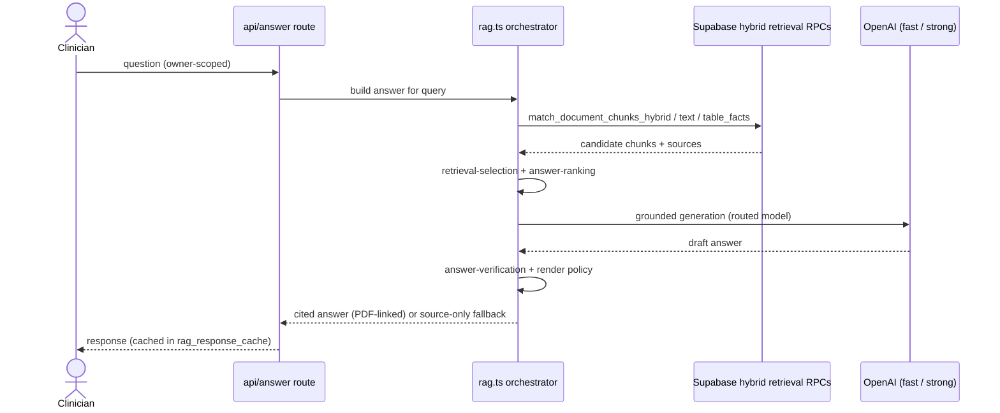

# Clinical KB — Codebase Index

Structured map for AI agents and onboarding. For live routes, see `docs/site-map.md` (`npm run docs:update` / `sitemap:check`). For agent rules and verification gates, see `AGENTS.md`; for test execution and flake policy, see `docs/testing.md`.

**Stack:** Next.js 16, React 19, Supabase (pgvector, Storage, Auth), OpenAI, Python OCR worker.  
**Live Supabase:** `Clinical KB Database` — ref `sjrfecxgysukkwxsowpy` (never use stale `qjgitjyhxrwxsrydablr`).

---

## Quick start

| Step                              | Command                          |
| --------------------------------- | -------------------------------- |
| Confirm Supabase target           | `npm run check:supabase-project` |
| Start app (project-specific port) | `npm run ensure`                 |
| Start ingestion worker            | `npm run worker`                 |
| Cheap verification gate           | `npm run verify:cheap`           |
| UI verification gate              | `npm run verify:ui`              |

---

## Top-level layout

| Path        | Purpose                                                          |
| ----------- | ---------------------------------------------------------------- |
| `src/`      | Next.js App Router UI, API routes, shared lib, components        |
| `supabase/` | SQL migrations, schema mirror, Edge Functions, CLI config        |
| `worker/`   | Local ingestion worker (parse, OCR, chunk, embed, DB writes)     |
| `scripts/`  | CLI ops: reindex, eval, backfill, governance, dev-server helpers |
| `tests/`    | Vitest unit (`*.test.ts`) + Playwright E2E (`ui-*.spec.ts`)      |
| `docs/`     | Runbooks, governance, search/RAG plans, generated sitemap        |
| `public/`   | Static assets (`public/llms.txt`)                                |
| `.github/`  | CI workflows, PR template (clinical governance preflight)        |

Smaller top-level directories that are easy to miss:

| Path            | Purpose                                                                                                                                                                                                                                                                                                             |
| --------------- | ------------------------------------------------------------------------------------------------------------------------------------------------------------------------------------------------------------------------------------------------------------------------------------------------------------------- |
| `data/`         | Committed clinical **snapshot exports** loaded at runtime by `src/lib/` (differentials, forms, medications, services, specifiers). Regenerate via the matching `scripts/import-*-export.ts` / `build-*-index.mjs`; do not hand-edit. Distinct from `src/data/`, which holds hand-authored static content.           |
| `eval/`         | Isolated evaluation labs, outside the product/runtime dependency graph. `eval/docling/` is the sandboxed, dispatch-only Docling extraction benchmark (own hashed Python lock + venvs, egress-blocked Docker run, synthetic fixtures + hostile corpus, aggregate-only reports; `docs/rag-improvement/README.md` §B3) |
| `eslint-rules/` | Repo-specific lint rules enforced by `npm run lint` (button wiring, hardcoded hex, type/icon scale, z-index ladder)                                                                                                                                                                                                 |
| `mockups/`      | Notes for the design-scratch routes under `src/app/mockups/` (the routes themselves 404 in production)                                                                                                                                                                                                              |
| `plugins/`      | `plugins/clinical-kb/` Codex plugin manifest and workflow skill                                                                                                                                                                                                                                                     |
| `.agents/`      | Canonical single-word skill catalogue (`npm run skills`); `npm run check:skills` also validates Claude, Cursor, and plugin skill policies                                                                                                                                                                           |
| `.claude/`      | Claude Code agents, skills, hooks, settings — plus the `.claude/worktrees/` working copies                                                                                                                                                                                                                          |
| `.codex/`       | Trusted Desktop/CLI config; tracked `config.toml` has disabled, secret-free Figma, Supabase, Railway, and Sentry MCP templates. Hosted ChatGPT/Codex apps are installed and authenticated separately; OAuth stays in the host credential store.                                                                     |
| `.cursor/`      | Cursor project rules and local-agent configuration                                                                                                                                                                                                                                                                  |
| `.design-sync/` | Generated design-system package metadata, validation notes, and project-sync artifacts                                                                                                                                                                                                                              |
| `.githooks/`    | Installed by `npm install`; `pre-push` runs `scripts/guard-push.mjs` (user-owned auto-merge preservation, format, drift staleness, static lint+typecheck, ledger write discipline)                                                                                                                                  |
| `.vscode/`      | Shared VS Code workspace recommendations and settings                                                                                                                                                                                                                                                               |

**Do not commit:** `.next/`, `node_modules/`, `coverage/`, `.env*`, `sample-documents/`, logs.

---

## Application architecture

### Shell and routing

- **Root layout:** `src/app/layout.tsx` — fonts, `AuthProvider`, global CSS
- **Shared search-app layout:** `src/app/(search-app)/layout.tsx` + `src/components/clinical-dashboard/shared-search-app-shell.tsx` — keeps `GlobalSearchShell` mounted across mode homes
- **App shell:** `src/components/clinical-dashboard/global-search-shell.tsx` — canonical route-aware shell and lazy dashboard dispatch. The mockup-named module is a compatibility re-export used only below `/mockups`.
- **PWA:** `docs/pwa.md` — install assets, privacy-first service worker/offline shell, lifecycle, security, and verification
- **Home:** `src/app/(search-app)/page.tsx` — dashboard rendered by shell
- **Dashboard:** `src/components/ClinicalDashboard.tsx` + `src/components/clinical-dashboard/`
- **Modes (15):** `src/lib/app-modes.ts` — answer, documents, services, forms, favourites, differentials, DSM-5 diagnosis, specifiers, formulation, prescribing, tools, calculators, Therapy, Factsheets, Dictionary
  - **Therapy review disclosure.** Therapy was `devOnly` while its 205-record catalogue awaited qualified-clinician sign-off. That hid the mode from production navigation, 404'd `/therapy-compass` in the route layout, and made `therapyRecordsForEnvironment` filter every record out — so all 205 detail/brief/sheet routes and every universal-search therapy hit 404'd for real users while working locally. The owner's decision (2026-08-19) replaced the gate with disclosure: reachability is no longer conditioned on review status anywhere, and the caveat is stated instead — catalogue-wide by `TherapyReviewNotice` above the Therapy home hero (counts from the generated `THERAPY_CATALOGUE_SUMMARY.needsReviewCount`, kept in step by the index generator's check mode), and per record by the `reviewStatus` badge on every card, detail page, brief, sheet, comparison, pathway, and universal-search result. `therapyNeedsReview` survives as the label source only. Pinned by `tests/app-modes.test.ts` (reachability), `tests/therapy-review-regressions.test.ts` (the notice and the per-record badges), and `tests/therapy-pr-unblocking-contract.test.ts` (the retired `PLAYWRIGHT_OFFLINE_MODE` bypass that existed only to reach the gated route).

### Product pages (`src/app/`)

| Route                                                                                                                                                      | File                                                                                      |
| ---------------------------------------------------------------------------------------------------------------------------------------------------------- | ----------------------------------------------------------------------------------------- |
| `/`                                                                                                                                                        | `src/app/(search-app)/page.tsx`                                                           |
| Shared mode-home route group (`/(search-app)`)                                                                                                             | `src/app/(search-app)/`                                                                   |
| Mode homes (`/services`, `/dsm`, `/documents/…`, …)                                                                                                        | `src/app/(search-app)/` shared shell group                                                |
| `/applications`                                                                                                                                            | `src/app/applications/route.ts`                                                           |
| `/differentials`, `/diagnoses`, `/presentations`, `/compare`                                                                                               | `src/app/(search-app)/differentials/`                                                     |
| `/dsm`, `/dsm/search`, `/dsm/compare`, `/dsm/diagnoses/[slug]`                                                                                             | `src/app/(search-app)/dsm/`                                                               |
| `/documents/search`, `/source`, `/evidence`, `/[id]`                                                                                                       | `src/app/(search-app)/documents/`                                                         |
| `/factsheets`, `/factsheets/search`, `/factsheets/[slug]`                                                                                                  | `src/app/(search-app)/factsheets/`                                                        |
| `/dictionary`, Terms (`/search`, one catalogue — `/browse` redirects to it), Topics, Definition, Compare, Sources                                          | `src/app/(search-app)/dictionary/`                                                        |
| `/favourites`                                                                                                                                              | `src/app/(search-app)/favourites/page.tsx`                                                |
| `/forms`, `/forms/[slug]`                                                                                                                                  | `src/app/(search-app)/forms/`                                                             |
| `/medications`, `/medications/[slug]`                                                                                                                      | `src/app/(search-app)/medications/`                                                       |
| `/privacy`                                                                                                                                                 | `src/app/privacy/page.tsx` → `privacy-quiet-signal-page.tsx` + `privacy-page-content.tsx` |
| `/reference/colour-coding`                                                                                                                                 | `src/app/reference/`                                                                      |
| `/safety-plan`                                                                                                                                             | `src/app/safety-plan/page.tsx`                                                            |
| `/calculators`, `/calculators/search`                                                                                                                      | `src/app/(search-app)/calculators/`                                                       |
| `/services`, `/services/[slug]`                                                                                                                            | `src/app/(search-app)/services/`                                                          |
| `/therapy-compass`                                                                                                                                         | `src/app/(search-app)/therapy-compass/`                                                   |
| `/tools`                                                                                                                                                   | `src/app/(search-app)/tools/`                                                             |
| `/specifiers`, `/specifiers/[slug]`, `/specifiers/builder`, `/specifiers/compare`, `/specifiers/map`                                                       | `src/app/(search-app)/specifiers/`                                                        |
| `/formulation`, `/formulation/[slug]`, `/formulation/builder`, `/formulation/compare`, `/formulation/map`                                                  | `src/app/(search-app)/formulation/`                                                       |
| `/ward-management`, `/constellation`, `/network`, `/queue`, `/capacity`, `/movements`, `/exceptions`, `/transport`, `/governance`, `/patients/[patientId]` | `src/app/ward-management/` — Ward Flow synthetic patient-flow prototype                   |
| `/mockups/*`                                                                                                                                               | `src/app/mockups/` (404 in production)                                                    |
| `/auth/callback`                                                                                                                                           | `src/app/auth/callback/route.ts`                                                          |

### API routes (`src/app/api/`)

| Area          | Routes                                                                                                                 | Entry files                                                     |
| ------------- | ---------------------------------------------------------------------------------------------------------------------- | --------------------------------------------------------------- |
| Account       | `/api/account/favourites`, `/api/account/preferences`                                                                  | `account/`                                                      |
| Answers       | `/api/answer`, `/api/answer/stream`, `/api/answer-feedback`                                                            | `answer/route.ts`, `answer/stream/route.ts`, `answer-feedback/` |
| Clinical Ask  | `/api/clinical-ask/stream`                                                                                             | `clinical-ask/stream/route.ts`                                  |
| Speech        | `/api/speech/transcribe`                                                                                               | `speech/transcribe/route.ts`                                    |
| Search        | `/api/search`, `/api/search/interaction`, `/api/search/universal`                                                      | `search/`                                                       |
| Upload        | `/api/upload`                                                                                                          | `upload/route.ts`                                               |
| Documents     | `/api/documents`, `/api/documents/[id]`, bulk/reindex, labels, reviews, search, signed URLs, summaries, table facts    | `documents/`                                                    |
| Differentials | `/api/differentials`, `/api/differentials/[slug]`, `/api/differentials/presentations/[slug]`                           | `differentials/`                                                |
| Medications   | `/api/medications`, `/api/medications/[slug]`                                                                          | `medications/`                                                  |
| Ingestion     | `/api/ingestion/batches`, `/api/ingestion/jobs`, retry, quality                                                        | `ingestion/`                                                    |
| Registry      | `/api/registry/records`, `/api/registry/records/[slug]`                                                                | `registry/records/`                                             |
| Images        | `/api/images/[id]/signed-url`                                                                                          | `images/[id]/signed-url/route.ts`                               |
| Ops           | `/api/health`, `/api/health/ready`, `/api/setup-status`, `/api/local-project-id`                                       | `health/`, `setup-status/`, `local-project-id/`                 |
| Eval / jobs   | `/api/eval-cases`; `/api/jobs` (admin/ops listing — see `docs/api-jobs-ops-surface.md`; UI uses `/api/ingestion/jobs`) | `eval-cases/`, `jobs/`                                          |
| Webhooks      | `/api/webhooks/railway`, `/api/webhooks/supabase/document-change` (inbound; secret-gated — see docs/webhooks.md)       | `webhooks/`                                                     |

---

## `src/lib/` module map

### RAG, retrieval, answers

The `rag.ts` orchestrator and its `rag-*` cluster live in **`src/lib/rag/`** (the first
domain-extracted directory; imported as `@/lib/rag/rag*`). Other modules below remain flat in
`src/lib/`.

| Module                                                                                                                  | Role                                                                                          |
| ----------------------------------------------------------------------------------------------------------------------- | --------------------------------------------------------------------------------------------- |
| `rag.ts`                                                                                                                | Main answer pipeline orchestrator                                                             |
| `rag-routing.ts`, `rag-provider.ts`, `rag-answer-text.ts`, `smart-rag-api.ts`                                           | Model routing, provider modes, API surface                                                    |
| `rag-contracts.ts`, `rag-answer-support.ts`, `rag-query-guard.ts`                                                       | Shared RAG contracts and pure answer/query policy                                             |
| `rag-evidence-gates.ts`, `rag-coverage-gate.ts`, `rag-second-stage.ts`                                                  | Evidence predicates, fast-path coverage gating, and second-stage ranking                      |
| `rag-hydration.ts`                                                                                                      | Per-request hydration: document ranking metadata, cached index quality, page visual evidence  |
| `rag-cache.ts`, `rag-retrieval-variants.ts`                                                                             | Bounded caches and retrieval variants                                                         |
| `clinical-search.ts`, `clinical-query-mode.ts`, `retrieval-selection.ts`                                                | Query modes and retrieval selection                                                           |
| `answer-ranking.ts`, `answer-verification.ts`, `answer-formatting.ts`, `answer-follow-up.ts`, `answer-render-policy.ts` | Answer quality and rendering                                                                  |
| `citations.ts`, `cross-document-synthesis.ts`, `evidence-relevance.ts`                                                  | Evidence and synthesis                                                                        |
| `ranking-config.ts`, `search-scope.ts`, `rag-eval-cases.ts`                                                             | Ranking tuning and eval fixtures                                                              |
| `clinical-ask/`                                                                                                         | Mode-aware Clinical Ask contracts, profiles, evidence, and orchestration                      |
| `security-headers.ts`, `privacy-page-content.tsx`                                                                       | Clinical Ask microphone policy, ephemeral-data disclosure, and provider-boundary privacy copy |

### Ingestion and indexing

| Module                                                                   | Role                                                |
| ------------------------------------------------------------------------ | --------------------------------------------------- |
| `ingestion.ts`, `ingestion-recovery.ts`, `ingestion-mutation-safety.ts`  | Job queue semantics and recovery                    |
| `ingestion-enqueue.ts`, `webhooks/` (`secret-auth.ts`, `chat-notify.ts`) | Reindex enqueue + inbound webhook auth/chat forward |
| `chunking.ts`, `extractors/document.ts`                                  | Text extraction and chunking                        |
| `document-index-units.ts`, `document-enrichment.ts`, `deep-memory.ts`    | Index artifacts and enrichment                      |
| `visual-intelligence.ts`, `image-filtering.ts`                           | Image captioning and filtering                      |
| `index-quality.ts`, `indexing-coverage.ts`, `model-index-extraction.ts`  | Index quality gates                                 |
| `reindex-pipeline.ts`, `reindex-eval-gate.ts`, `bulk-import.ts`          | Atomic reindex and bulk import                      |

### Source governance and metadata

| Module                                                                                                                 | Role                                             |
| ---------------------------------------------------------------------------------------------------------------------- | ------------------------------------------------ |
| `source-metadata.ts`, `source-governance.ts`, `source-text-sanitizer.ts`                                               | Source provenance and governance                 |
| `documents/` (`is-public-document.ts`), `document-label-governance.ts`, `document-tags.ts`, `document-organization.ts` | Labels, organization, and public boundary checks |
| `table-review.ts`, `accessible-table-normalization.ts`                                                                 | Table facts                                      |

### Supabase, auth, env

| Module                                                                                            | Role                                                                                                                                                                         |
| ------------------------------------------------------------------------------------------------- | ---------------------------------------------------------------------------------------------------------------------------------------------------------------------------- |
| `src/lib/supabase/` — `client.tsx`, `server.ts`, `admin.ts`, `auth.ts`, `health.ts`, `project.ts` | Clients and auth                                                                                                                                                             |
| `src/lib/supabase/database.types.ts`                                                              | Generated DB types                                                                                                                                                           |
| `env.ts`                                                                                          | Zod-validated environment                                                                                                                                                    |
| `owner-scope.ts`, `query-privacy.ts`, `privacy.ts`, `audit.ts`                                    | Multi-user scope and privacy                                                                                                                                                 |
| `authorization.ts`                                                                                | `site_role === "administrator"` claim check                                                                                                                                  |
| `src/lib/developer-area/` — `access.ts`, `headers.ts`                                             | Signed-in-administrator gate for the Settings "Development" hub (`/mockups/development`, `/mockups/caring-contacts/**`); the production block itself lives in `src/proxy.ts` |

### Clinical product data

| Module                                                               | Role                                                                                                                                                                                                                                                                                                                                       |
| -------------------------------------------------------------------- | ------------------------------------------------------------------------------------------------------------------------------------------------------------------------------------------------------------------------------------------------------------------------------------------------------------------------------------------ |
| `differentials.ts`, `forms.ts`, `services.ts`, `registry-records.ts` | Shared catalogue content with optional owner overrides                                                                                                                                                                                                                                                                                     |
| `mha-act-sections.ts`                                                | Mental Health Act 2014 (WA) section summaries shared across forms; `actSectionsForCue` resolves a form's `sourceFacts.sectionCue` and withholds the whole list until every cited section has a summary; `drafted` entries render with an awaiting-clinical-review note, `reviewed` ones name their reviewer (`docs/wiring-conventions.md`) |
| `dictionary-data.ts`, `dictionary.ts`                                | Governed terminology, sources, topics, aliases, filters; `dictionaryCatalogue` is the one selector behind the merged Terms surface                                                                                                                                                                                                         |
| `dsm.ts`                                                             | Local DSM diagnosis catalogue and comparison helpers                                                                                                                                                                                                                                                                                       |
| `formulation.ts`                                                     | Local formulation mechanism library and builder helpers                                                                                                                                                                                                                                                                                    |
| `clinical-safety.ts`, `demo-data.ts`, `ui-copy.ts`                   | Safety copy and demo mode                                                                                                                                                                                                                                                                                                                  |

### Infra helpers

| Module                                                                                                                 | Role                                                                                                                                                                     |
| ---------------------------------------------------------------------------------------------------------------------- | ------------------------------------------------------------------------------------------------------------------------------------------------------------------------ |
| `openai.ts`, `embedding-dimensions.ts`, `api-rate-limit.ts`                                                            | External APIs and rate limits                                                                                                                                            |
| `observability/` — `answer-slo.ts`, `cache-metrics.ts`, `spend-metrics.ts`, `error-tracking.ts`, `agent-monitoring.ts` | Deep-health SLO / cache-hit / answer-spend snapshots; privacy-safe Sentry error + DB-span scrubbers and metadata-only OpenAI agent monitoring (`docs/error-tracking.md`) |
| `validation/`                                                                                                          | `body.ts`, `query.ts`, `params.ts`, `http.ts`, `form-data.ts`                                                                                                            |
| `app-modes.ts`, `document-flow-routes.ts`, `local-project-identity.ts`, `local-server-utils.mjs`                       | Routing and project identity                                                                                                                                             |
| `tailwind-merge.ts`                                                                                                    | The `extendTailwindMerge` config behind `cn()` — declares this repo's custom `@theme` scales so twMerge does not misclassify them (`docs/design-system/TOKENS.md`)       |

---

## Supabase

### Config and schema

- **CLI:** `supabase/config.toml` — `indexing-v3-agent` function, `verify_jwt = false`
- **Schema mirror:** `supabase/schema.sql` (reference; migrations are source of truth)
- **Migrations:** `supabase/migrations/*.sql` (chronological source of truth; do not hardcode a count)
- **Drift policy:** `docs/supabase-migration-reconciliation.md`

### Schema tables

`documents`, `document_pages`, `document_images`, `document_chunks`, `document_embedding_fields`, `document_index_units`, `document_table_facts`, `document_labels`, `document_summaries`, `document_sections`, `document_memory_cards`, `document_index_quality`, `document_title_words`, `document_publication_approvals`, `ingestion_jobs`, `ingestion_job_stages`, `indexing_v3_agent_jobs`, `import_batches`, `image_caption_cache`, `rag_queries`, `rag_query_misses`, `rag_aliases`, `rag_response_cache`, `rag_retrieval_logs`, `rag_visual_eval_cases`, `rag_visual_eval_runs`, `rag_answer_feedback`, `clinical_registry_records`, `clinical_registry_record_sources`, `medication_records`, `differential_records`, `source_review_events`, `user_favourites`, `user_preferences`, `api_rate_limits`, `api_rate_limit_subjects`, `audit_logs`, `storage_cleanup_jobs`

**Storage buckets:** `clinical-documents`, `clinical-images` (private)

### Migration themes

| Theme                             | Examples                                                                                                        |
| --------------------------------- | --------------------------------------------------------------------------------------------------------------- |
| Bulk ingestion and job queue      | `20260527000000_bulk_ingestion.sql`, `20260616001000_ingestion_job_state_rpcs.sql`                              |
| Hybrid retrieval RPCs             | `20260607183245_search_trigram_indexes_and_response_cache.sql`, `20260701140631_codify_live_retrieval_rpcs.sql` |
| Embeddings / HNSW                 | `20260623014639_finalize_embedding_fields_hnsw_health.sql`                                                      |
| Deep memory / visual intelligence | `20260528009000_deep_memory_indexing.sql`, `20260623150000_visual_intelligence_v1.sql`                          |
| Indexing v3 agent                 | `20260625000000_indexing_v3_agent_worker_hardening.sql`, `20260702190000_indexing_v3_agent_jobs_table.sql`      |
| Atomic reindex                    | `20260628000000_atomic_reindex_generation_commit.sql`                                                           |
| Clinical registry                 | `20260703020000_clinical_registry_records.sql`                                                                  |

### Key RPCs

- **Jobs:** `claim_ingestion_jobs`, `claim_indexing_v3_agent_jobs`
- **Index lifecycle:** `commit_document_index_generation`, `cleanup_abandoned_document_index_generations`
- **Retrieval:** `match_document_chunks_hybrid`, `match_document_chunks_text`, `match_documents_for_query`, `match_document_table_facts_text`, `match_document_embedding_fields_hybrid`, `match_document_memory_cards_hybrid_v2`
- **Health:** `search_schema_health`, `explain_retrieval_rpc`

### Edge Functions

| Function          | Path                                            |
| ----------------- | ----------------------------------------------- |
| indexing-v3-agent | `supabase/functions/indexing-v3-agent/index.ts` |

Cron-triggered agent for indexing v3 completion gates. Auth via `INDEXING_V3_AGENT_SECRET`. Type-checked by `npm run check:edge:functions`.

---

## Worker (`worker/`)

| File                           | Role                                                                                    |
| ------------------------------ | --------------------------------------------------------------------------------------- |
| `index.ts`                     | Bootstrap → `main.ts`                                                                   |
| `main.ts`                      | Polls `ingestion_jobs`, extracts, chunks, embeds, writes index artifacts                |
| `observability.ts`             | Worker-side Sentry init/capture/flush, app privacy scrubbers (`docs/error-tracking.md`) |
| `embedding-fields.ts`          | Additional embedding field inputs                                                       |
| `table-facts.ts`               | Table fact extraction                                                                   |
| `prerequisites.ts`             | Python/PDF OCR checks                                                                   |
| `python/extract_pdf_assets.py` | PDF asset extraction (PyMuPDF/Tesseract)                                                |

**Flow:** Administrator backend upload → Storage + job queue → worker parses (PDF/DOCX/XLSX/TXT) → OCR fallback → image captioning → chunking → OpenAI embeddings → pgvector. The site does not expose a user document-upload workflow.

**Run:** `npm run worker` or `npm run worker:once`

---

## Scripts (grouped)

| Group                 | Key scripts                                                                                                                                                                                                              |
| --------------------- | ------------------------------------------------------------------------------------------------------------------------------------------------------------------------------------------------------------------------ |
| Dev/server            | `ensure-local-server.mjs`, `dev-free-port.mjs`, `check-runtime.ts`                                                                                                                                                       |
| Ingestion/indexing    | `import-documents.ts`, `reindex.ts`, `reindex-health.ts`, `check-indexing.ts`, `backfill-smart-index.ts`, `recover-ingestion-queue.ts`                                                                                   |
| Document intelligence | `enrich-documents.ts`, `classify-documents.ts`, `backfill-gold-document-labels.ts`                                                                                                                                       |
| Governance            | `audit-source-governance.ts`, `production-readiness.ts`, `check-supabase-project.ts`                                                                                                                                     |
| RAG eval              | `eval-rag.ts`, `eval-retrieval.ts`, `eval-quality.ts`, `retrieval-health.ts`                                                                                                                                             |
| Maintenance           | `cleanup-storage.ts`, `generate-site-map.ts`, `optimize-public-images.mjs`, `update-docs-inventory.mjs`, `seed-registry-records.ts`, `generate-outstanding-issues-snapshot.mjs`, `check-outstanding-issues-snapshot.mjs` |

Golden retrieval fixture: `scripts/fixtures/rag-retrieval-golden.json`

---

## Tests

| Config           | Path                                          |
| ---------------- | --------------------------------------------- |
| Unit (Vitest)    | `vitest.config.mts` — `tests/**/*.test.ts`    |
| E2E (Playwright) | `playwright.config.ts` — `tests/ui-*.spec.ts` |
| Visual E2E       | `playwright.visual.config.ts`                 |

**Domain clusters in `tests/`:** RAG/answers, retrieval, ingestion/indexing, source governance, API routes, Supabase schema, shell/routing, UI formatting guards.

**Gates:** `verify:cheap` (lint + typecheck + full offline unit suite), `verify:ui` (required production Chromium journeys), `verify:release` (full build + all browsers + production readiness). Use `test:focused` only for safe source-only iteration.

---

## Domain concepts

### Indexing pipeline

1. Administrator backend upload via `/api/upload` → `clinical-documents` bucket
2. Queue `ingestion_jobs` (+ optional `import_batches`)
3. **Worker** (`worker/main.ts`) or **Edge agent** (`indexing-v3-agent`) processes: extract → chunk → embed → write chunks, pages, images, embedding fields, index units, table facts
4. Quality gates: `document_index_quality`, enrichment versions, strict completion RPCs
5. Reindex: atomic generation commits (`reindex-pipeline.ts`), abandoned generation recovery

### RAG

- Hybrid retrieval: pgvector HNSW + lexical (tsvector/trigram) via Postgres RPCs
- Answer routing: fast vs strong models; `RAG_PROVIDER_MODE` (auto/openai/offline)
- Caching: `rag_response_cache`, app-layer caches in `env.ts`
- Eval: `npm run eval:quality`, `eval:retrieval`

Answer request flow (`rag.ts` orchestrates retrieval → ranking → generation →
verification; failed generation degrades to a deterministic source-only answer):

```mermaid
sequenceDiagram
    actor U as Clinician
    participant API as api/answer route
    participant RAG as rag.ts orchestrator
    participant DB as Supabase hybrid retrieval RPCs
    participant AI as OpenAI (fast / strong)
    U->>API: question (owner-scoped)
    API->>RAG: build answer for query
    RAG->>DB: match_document_chunks_hybrid / text / table_facts
    DB-->>RAG: candidate chunks + sources
    RAG->>RAG: retrieval-selection + answer-ranking
    RAG->>AI: grounded generation (routed model)
    AI-->>RAG: draft answer
    RAG->>RAG: answer-verification + render policy
    RAG-->>API: cited answer (PDF-linked) or source-only fallback
    API-->>U: response (cached in rag_response_cache)
```

### Clinical KB surface

- 13 app modes with unified search shell
- Documents mode: browse indexed guidelines, search, scope, and inspect cited answers; document uploads remain in the administrator backend
- Answer mode: grounded Q&A with PDF-linked citations
- Registry modes: services, forms, medications, differentials; Formulation is a local mechanism and structured-draft workspace
- Demo mode: synthetic data when Supabase unavailable (`demo-data.ts`, `isDemoMode()` in `env.ts`)

### Ward Flow (`src/app/ward-management/`, `src/components/ward-management/`)

Synthetic prototype for WA metro psychiatry patient flow: getting a patient from an emergency
department to an inpatient psychiatric bed. Offline and fixture-backed — no provider calls, no
persistence, no patient-identifiable data. Advisory only: the system proposes destinations with
visible reasons and a human confirms or overrides.

- **Design spec:** `docs/superpowers/specs/2026-08-18-ward-flow-metro-patient-flow-design.md`
- **Glossary:** `docs/ward-management-context.md` · **Decisions:** `docs/ward-management-decisions.md`
- **Route/role map:** `docs/ward-management-mode-map.md`
- **Model:** `src/components/ward-management/ward-clock.ts` (the only module that reads the
  wall clock), `ward-model.ts` (domain types only), `ward-eligibility.ts` (the eight
  placement gates), `ward-sites.ts` (17 sites, 8 emergency departments, 22 units),
  `ward-movements.ts` (48 movements, 6 bed releases), `ward-derivations.ts` (shared pure UI
  derivations)
- **Surfaces:** `ward-management-console.tsx` (command), `ward-management-modes.tsx` (mode
  workspaces), `ward-management-network.tsx` (network diagram), `ward-management-navigation.tsx`
- **Tests:** `tests/ward-management.test.ts`, `tests/ui-ward-management.spec.ts`

### Developer hub (`src/app/mockups/development/`, `src/lib/developer-area/`)

Login-gated internal hub for repository/task state, reachable only to a signed-in administrator
account (`DeveloperAreaGate`, `src/components/developer-area/developer-area-gate.tsx`; gate helpers
`src/lib/developer-area/access.ts` + `headers.ts` — see the Supabase/auth/env table above). Phase 1
ships one live panel; the rest of the registry is declared placeholders.

- **Panel registry:** `src/lib/developer-area/hub-panels.ts` (`HUB_PANELS`, `panelsInGroup`) — one
  entry per panel with its `group` (`work` | `clinical` | `system` | `reference`) and delivery
  `phase` (1 = built now; 2–4 = declared placeholder with no `href` yet). Shipping a later-phase
  panel is flipping its phase and adding an `href`.
- **Task ledger data:** `src/lib/developer-area/ledger-snapshot.ts` imports the generated
  `data/outstanding-issues-snapshot.json` (never hand-edited; listed in `.prettierignore`) rather
  than reading `docs/outstanding-issues.md` at runtime — the production Docker image never copies
  `docs/`, so a server component reading the ledger live would work in dev and silently find
  nothing in production (the `#338` failure this feature exists to prevent). Exposes
  `loadLedgerSnapshot` (throws if the snapshot's `version` doesn't match
  `LEDGER_SNAPSHOT_VERSION`), `openItemsByPriority`, and `resolveFreshness`.
- **Snapshot generation:** `scripts/generate-outstanding-issues-snapshot.mjs` parses the ledger
  markdown and the `docs/outstanding-issues-inbox/` request JSON into
  `data/outstanding-issues-snapshot.json`; it owns all markdown parsing, so the app itself never
  parses markdown. Runs from `npm run docs:update` and `npm run prebuild`, and at the end of
  `npm run issues:reconcile` — the only sanctioned writer of the ledger, which also empties the
  inbox, so both halves of the snapshot go stale in the same operation. That regeneration sits
  outside the reconciliation transaction on purpose (the journal restores only the ledger and the
  pending request files); if it fails, reconcile warns and names `npm run snapshot:issues` rather
  than claiming the reconcile failed. Commit the regenerated snapshot with the ledger.
  When git is unavailable — the production image excludes `.git`, and `prebuild` regenerates there —
  the generator keeps the committed `ledger_revision` instead of overwriting it with `null`, so the
  freshness stamp can still state the page's age. A preserved revision can only make the page report
  itself as older than it is, never fresher, and it feeds none of the compared content keys.
  `scripts/check-outstanding-issues-snapshot.mjs` regenerates the snapshot in memory and compares
  its content keys (`queue`, `open`, `pending`) against the committed file, failing with the fix
  command on any mismatch — this is what makes a stale snapshot impossible to ship.
- **Routes:** `/mockups/development` (`page.tsx`, Server Component) — the grouped hub: environment
  strip, a blocking-items callout when the ledger has P1s, then one section per non-empty panel
  group. `/mockups/development/ledger` (`ledger/page.tsx`, Server Component) — the task ledger
  page: freshness stamp, count tiles, a "blocking now" callout, the recommended running order
  (acuity — urgency, kept deliberately separate from priority), open items grouped by priority,
  and pending inbox requests. Both inherit `DeveloperAreaGate` from `layout.tsx`.
- **Components:** `src/components/developer-area/developer-hub-nav-header.tsx` (`"use client"`,
  owns the hub's in-page section table and mounts `InPageNavHeader`) and
  `src/components/developer-area/hub/` — `freshness-stamp.tsx`, `environment-strip.tsx`,
  `panel-card.tsx` (a Client Component because it renders an inert click handler for
  not-yet-built panels), `ledger-item.tsx`.
- **Tests:** `tests/developer-area-access.test.ts`, `tests/developer-hub-panels.test.ts`,
  `tests/developer-ledger-snapshot.test.ts`, `tests/developer-hub-components.dom.test.tsx`,
  `tests/developer-hub-page.dom.test.tsx`, `tests/developer-ledger-page.dom.test.tsx`.

### Global search composer placement rules

One shared composer (`master-search-header.tsx`) serves every mode. Placement:

- **Mode homes**: the one shared home at `/?mode=<id>`, plus the three routes that still own a home of their own — `/medications` (the prescribing workspace, with dose/safety/monitoring checks), `/favourites` (a hub) and `/tools` (a launcher). None of those three is a duplicate of the shared home; each is its mode's only functional surface. Composer inline in the hero via the `mode-home-composer-slot` portal, on phone and tablet+ alike. The other eleven modes were consolidated onto the shared home: `/services`, `/forms`, `/differentials`, `/dsm`, `/specifiers`, `/formulation`, `/calculators`, `/factsheets`, `/dictionary`, `/therapy-compass` and `/documents` are now `redirect()` stubs (`src/lib/consolidated-mode-home-redirect.ts`, resolved in `src/proxy.ts` so they emit a real 307 rather than a streamed meta-refresh). Their per-mode copy is `sharedHomePresentation` in `src/lib/ui-copy.ts`; the retired detailed pages are preserved off the live routes at `/mockups/<mode>-home-detailed`. (`/applications` is a redirect to `/tools`, not a composer surface.)
- **Information (detail) pages**: catalogue/record routes under each mode (`/services/[slug]`, `/forms/[slug]`, `/medications/[slug]`, `/specifiers/[slug]`, `/formulation/[slug]`, `/factsheets/[slug]`, `/dictionary/[slug]`, `/dictionary/topics/[slug]`, `/therapy-compass/[slug]`, `/dsm/diagnoses/[slug]`, …). Route detection: `src/lib/information-pages.ts` (`isInformationPage`). Shared outer chrome: `src/components/information-page-shell.tsx` (`InformationPageShell`, breadcrumbs, optional footer). Specifier/formulation mode shells re-export that primitive. Intentional opt-outs: document viewer and the differentials presentation workflow.
- **Result and detail views**: fixed bottom dock on phone (compact variant on submitted searches), sticky top from `sm` up.
- **Results routing**: each consolidated mode owns its submitted searches at `<mode>/search` (`/services/search` → `ServicesNavigatorPage`, `/forms/search` → `FormsSearchResultsPage`, `/differentials/search` → `DifferentialsHome` results view, `/formulation/search` → local mechanism results, and the same shape for dsm, dictionary, factsheets, specifiers, calculators, therapy-compass and documents). That split is not cosmetic: the bare path redirects to the shared home, so routing a submitted query back at it would loop — `consolidatedModeHomeModeIds` drives both halves from one list, and `tests/consolidated-mode-home-redirect.test.ts` pins the no-loop property. `/favourites` and `/tools` keep filtering in place on their own routes. Answer, Documents, and Prescribing submitted searches render inside `ClinicalDashboard` — intentional, since they need retrieval/answer state. Bare `/?mode=<id>` always renders the shared home with that mode preselected; only a submitted deep link (`q` plus `run=1`) resolves onward to the mode's own search surface.
- **Intentionally composer-free routes**: `/differentials/presentations/*` and `/differentials/compare` (comparison workflow owns its chrome), `/documents/[id]` viewer (has its own in-document ask composer), `/documents/source/*` (document flow owns mobile chrome). Do not re-flag these in search-consistency audits.
- **Shared in-page navigation**: `src/components/in-page-nav/` is the default template for section navigation on any mode page (`docs/search-chrome-behaviour.md`). `in-page-nav-header.tsx` (`InPageNavHeader`) owns the header row, both sheets and the `PhoneHeaderCollapsePortal` wrapper; `page-section-index.ts` (`PageSection`, `toDocumentSections`, `sectionTargetIds`) is the declaration shape; `use-resolved-page-sections.ts` narrows a declaration to the anchors actually rendered at this breakpoint; `use-in-page-section-nav.ts` composes that with `useDocumentSectionSpy` and `jumpToDocumentSection`; `use-page-section-weights.ts` measures segment weights; `use-in-page-chrome-metrics.ts` publishes `--inpage-anchor-offset`; `in-page-nav-classes.ts` holds the shared anchor (`inPageAnchor`) and actions-sheet row classes; `in-page-section-rail.tsx` (`InPageSectionRail`) is the optional visible second rail, opted into with `rail={{ label }}` by panel-swap routes with few sections (medications only) in place of the weighted track. Anchor measurement itself is `src/components/sticky-chrome-metrics.ts` (`useStickyChromeMetrics`), shared with the document viewer's `use-document-chrome-metrics.ts`. Mounted by `dictionary/dictionary-term-page.tsx`, Dictionary topic detail in `dictionary/dictionary-catalogue-pages.tsx`, `differentials/differential-detail-page.tsx`, `services/service-detail-page.tsx`, `forms/form-detail-page.tsx`, `dsm/dsm-differential-considerations-page.tsx`, and — through a colocated `"use client"` nav-header sibling that owns and exports the route's section table — `specifiers/specifier-nav-header.tsx`, `formulation/formulation-nav-header.tsx`, `dsm/dsm-diagnosis-nav-header.tsx`, `factsheets/factsheet-nav-header.tsx` and `clinical-dashboard/medication-nav-header.tsx`. The sibling is mandatory for the four Server Component pages (neither `onSelectSection` nor a `LucideIcon` crosses the RSC boundary) and the convention for the rest. Two adopters swap panels instead of scrolling — `differential-detail-page.tsx` and the medication record page — so they pass explicit weights, carry no `inPageAnchor`, and use neither `useResolvedPageSections` nor the scroll spy. Every declared section is pinned against rendered DOM by `tests/in-page-nav-route-sections.dom.test.tsx` (anchors for the scrolling routes, swapped-in panels for the tab routes) and focused Dictionary DOM contracts.
- **Shared secondary navigation**: `src/components/page-secondary-navigation.tsx` (`PageSecondaryNavigation`, mode destinations only). Mode destinations come from `src/lib/mode-secondary-navigation.ts` (`modeSecondaryNavigationRegistry`, no "Home" item). `GlobalSearchShell` renders it in normal flow at the top of `#main-content` for its owned namespaced modes; it self-suppresses on clean mode homes, on Therapy Compass, and on every information page — `hasLocalInformationPageNavigation` is now just `isInformationPage`, because each of those routes owns its own in-page navigation. The older shared `SecondaryNavigation` component was deleted here (`/issues #271`): its `section` kind and "On this page" pill rail went when the last six information routes moved onto `InPageNavHeader`, and the surviving `route`/`action` kinds had no production constructor left — `RegistryModeNav` renders `ModeNav`, not `SecondaryNavigation`, so the only remaining caller was its own test file, which went with it.
- **Patient context (decision support)**: the app's patient-specific surface, spanning two engines over one session-scoped profile. Store: `src/lib/patient-profile-storage.ts` (sessionStorage external store, anonymous physiology + catalogue medication slugs, cleared on tab close) behind `clinical-dashboard/patient-profile-context.tsx` (`PatientProfileProvider`, mounted for the whole shell). Engines: `src/lib/medication-patient-alerts.ts` (physiology — age/renal/hepatic/QTc/pregnancy/allergy, with an `unassessed` fail-safe) and `src/lib/medication-interactions.ts` (drug–drug, against the entered medication list). The interaction engine reads the generated `data/medication-interaction-index.json`, built by `scripts/build-medication-interaction-index.ts` (`npm run medications:interactions`, staleness-gated by `check:medication-interactions`) from the curated `src/lib/medication-interaction-lexicon.ts` — the catalogue's `Key Interactions` rows are prose, and that lexicon is what resolves their class/mechanism/non-drug terms to catalogue targets. `composeMedicationVerdict` folds both engines into the one tone a result row wears; **green is unreachable whenever either engine left something unassessed or unresolved**, degrading to a neutral "needs manual review" instead. UI: `clinical-dashboard/patient-profile-panel.tsx` (the form, including the medication picker), `medication-considerations.tsx` (both detail-page blocks and the verdict badge/edge helpers), and `patient-details-dock-action.tsx` (the phone dock pill — see the addon-slot section of `docs/search-chrome-behaviour.md`). Regulatory status is **open**: `docs/samd-classification-medication-considerations.md`.
- **Local filter fields** (sidebar "Search chats", document drawer "Find a document"/"Find a source PDF") are scoped filters, not global search; they share the `fieldControlWithIcon`/`fieldIcon` primitives.
- **Wiring conventions** for buttons and route navigation (and the gates that enforce them — the dead-button ESLint rule and the orphan-route reachability test) live in `docs/wiring-conventions.md`.

---

## Key config files

| File                                       | Role                                                      |
| ------------------------------------------ | --------------------------------------------------------- |
| `package.json`                             | Scripts, deps, Node 24 / npm 11                           |
| `.env.example`                             | Full env template                                         |
| `next.config.ts`                           | CSP, security headers, build config                       |
| `tsconfig.json`                            | Strict TS; excludes `supabase/functions/**`               |
| `eslint.config.mjs`                        | Lint scope                                                |
| `AGENTS.md`                                | Agent rules, verification gates, shortcuts                |
| `.github/workflows/ci.yml`                 | CI pipeline                                               |
| `scripts/sync-open-pr-branches.mjs`        | Operator-only dry-run/apply helper for PR branch sync     |
| `docs/process-hardening.md`                | Verification pyramid                                      |
| `docs/phone-chrome-physical-acceptance.md` | Physical Safari / cold-launch PWA phone-chrome acceptance |
| `docs/clinical-governance.md`              | Clinical safety governance                                |
| `docs/reindex-runbook.md`                  | Reindex operations                                        |
| `docs/retrieval-quality-runbook.md`        | Retrieval tuning                                          |

---

## Related docs

| Topic                      | Doc                                                                    |
| -------------------------- | ---------------------------------------------------------------------- |
| Full documentation index   | `docs/README.md`                                                       |
| Routes and modes           | `docs/site-map.md`                                                     |
| Search/RAG roadmap         | `docs/search-rag-master-plan.md`                                       |
| Universal task ledger      | `docs/outstanding-issues.md`                                           |
| Reindex operations         | `docs/reindex-runbook.md`                                              |
| Production readiness       | `docs/production-readiness-checklist.md`                               |
| Capacity / scale-up        | `docs/audit/capacity-review.md`, `docs/auth-connection-cap-runbook.md` |
| Frontend architecture      | `docs/frontend-architecture.md`                                        |
| Repo audit (2026-07-01)    | `docs/audit/repo-audit-2026-07-01.md`                                  |
| Latency audit (2026-07-28) | `docs/audit/latency-audit-2026-07-28.md`                               |

---

_Generated for agent onboarding. Update when adding major modules, API surfaces, or migration themes._
