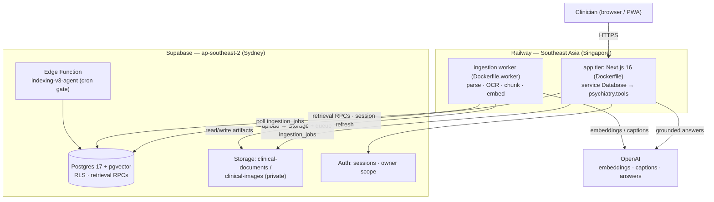

# Deployment Architecture

Decision record for the production topology of Clinical KB. Written 2026-07-06,
revised 2026-07-12 when the app went live on Railway. Companion documents:
`docs/observability-slos.md` (SLOs + eval canary) and `docs/capacity-review.md`
(load model, first bottleneck, soak test).

Status of this document: **decided and live in production.** The app tier and
ingestion worker run on Railway (Singapore) from the committed `Dockerfile` and
`Dockerfile.worker`. The core platform is **Railway** (see §2, "Why Railway").
Host provisioning, staging setup, and secret placement remain operator actions
and are specified here.

## Topology at a glance



The app↔Supabase path is public internet fronted by Supabase's CDN (Supabase is not on
Railway's private network — see §2.1). Both Railway services deploy from
`BigSimmo/Database` on pushes to `main`.

## 1. Current state (what runs today)

- **Live on Railway.** Project **`Database`** (`5deaad0b-675a-4c13-978e-5ca2b5b877f9`),
  environment `production` (`6aa16f7b-d3e8-4aa2-9854-ee9ead9fcbd4`), region
  **Southeast Asia (`asia-southeast1-eqsg3a`, Singapore)** — the closest Railway
  region to the Supabase project. Two services from this one repo, both connected
  to the `BigSimmo/Database` GitHub repo and auto-deploying on pushes to `main`:
  - **`Database`** — the Next.js app tier (`Dockerfile`), serving the custom domain
    **`https://psychiatry.tools`**, one warm replica, Railway healthcheck path
    `/api/health/ready`, restart-on-failure.
  - **`worker`** — the ingestion worker (`Dockerfile.worker`), one always-on
    replica, long-polling the ingestion queue.
- **Superseded project.** An earlier Railway project named `clinical-kb`
  (`4361c04f-dd3c-4ee9-9e97-49e4e5707b70`) still exists with `app`/`worker`/`staging-app`
  services, but has **zero active deployments** (last activity 2026-07-14, all
  `REMOVED`) and its generated domain `app-production-68ebf.up.railway.app` returns 404. It is not production. Do not `railway link` a worktree to it — deploys sent
  there go nowhere. Retiring it is an open operator decision.
- **Database/auth/storage:** live Supabase project `Clinical KB Database`
  (`sjrfecxgysukkwxsowpy`), region **ap-southeast-2 (Sydney)**, Postgres 17,
  ~2,000 indexed documents / ~69k chunks. RLS is service-role-only; the app
  layer is the ownership boundary. Supabase is a managed external service — it is
  **not** on Railway's private network, so the app↔DB path is public internet
  fronted by Supabase's CDN (see §2.1).
- **Ingestion:** the containerized `worker` plus the `indexing-v3-agent` Supabase
  Edge Function acting as a cron-triggered completion/repair gate — not a full
  extraction pipeline.
- **Known failure mode:** silent degradation. Hybrid retrieval RPCs once died
  quietly while the app kept serving from fallbacks. Every topology decision
  below biases toward _loud_ failure and standing guards.

## 2. App tier

### Decision

Run the Next.js app as a **single long-lived container** (Node 24, image built
from `Dockerfile`) on **Railway**, pinned to the **Southeast Asia (Singapore)**
region — the closest Railway region to the Supabase project's ap-southeast-2
(Sydney) home. Keep one warm replica (no scale-to-zero).

### Why Railway

Railway runs plain OCI images with per-service secrets, health checks, rolling
deploys with rollback to a previous deployment, private networking, and a managed
multi-service project model that fits the app-plus-worker topology directly. Two
properties made it the pragmatic core platform:

- **Remote builds.** Railway builds the image on its own infrastructure, so the
  8 GiB-heap `next build` (see the image contract below) never has to run on a
  local Docker daemon — the local build reliably OOMs on that heap, which had been
  the deploy blocker. In production the app image compiled in ~21 s with no OOM on
  a 1-CPU builder.
- **Already provisioned.** The account, workspace, and billing were in place, so
  there was no cold-start account/credentials blocker.

**The trade Railway forces — and why it was accepted:** Railway has **no
Australian region** (its regions are US West, US East, Amsterdam, Singapore),
while Supabase is in Sydney. The app therefore pays a cross-region hop to the
database (quantified in §2.1). Warm responses show that this hop can be bounded,
but 2026-07-14 cold probes also exposed database-execution outliers far larger
than network RTT. A Singapore replica would copy those query plans rather than
fix them, so the current first lever is RPC/query-plan work and, if needed, a
small primary-compute comparison. Given that shipping a real environment was the
priority, a live-in-Singapore deployment beat an indefinitely blocked "optimal"
one.

### Why a long-lived container and not serverless (Vercel et al.)

- **In-memory coalescing and caches are load-bearing.** The answer pipeline
  coalesces identical in-flight questions (`answer_inflight_coalesced` in
  `src/lib/rag/rag.ts`) and holds LRU answer/search caches
  (`RAG_ANSWER_CACHE_TTL_MS`/`RAG_ANSWER_CACHE_SIZE`). Serverless isolates get
  one request each, so coalescing never fires and every duplicate ward-round
  question pays the full ~6-RPC fan-out plus an OpenAI generation.
- **Fire-and-forget background work.** Cache invalidation and telemetry writes
  run as `void (async () => ...)` after the response; serverless platforms may
  freeze the isolate at response end.
- **Long requests.** The strong answer route runs up to
  `OPENAI_ANSWER_TIMEOUT_MS` (30 s) plus retrieval; streaming responses run
  longer. That is hostile to per-request serverless billing/limits.
- **Connection amplification.** Many cold instances multiply concurrent
  PostgREST/auth traffic against a database whose auth server is capped at 10
  absolute connections (see `docs/capacity-review.md`).

Scale-out plan: stay at 1 replica (vertical scaling first) until sustained load
demands more; replicas are safe but dilute in-memory coalescing, so add them only
after the shared `rag_response_cache` hit rate is confirmed healthy. On Railway,
prefer a single-region replica bump (`railway scale southeast-asia=N`) over
spreading replicas across regions, which would multiply the cross-region DB hop.
**Before the first vertical scale-up**, clear the auth 10-connection cap so the
auth pool scales with compute instead of staying pinned — operator runbook:
`docs/auth-connection-cap-runbook.md` (`docs/capacity-review.md` §2–§3).

### 2.1 The Railway↔Supabase connection (Singapore → Sydney)

This is the one place the topology is not co-located, so it is characterized here
rather than left as a footnote.

**Path.** The app uses `@supabase/supabase-js` (PostgREST over HTTPS) against
`https://<ref>.supabase.co`. That hostname is anycast/CDN-fronted, so the TCP+TLS
connection terminates at the nearest edge PoP (~2 ms from Railway Singapore) and
the CDN forwards the request over its backbone to the Postgres/PostgREST origin in
Sydney. `@supabase/supabase-js` runs on undici with keep-alive, so warm requests
reuse the pooled connection and skip the client→edge handshake — but every request
that reads data still has to reach the Sydney origin, so the edge→origin hop is
inherent per RPC.

**Measured (Railway Singapore → Supabase Sydney), 2026-07-12:**

| Path                               | What it is                                              | Result                                                |
| ---------------------------------- | ------------------------------------------------------- | ----------------------------------------------------- |
| Raw TCP → Sydney Postgres pooler   | Physical Singapore↔Sydney RTT floor                     | **~94 ms**                                            |
| Authenticated PostgREST round-trip | Real per-RPC cost the app pays                          | **~145 ms best, ~340 ms typical**                     |
| Production novel answer            | `supabase_rpc_latency_ms` (retrieval, 3 query variants) | **~4.4 s**; total ~25 s incl. ~19 s OpenAI generation |

**Fresh production comparison, 2026-07-14:** one warmed repeat reported
`supabase_rpc_latency_ms=0`, while two cold synthesis probes reported
**48.5–49.4 s** of Supabase RPC time and **51–53 s** total. A six-case approved
live-database retrieval run on the current local code preserved perfect fixture
recall/hit-rate with **1.8 s median / 47.3 s p90** latency. Database statistics
also show large temporary-file I/O in the slow hybrid RPC families. These
outliers supersede the earlier assumption that generation or cross-region RTT is
always the dominant latency.

**What multiplies, what doesn't.** Retrieval fans out _wide_ but the RPCs within
a stage run in parallel (`Promise.all`), so fan-out width costs ~1×RTT, not N×.
What multiplies RTT is the sequential **depth** — ~5–8 serial DB round-trips on a
cache-miss answer (index-version check [5 s TTL], shared-cache lookups, retrieval
stages, chunk + document hydration). Net penalty vs. full co-location with the
database region: roughly **+0.6 s to +2 s per novel answer**. Cached/repeat answers are served from
the in-memory LRU (or coalesced) and are largely spared; answers that fall to the
shared Postgres cache tier still pay ~one origin round-trip.

**Optimisations in place:**

- Region pinned to Singapore (closest region) rather than a Railway default.
- One warm replica, no scale-to-zero — keeps the caches and coalescing hot and
  avoids cold-start connection amplification against the 10-connection auth cap.
- Single-region scaling policy (above) so replicas never spread the DB hop.
- keep-alive connection reuse (undici default) removes repeated client→edge
  handshakes on the hot path.

**Mitigations, in current priority order:**

1. **Profile and optimise the slow hybrid RPC plans**, then compare the Sydney
   primary on Micro versus Small compute if execution remains resource-bound.
   The live primary currently exposes the Micro connection ceiling (60 direct
   connections) and a small `work_mem`; scaling the primary tests query-memory
   headroom without adding read routing or replica staleness.
2. **Reduce sequential DB depth** in the answer path (batch the cache-version +
   shared-cache probes, collapse hydration round-trips). App change; measure
   `latencyTimings.supabase_rpc_latency_ms` before/after.
3. **Reconsider a Singapore read replica only after the query plans are fast and
   network time is again material.** Supabase currently requires at least Small
   compute for read replicas; a same-size replica is asynchronous/read-only and
   adds compute/storage cost plus read-routing and freshness validation. It is
   not justified by the current evidence because it would reproduce the observed
   execution outliers.

The OpenAI leg is region-agnostic: OpenAI is US-hosted, so app→OpenAI RTT is
comparable (~200 ms) from Singapore or Sydney and does not favour either host.

### Image contract (`Dockerfile`)

- `node:24-bookworm-slim` in all stages — respects `engines`/`engine-strict`
  and the `preinstall` engine guard.
- The build stage runs the repo's own `npm run build`
  (`guard-next-build.mjs` + `next build --webpack` + the client-bundle secret
  scan) — **the image build fails exactly where a local build would**. The
  `--webpack` flag is deliberate: `next.config.ts` carries a webpack-specific
  WasmHash workaround and the CSP-nonce work was validated against webpack
  prod chunks, so switching bundlers needs its own verified change. The build
  allocates an 8 GiB heap; Railway's remote builder handles it (the ceiling is
  headroom, not a reservation — the real build compiled in ~21 s).
- `NEXT_PUBLIC_SUPABASE_URL` and `NEXT_PUBLIC_SUPABASE_PUBLISHABLE_KEY` are
  build args (they inline into the client bundle). On Railway, service variables
  are exposed to the Dockerfile build via the matching `ARG` declarations, so
  setting them as service variables inlines the real values. The publishable key
  is public by design; the placeholder default exists so CI can build without
  secrets. **Production images must be built with the real publishable key.**
- `NEXT_PUBLIC_MAX_UPLOAD_MB` is also a build-time public variable (Docker
  `ARG`/`ENV` before `npm run build`). When operators lower server-side
  `MAX_UPLOAD_MB`, mirror the same value in `NEXT_PUBLIC_MAX_UPLOAD_MB` before
  building the production image so the browser precheck rejects over-limit
  files without a full transfer. Runtime-only Railway variables are not enough
  for this value because Next inlines `NEXT_PUBLIC_*` at build time.
- Runtime is a non-root `node` user, prod-only `node_modules`, direct
  `next start -H 0.0.0.0 -p $PORT` (Railway injects `$PORT`; the local
  port-picker script is deliberately bypassed), and a `HEALTHCHECK` against
  `/api/health`.
- No secret is ever baked into a layer. `SUPABASE_SERVICE_ROLE_KEY`,
  `OPENAI_API_KEY`, etc. are injected at run time by Railway's variable store.
- Request bodies are bounded twice: Next Proxy buffers at most 151 MiB, and
  `/api/upload` rejects declared multipart bodies above `MAX_UPLOAD_MB` plus
  1 MiB framing overhead before authentication or `request.formData()`. Keep
  the managed host's request-body limit at 151 MiB or lower as a third ingress
  fence; `MAX_UPLOAD_MB` is capped at 150 MiB by environment validation.

### Config as code (`railway.app.json`)

The app service's build/deploy config is captured in `railway.app.json` at the
repo root (Railway schema). It is intentionally **not** named `railway.json`
because a default-named file is auto-loaded by _every_ service in the project and
would clash with the worker (which needs a different Dockerfile and no
healthcheck). The production app service uses `railway.app.json` as its
config-as-code path (dashboard → service → Settings → Config-as-code, or the
service-settings API); the worker uses `railway.worker.json`. Keep both paths
wired: Railway does not auto-discover these service-specific filenames. After
changing either file, confirm the deployment metadata reports the tracked health
check and watch patterns rather than relying on dashboard defaults.

```jsonc
// railway.app.json (source of truth for the live app service)
{
  "build": {
    "builder": "DOCKERFILE",
    "dockerfilePath": "Dockerfile",
    "watchPatterns": ["/src/**", "/public/**", "/data/**", "..."],
  },
  "deploy": {
    "healthcheckPath": "/api/health/ready",
    "healthcheckTimeout": 60,
    "restartPolicyType": "ON_FAILURE",
    "multiRegionConfig": { "asia-southeast1-eqsg3a": { "numReplicas": 1 } },
  },
}
```

## 3. Ingestion tier

### Decision: containerized worker (recommended) over completing the edge-agent migration

Ship the existing worker as a container (`Dockerfile.worker`: Node 24 + a
prebuilt esbuild bundle over production-only `node_modules` +
Tesseract + a Python venv with `worker/python/requirements.txt`) and run **one
always-on worker instance** co-located in Railway Singapore (`worker` service),
using Railway's `ALWAYS` restart policy so repeated bootstrap failures cannot
exhaust a finite retry allowance and leave the queue undrained.
The `indexing-v3-agent` Edge Function **stays** in its current role as the
cron-triggered completion/repair gate — the two are complementary, not
alternatives. The worker service selects its Dockerfile via the
`RAILWAY_DOCKERFILE_PATH=Dockerfile.worker` variable (captured in
`railway.worker.json`).

> **Operator run recipe:** the copy-pasteable build/run/verify steps, the
> required env + secrets, and the pre-deploy migration gate live in
> [`worker-deploy-runbook.md`](worker-deploy-runbook.md). This section is the
> decision record; that runbook is how to ship it.

Reasoning:

1. **The OCR stack cannot run at the edge.** PyMuPDF and Tesseract are native
   binaries driven from Python. Supabase Edge Functions are Deno isolates with
   no native-binary support and hard wall-clock/memory ceilings. "Completing
   the migration" would mean reimplementing PDF parsing, OCR fallback, image
   captioning, and table extraction inside those ceilings — a rewrite with a
   strictly worse capability ceiling, not a migration.
2. **Job shape mismatch.** Large guideline PDFs take multi-minute processing
   (the queue's stale-claim window is 45 minutes); edge functions are built for
   sub-minute invocations.
3. **The worker is already multi-instance safe.** `claim_ingestion_jobs` uses
   `FOR UPDATE SKIP LOCKED` with per-document exclusivity, so containerizing it
   verbatim gives horizontal scaling for free (see queue semantics below).
4. **Smallest delta.** `worker/main.ts` runs unchanged in the container; the
   only new artifact is the image. The edge path would fork the pipeline into
   two implementations that drift — this repo's defining failure mode.

Scaling: raise `WORKER_BATCH_SIZE` / `WORKER_CONCURRENCY` on the single instance
first; add replicas (`railway scale --service worker southeast-asia=N`) only for
sustained backlog (safe by construction). The worker also pays the Singapore→
Sydney hop on each write, but ingestion is batch/background and off the answer
critical path, so its latency budget is generous.

### Queue durability when a worker dies mid-job

Semantics of `claim_ingestion_jobs` (migration
`20260615114506_claim_ingestion_jobs_document_lock.sql`):

- **Claim:** `status → processing`, `locked_at = now()`, `locked_by = worker`,
  and — important — **`attempt_count` is incremented at claim time**, not at
  failure time. Claims take `FOR UPDATE SKIP LOCKED` over the job _and_ its
  document row, rank one job per document, and exclude any document that
  already has a _fresh_ processing job.
- **There is no heartbeat.** The worker never refreshes `locked_at` mid-job.
  If the worker dies, the job sits in `processing` until `locked_at` is older
  than the stale window (`p_stale_after_minutes`, default 45, worker-side
  `WORKER_STALE_AFTER_MINUTES`), after which any worker reclaims it
  (`stage = 'reclaimed stale job'`).
- **Dead-lettering is implicit.** Because attempts are consumed at claim, a
  crash-looping job exhausts `max_attempts` (default 3) after ~3 stale windows
  and becomes terminally `failed` — the de-facto dead-letter state. Recovery is
  operator-driven: `npm run recover:ingestion` or the retry API, both protected
  by the ingestion rollback fence (`updated_at` fence) against retry/reindex
  overlap races.

Operational rules that follow:

- **The stale window must exceed the worst-case job runtime.** If a live
  worker runs a job longer than 45 minutes, a second worker can reclaim and
  double-process the same document (the per-document exclusion only respects
  _fresh_ locks). The rollback fence bounds the damage but does not prevent the
  wasted work. When adding worker replicas, first confirm p100 job duration
  against the window.
- **Worker death costs at most one stale window of latency** for the in-flight
  job and zero data loss: all artifact writes are idempotent per
  generation/chunk-key, and completion is gated by the strict completion RPCs
  plus the edge agent. Railway's always-restart policy brings the worker back and
  it reclaims stale jobs automatically.
- **Backlog improvement (not in this change):** a heartbeat that refreshes
  `locked_at` could ride the existing throttled progress updates
  (`WORKER_PROGRESS_UPDATE_MIN_INTERVAL_MS`, 60 s), which would let the stale
  window shrink from 45 min to ~5 min without double-claim risk. Touches
  worker + RPC; needs its own migration and review.

## 4. Secrets management

| Variable                                         | Sensitivity      | Build-time or runtime     | Where it lives                                                    |
| ------------------------------------------------ | ---------------- | ------------------------- | ----------------------------------------------------------------- |
| `NEXT_PUBLIC_SUPABASE_URL`                       | public           | build (inlined) + runtime | Railway service variable (also the Dockerfile ARG default)        |
| `NEXT_PUBLIC_SUPABASE_PUBLISHABLE_KEY`           | public-by-design | build (inlined)           | Railway service variable (exposed to the build via `ARG`)         |
| `SUPABASE_SERVICE_ROLE_KEY`                      | **critical**     | runtime                   | Railway variable store; GitHub repo secret (CI boot smoke + eval) |
| `OPENAI_API_KEY`                                 | **critical**     | runtime                   | Railway variable store; GitHub repo secret                        |
| `SUPABASE_PROJECT_REF` / `SUPABASE_PROJECT_NAME` | low              | runtime                   | plain Railway variable (pins the `check:supabase-project` guard)  |
| `INDEXING_V3_AGENT_SECRET`                       | high             | runtime                   | Supabase Edge Function secrets                                    |
| `RAG_QUERY_HASH_SECRET`                          | high             | runtime                   | Railway variable store; GitHub repo secret (CI boot smoke)        |
| `E2E_USER_EMAIL` / `E2E_USER_PASSWORD`           | medium           | CI only                   | GitHub repo secrets                                               |

Rules:

- Secrets never enter images, the repo, or `NEXT_PUBLIC_*` names. `.env.local`
  is a local-dev convenience only. Set runtime secrets as Railway service
  variables (e.g. `railway variable set KEY --stdin` so the value is piped, never
  echoed); Railway injects them at run time.
- `RAG_QUERY_HASH_SECRET` is **required in production** (`src/lib/env.ts`
  `requireQueryHashSecret()` throws without it) and is generated fresh per
  environment (`openssl rand -hex 32`); it is not copied from local dev.
- Each environment (production, staging, CI) gets **separate** service-role and
  OpenAI keys so rotation and blast radius stay per-environment.
- Rotation: publishable-key rotation is already an operator runbook item
  (`docs/archive/operator-decisions-2026-07-04.md`); service-role rotation is a
  Supabase dashboard action + Railway variable update + redeploy.
- `npm run check:supabase-project` runs after any Supabase env change (repo
  rule), and the eval canary runs it before every scheduled eval.

## 5. Staging environment

- **A second, dedicated Supabase project** (same org, ap-southeast-2) — not a
  branch of production. `Clinical KB Staging` was provisioned and migrated on
  2026-07-19. Rationale: staging must absorb soak tests, destructive
  ingestion experiments, and migration rehearsal without any shared compute,
  pooling, or the production auth 10-connection cap; per-environment keys fall
  out naturally.
- Seeded via the existing pipeline (`npm run import:docs`, `registry:seed`,
  `differentials:seed`, `medications:seed`) with a small (~50-document)
  synthetic/public corpus. `public/demo-documents/` plus generated samples
  (`npm run samples`) are sufficient for load-shape realism; do not copy
  clinical production documents into staging.
- One staging `app` container and **no staging worker**. The active Railway
  `Database` project has a `staging` environment pinned to Singapore with
  `RAG_PROVIDER_MODE=offline`, isolated Supabase credentials, and no OpenAI key.
  This keeps release proofs deterministic and prevents staging ingestion from
  draining or mutating production data. See `docs/staging-setup.md` for the
  turnkey runbook.
- `src/lib/supabase/project.ts` is staging-aware only when both
  `SUPABASE_STAGING_PROJECT_REF` and `SUPABASE_STAGING_PROJECT_NAME` are set.
  The declared staging ref must differ from production and every stale project;
  otherwise `check:supabase-project` fails closed.
- The soak test (`scripts/soak-test.ts`) targets staging **only** — see
  `docs/capacity-review.md`.

## 6. Rollout and rollback

- `.github/workflows/docker-image.yml` validates both container builds on
  `main`, release branches, a weekly schedule, and container-affecting pull
  requests. It deliberately does not push to a registry; Railway builds the
  deployable image itself from the tree on deploy, after the standard gates
  (`verify` + `ui-smoke` + the clinical governance preflight where relevant).
- **Deploy:** `railway up --service Database` / `--service worker` (or the
  connected GitHub source) builds and releases. Per-service watch patterns skip
  docs, tests, and CI-only commits while retaining every runtime, dependency,
  Docker, and service-config input. Railway does a rolling app deploy and marks
  the release `SUCCESS` only after `/api/health/ready` passes. The non-HTTP worker
  is verified through deployment status, logs, and `npm run reindex:health`.
- **Rollback = redeploy the previous Railway deployment** (`railway redeploy`, or
  the dashboard's per-deployment rollback). Database migrations follow the
  existing rule: committed migrations + `schema.sql` reconciliation only, never
  raw SQL against live.
- The nightly eval canary (`.github/workflows/eval-canary.yml`) is the standing
  guard that retrieval/answer quality did not silently regress after any
  deploy — see `docs/observability-slos.md`.
- **Observability:** Railway per-service metrics + logs (`railway logs`,
  `railway metrics`) cover CPU/memory/HTTP; the app additionally emits
  `Server-Timing` and `latencyTimings` (including `supabase_rpc_latency_ms`,
  the cross-region signal from §2.1) on the answer path.
