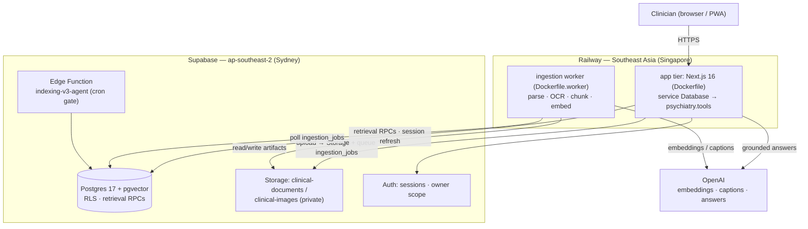

# Deployment Architecture

Decision record for the production topology of PsychSift. Written 2026-07-06,
revised 2026-07-12 when the app went live on Railway. Companion documents:
`docs/observability-slos.md` (SLOs + eval canary) and `docs/audit/capacity-review.md`
(load model, first bottleneck, soak test).

Status of this document: **decided and live in production.** The app tier and
ingestion worker run on Railway (Singapore) from the committed `Dockerfile` and
`Dockerfile.worker`. The core platform is **Railway** (see §2, "Why Railway").
Host provisioning, staging setup, and secret placement remain operator actions
and are specified here.

## Topology at a glance


```mermaid
flowchart TB
    user["Clinician (browser / PWA)"]
    subgraph railway["Railway — Southeast Asia (Singapore)"]
        app["app tier: Next.js 16 (Dockerfile)<br/>service Database → psychiatry.tools"]
        worker["ingestion worker (Dockerfile.worker)<br/>parse · OCR · chunk · embed"]
    end
    subgraph supabase["Supabase — ap-southeast-2 (Sydney)"]
        pg[("Postgres 17 + pgvector<br/>RLS · retrieval RPCs")]
        storage["Storage: clinical-documents /<br/>clinical-images (private)"]
        auth["Auth: sessions · owner scope"]
        edge["Edge Function<br/>indexing-v3-agent (cron gate)"]
    end
    openai["OpenAI<br/>embeddings · captions · answers"]

    user -->|HTTPS| app
    app -->|"upload → Storage + queue ingestion_jobs"| storage
    app -->|"retrieval RPCs · session refresh"| pg
    app --> auth
    app -->|grounded answers| openai
    worker -->|poll ingestion_jobs| pg
    worker -->|"read/write artifacts"| storage
    worker -->|"embeddings / captions"| openai
    edge --> pg
```

The app↔Supabase path is public internet fronted by Supabase's CDN (Supabase is not on
Railway's private network — see §2.1). Both Railway services deploy from
`BigSimmo/Database` on pushes to `main`.

## 1. Current state (what runs today)

- **Live on Railway.** Project **`Database`** (`5deaad0b-675a-4c13-978e-5ca2b5b877f9`),
  environment `production` (`6aa16f7b-d3e8-4aa2-9854-ee9ead9fcbd4`), region
  **Southeast Asia (`asia-southeast1-eqsg3a`, Singapore)** — the closest Railway
  region to the Supabase project. Two services from this one repo, both connected
  to the `BigSimmo/Database` GitHub repo and auto-deploying on pushes to `main`:
  - **`Database`** — the Next.js app tier (`Dockerfile`), serving the custom domain
    **`https://psychiatry.tools`**, one warm replica, Railway healthcheck path
    `/api/health/ready`, restart-on-failure.
  - **`worker`** — the ingestion worker (`Dockerfile.worker`), one always-on
    replica, long-polling the ingestion queue.
- **Superseded project.** An earlier Railway project named `clinical-kb`
  (`4361c04f-dd3c-4ee9-9e97-49e4e5707b70`) still exists with `app`/`worker`/`staging-app`
  services, but has **zero active deployments** (last activity 2026-07-14, all
  `REMOVED`) and its generated domain `app-production-68ebf.up.railway.app` returns 404. It is not production. Do not `railway link` a worktree to it — deploys sent
  there go nowhere. Retiring it is an open operator decision.
- **Database/auth/storage:** live Supabase project `Clinical KB Database`
  (`sjrfecxgysukkwxsowpy`), region **ap-southeast-2 (Sydney)**, Postgres 17,
  ~2,000 indexed documents / ~69k chunks. RLS is service-role-only; the app
  layer is the ownership boundary. Supabase is a managed external service — it is
  **not** on Railway's private network, so the app↔DB path is public internet
  fronted by Supabase's CDN (see §2.1).
- **Ingestion:** the containerized `worker` plus the `indexing-v3-agent` Supabase
  Edge Function acting as a cron-triggered completion/repair gate — not a full
  extraction pipeline.
- **Known failure mode:** silent degradation. Hybrid retrieval RPCs once died
  quietly while the app kept serving from fallbacks. Every topology decision
  below biases toward _loud_ failure and standing guards.

## 2. App tier

### Decision

Run the Next.js app as a **single long-lived container** (Node 24, image built
from `Dockerfile`) on **Railway**, pinned to the **Southeast Asia (Singapore)**
region — the closest Railway region to the Supabase project's ap-southeast-2
(Sydney) home. Keep one warm replica (no scale-to-zero).

### Why Railway

Railway runs plain OCI images with per-service secrets, health checks, rolling
deploys with rollback to a previous deployment, private networking, and a managed
multi-service project model that fits the app-plus-worker topology directly. Two
properties made it the pragmatic core platform:

- **Remote builds.** Railway builds the image on its own infrastructure, so the
  8 GiB-heap `next build` (see the image contract below) never has to run on a
  local Docker daemon — the local build reliably OOMs on that heap, which had been
  the deploy blocker. In production the app image compiled in ~21 s with no OOM on
  a 1-CPU builder.
- **Already provisioned.** The account, workspace, and billing were in place, so
  there was no cold-start account/credentials blocker.

**The trade Railway forces — and why it was accepted:** Railway has **no
Australian region** (its regions are US West, US East, Amsterdam, Singapore),
while Supabase is in Sydney. The app therefore pays a cross-region hop to the
database (quantified in §2.1). Warm responses show that this hop can be bounded,
but 2026-07-14 cold probes also exposed database-execution outliers far larger
than network RTT. A Singapore replica would copy those query plans rather than
fix them, so the current first lever is RPC/query-plan work and, if needed, a
small primary-compute comparison. Given that shipping a real environment was the
priority, a live-in-Singapore deployment beat an indefinitely blocked "optimal"
one.

### Why a long-lived container and not serverless (Vercel et al.)

- **In-memory coalescing and caches are load-bearing.** The answer pipeline
  coalesces identical in-flight questions (`answer_inflight_coalesced` in
  `src/lib/rag/rag.ts`) and holds LRU answer/search caches
  (`RAG_ANSWER_CACHE_TTL_MS`/`RAG_ANSWER_CACHE_SIZE`). Serverless isolates get
  one request each, so coalescing never fires and every duplicate ward-round
  question pays the full ~6-RPC fan-out plus an OpenAI generation.
- **Fire-and-forget background work.** Cache invalidation and telemetry writes
  run as `void (async () => ...)` after the response; serverless platforms may
  freeze the isolate at response end.
- **Long requests.** The strong answer route runs up to
  `OPENAI_ANSWER_TIMEOUT_MS` (30 s) plus retrieval; streaming responses run
  longer. That is hostile to per-request serverless billing/limits.
- **Connection amplification.** Many cold instances multiply concurrent
  PostgREST/auth traffic against a database whose auth server is capped at 10
  absolute connections (see `docs/audit/capacity-review.md`).

Scale-out plan: stay at 1 replica (vertical scaling first) until sustained load
demands more; replicas are safe but dilute in-memory coalescing, so add them only
after the shared `rag_response_cache` hit rate is confirmed healthy. On Railway,
prefer a single-region replica bump (`railway scale southeast-asia=N`) over
spreading replicas across regions, which would multiply the cross-region DB hop.
**Before the first vertical scale-up**, clear the auth 10-connection cap so the
auth pool scales with compute instead of staying pinned — operator runbook:
`docs/auth-connection-cap-runbook.md` (`docs/audit/capacity-review.md` §2–§3).

### 2.1 The Railway↔Supabase connection (Singapore → Sydney)

This is the one place the topology is not co-located, so it is characterized here
rather than left as a footnote.

**Path.** The app uses `@supabase/supabase-js` (PostgREST over HTTPS) against
`https://<ref>.supabase.co`. That hostname is anycast/CDN-fronted, so the TCP+TLS
connection terminates at the nearest edge PoP (~2 ms from Railway Singapore) and
the CDN forwards the request over its backbone to the Postgres/PostgREST origin in
Sydney. `@supabase/supabase-js` runs on undici with keep-alive, so warm requests
reuse the pooled connection and skip the client→edge handshake — but every request
that reads data still has to reach the Sydney origin, so the edge→origin hop is
inherent per RPC.

**Measured (Railway Singapore → Supabase Sydney), 2026-07-12:**

| Path                               | What it is                                              | Result                                                |
| ---------------------------------- | ------------------------------------------------------- | ----------------------------------------------------- |
| Raw TCP → Sydney Postgres pooler   | Physical Singapore↔Sydney RTT floor                     | **~94 ms**                                            |
| Authenticated PostgREST round-trip | Real per-RPC cost the app pays                          | **~145 ms best, ~340 ms typical**                     |
| Production novel answer            | `supabase_rpc_latency_ms` (retrieval, 3 query variants) | **~4.4 s**; total ~25 s incl. ~19 s OpenAI generation |

**Fresh production comparison, 2026-07-14:** one warmed repeat reported
`supabase_rpc_latency_ms=0`, while two cold synthesis probes reported
**48.5–49.4 s** of Supabase RPC time and **51–53 s** total. A six-case approved
live-database retrieval run on the current local code preserved perfect fixture
recall/hit-rate with **1.8 s median / 47.3 s p90** latency. Database statistics
also show large temporary-file I/O in the slow hybrid RPC families. These
outliers supersede the earlier assumption that generation or cross-region RTT is
always the dominant latency.

**What multiplies, what doesn't.** Retrieval fans out _wide_ but the RPCs within
a stage run in parallel (`Promise.all`), so fan-out width costs ~1×RTT, not N×.
What multiplies RTT is the sequential **depth** — ~5–8 serial DB round-trips on a
cache-miss answer (index-version check [5 s TTL], shared-cache lookups, retrieval
stages, chunk + document hydration). Net penalty vs. full co-location with the
database region: roughly **+0.6 s to +2 s per novel answer**. Cached/repeat answers are served from
the in-memory LRU (or coalesced) and are largely spared; answers that fall to the
shared Postgres cache tier still pay ~one origin round-trip.

**Optimisations in place:**

- Region pinned to Singapore (closest region) rather than a Railway default.
- One warm replica, no scale-to-zero — keeps the caches and coalescing hot and
  avoids cold-start connection amplification against the 10-connection auth cap.
- Single-region scaling policy (above) so replicas never spread the DB hop.
- keep-alive connection reuse (undici default) removes repeated client→edge
  handshakes on the hot path.

**Mitigations, in current priority order:**

1. **Profile and optimise the slow hybrid RPC plans**, then compare the Sydney
   primary on Micro versus Small compute if execution remains resource-bound.
   The live primary currently exposes the Micro connection ceiling (60 direct
   connections) and a small `work_mem`; scaling the primary tests query-memory
   headroom without adding read routing or replica staleness.
2. **Reduce sequential DB depth** in the answer path (batch the cache-version +
   shared-cache probes, collapse hydration round-trips). App change; measure
   `latencyTimings.supabase_rpc_latency_ms` before/after.
3. **Reconsider a Singapore read replica only after the query plans are fast and
   network time is again material.** Supabase currently requires at least Small
   compute for read replicas; a same-size replica is asynchronous/read-only and
   adds compute/storage cost plus read-routing and freshness validation. It is
   not justified by the current evidence because it would reproduce the observed
   execution outliers.

The OpenAI leg is region-agnostic: OpenAI is US-hosted, so app→OpenAI RTT is
comparable (~200 ms) from Singapore or Sydney and does not favour either host.

### Image contract (`Dockerfile`)

- `node:24-bookworm-slim` is pinned by multi-platform SHA-256 digest in a
  shared `node-base` stage and used by every stage. Dependency installs use
  ordinary Docker layer caching. The shared Dockerfiles deliberately avoid
  BuildKit cache mounts because Railway requires hard-coded, service-specific
  cache IDs, which would couple each image to one Railway service.
- The build stage runs the repo's own `npm run build`
  (`guard-next-build.mjs` + `next build --webpack` + the client-bundle secret
  scan) — **the image build fails exactly where a local build would**. The
  `--webpack` flag is deliberate: `next.config.ts` carries a webpack-specific
  WasmHash workaround and the CSP-nonce work was validated against webpack
  prod chunks, so switching bundlers needs its own verified change. The build
  allocates an 8 GiB heap; Railway's remote builder handles it (the ceiling is
  headroom, not a reservation — the real build compiled in ~21 s).
- `NEXT_PUBLIC_SUPABASE_URL` and `NEXT_PUBLIC_SUPABASE_PUBLISHABLE_KEY` are
  build args (they inline into the client bundle). On Railway, service variables
  are exposed to the Dockerfile build via the matching `ARG` declarations, so
  setting them as service variables inlines the real values. The publishable key
  is public by design; the placeholder default exists so CI can build without
  secrets. **Production images must be built with the real publishable key.**
- `NEXT_PUBLIC_MAX_UPLOAD_MB` is also a build-time public variable (Docker
  `ARG`/`ENV` before `npm run build`). When operators lower server-side
  `MAX_UPLOAD_MB`, mirror the same value in `NEXT_PUBLIC_MAX_UPLOAD_MB` before
  building the production image so the browser precheck rejects over-limit
  files without a full transfer. Runtime-only Railway variables are not enough
  for this value because Next inlines `NEXT_PUBLIC_*` at build time. Docker also
  accepts `MAX_UPLOAD_MB` as a build arg solely for this parity check; it is not
  copied into the final runtime image, where Railway remains authoritative. The
  checker loads Next's production dotenv precedence, and the local, static-PR,
  and production-build guard fails when the effective client and server values
  differ.
- Runtime is a non-root `node` user, prod-only `node_modules`, direct
  `next start -H 0.0.0.0 -p $PORT` (Railway injects `$PORT`; the local
  port-picker script is deliberately bypassed), a `HEALTHCHECK` against
  `/api/health`, an explicit `STOPSIGNAL SIGTERM`, and OCI source/title
  labels for supply-chain traceability.
- No secret is ever baked into a layer. `SUPABASE_SERVICE_ROLE_KEY`,
  `OPENAI_API_KEY`, etc. are injected at run time by Railway's variable store.
- Request bodies are bounded twice: Next Proxy buffers at most 151 MiB, and
  `/api/upload` rejects declared multipart bodies above `MAX_UPLOAD_MB` plus
  1 MiB framing overhead before authentication or `request.formData()`. Keep
  the managed host's request-body limit at 151 MiB or lower as a third ingress
  fence; `MAX_UPLOAD_MB` is capped at 150 MiB by environment validation.

### Config as code (`railway.app.json`)

The app service's build/deploy config is captured in `railway.app.json` at the
repo root (Railway schema). It is intentionally **not** named `railway.json`
because a default-named file is auto-loaded by _every_ service in the project and
would clash with the worker (which needs a different Dockerfile and no
healthcheck). The production app service uses `railway.app.json` as its
config-as-code path (dashboard → service → Settings → Config-as-code, or the
service-settings API); the worker uses `railway.worker.json`. Keep both paths
wired: Railway does not auto-discover these service-specific filenames. After
changing either file, confirm the deployment metadata reports the tracked health
check and watch patterns rather than relying on dashboard defaults.

```jsonc
// railway.app.json (source of truth for the live app service)
{
  "build": {
    "builder": "DOCKERFILE",
    "dockerfilePath": "Dockerfile",
    "watchPatterns": ["/src/**", "/public/**", "/data/**", "..."],
  },
  "deploy": {
    "healthcheckPath": "/api/health/ready",
    "healthcheckTimeout": 300,
    "restartPolicyType": "ON_FAILURE",
    "multiRegionConfig": { "asia-southeast1-eqsg3a": { "numReplicas": 1 } },
  },
}
```

### Selective Railway PR previews

**Default: automatic PR Environments off.** Iterate locally with the smallest
relevant checks, publish coherent changes for required GitHub CI, and use an
explicitly requested isolated app preview when a hosted review adds value. Keep
production deployment from protected `main`. A PR does not need a second copy of
the app and ingestion worker merely to exist, including PRs opened by agents.

#### Verified review and containment, 2026-09-22

The live Railway project `Database` (`5deaad0b-675a-4c13-978e-5ca2b5b877f9`)
had automatic PR Environments enabled, **production** selected as its base,
bot previews enabled, and Focused PR Environments disabled. Opening the
documentation-only PR #2987 started both app and worker builds. Its worker
subsequently waited for the app deployment; this was dependency waiting, not
GitHub CI waiting (`source.checkSuites` was false).

Both services in previews #2985 and #2987 pointed at the production Supabase
project and had service-role and OpenAI credentials configured. Only target
identifiers and credential-presence booleans were retained; no secret values were
recorded. Separate Railway containers did **not** isolate that external database
or ingestion queue. No database-content or provider-usage audit was performed,
so this review does not establish whether the previews processed live jobs.

Under the owner's explicit fix request, automatic PR Environments were disabled,
and the four preview deployments were stopped. The retained #2987 preview showed
auto-deploy disabled. No preview environment was manually deleted; Railway removed
#2985 after that PR was independently merged during the review.

An attempted extra containment step exposed a CLI scope trap: Railway CLI 5.27.0
`service source disconnect --environment <preview>` disconnected the shared
service source, including production. The environment selector did not isolate
that mutation. Both production sources were restored to `BigSimmo/Database` on
`main`. Reconnection also attached `main` auto-deploy triggers to the retained
preview; both were disabled using each preview service's dashboard **Disable**
control. Global PR-environment creation and existing service auto-deploy triggers
are separate controls: verify both. All four reconnect-triggered attempts (two
production, two preview) were **SKIPPED** by watch paths; the earlier app
deployment `9717aa0d-9a9f-4023-b937-76b94eebf218` and worker
deployment `0d096830-d226-4611-b3b1-90bd18322d8e` remained **SUCCESS**. Do not use
that CLI command as a preview-only containment control. The staged preview branch
edit was discarded without deployment. Credentials, staging, Supabase settings
and required GitHub checks were not changed.

The original PR added documentation only; it did not enable Railway previews.
The actor and time of the earlier setting change have not been established.
This is a dated observation, not proof that future settings remain unchanged.

#### Fast iteration without weakening release checks

1. While editing, use the project-safe local server and focused checks for the
   affected behaviour. Keep ordinary preview work provider-free.
2. Batch a coherent correction before pushing. Preserve required CI, avoid
   cancelling useful in-flight checks, and reuse evidence only while its inputs
   remain valid. Do not rerun full local suites that add no new coverage.
3. Request a hosted app preview only when needed for review. Before starting it,
   verify non-production database, storage and auth targets, synthetic data,
   `RAG_PROVIDER_MODE=offline`, and no paid-provider credentials. Routine app
   previews must not start ingestion workers. An ingestion preview needs its own
   isolated queue/storage and explicit provider authority.
4. Keep merge and production deployment gates intact. A preview is feedback,
   not evidence that required CI or clinical/provider acceptance passed.

The existing staging app was observed using the separate staging Supabase
project, offline AI and no OpenAI key. However, the staging environment also
contains `worker-5g6o`, which has an OpenAI key and no service-specific config file.
Do not copy that whole environment as a supposedly safe preview template. An
app-only template and its data/access controls still need explicit verification.

If automatic previews are requested later, first prepare that isolated app-only
base, then enable **Focused PR Environments** in **Project Settings → Environments**.
Preserve the existing app's `railway.app.json` watch paths. For a new preview
service, verify Railway's supported configuration mechanism rather than assuming
a new service can opt into legacy config-as-code. Documentation, ordinary tests
and CI-only changes should skip previews;
runtime code, assets, build inputs and dependency updates should remain eligible.
Bot previews can follow the same isolation and path rules if requested. Leave
preview Wait for CI off only after isolation is established, so preview builds
can run alongside CI; do not remove required merge checks to speed them up.

Railway can include referenced service dependencies even when their own files
did not change. Verify selection on the next authorised documentation-only and
app-only PRs rather than assuming the toggle proves it. Check effective deployment
configuration: config-as-code can override older dashboard watch paths. Retain
runtime build inputs such as `tests/stubs/server-only.ts` when a worker preview
is explicitly commissioned. Do not create a duplicate GitHub deploy workflow.

Do not enable cross-environment **Skipped Builds** for this Next.js app: its
`NEXT_PUBLIC_*` values are baked into the browser bundle, and Railway's skipped
build reuse does not account for changed environment variables. Preserve normal
Docker caching instead. If preview isolation or selection fails, disable automatic
previews and stop the affected preview deployment; never fall back to production
credentials. Re-enabling the retained previews is not a safe rollback while those
credentials remain inherited.

References: [Railway PR environments](https://docs.railway.com/guides/preview-deployments-with-pr-environments),
[Focused PR Environments](https://docs.railway.com/environments#focused-pr-environments),
and [Skipped Builds](https://docs.railway.com/builds/skipped-builds)
(checked 2026-09-22). Hosted settings are separate from this documentation PR.

### Readiness: what `/api/health/ready` may and may not ask

**Readiness answers one question — can THIS CONTAINER serve requests?** Configuration is
present, and Supabase answers a one-row `select`. Nothing else belongs on it.

It must never carry a whole-corpus or cross-tenant audit. Railway allows each healthcheck
attempt **ten seconds** (measured from the deploy-log retry cadence: a 10 s request timeout plus
exponential backoff of 0.2 / 1.2 / 2.2 / 4.2 / 8.2 s), and a deployment that cannot answer inside
the window is discarded and rolled back.

Between **2026-09-11 and 2026-09-14 that is exactly what happened, 24 times.** The endpoint had
been calling `read_site_content_health()` — the site-content control-plane integrity audit — which
costs about seven seconds against the live database:

```
/api/health          http=200 total=0.798s   # shallow: config flags only
/api/health/ready    http=200 total=7.884s   # with the audit, measured on the live container
```

Seven against a ten-second limit is a coin flip, and a cold container — no warm Postgres
connection, no cached plan, cold PostgREST schema cache — loses it. Every merge built, started
cleanly, answered too slowly and was rolled back; production sat on three-day-old code and
nothing said so. `PR #2785`, which made that function cheaper, briefly restored deploys on
13 September before the margin closed again — the clearest single confirmation of the mechanism.

The audit itself was not weakened. It keeps its home on the token-gated `/api/health?deep=1` and
in `npm run check:production-readiness`; only the deploy gate stopped asking, via
`includeSiteContent: false`. Its read is additionally bounded by an `AbortSignal`, so no future
caller can put an unbounded control-plane query back on a request path.

**That deadline is derived from two measurements, not chosen.** It has to clear the audit's
healthy cost, because an abort below that manufactures the fault it is meant to
bound: the timeout surfaces as `checks.siteContent = "error"`, which is indistinguishable from a
real corpus inconsistency and drops the whole probe to 503. It also has to stay under the 15-second
whole-response budget that `scripts/lib/deployment-rag-activation.mjs` already applies when it
reads this endpoint for `check:production-readiness`, or the caller gives up first and a
diagnosable one-field timeout becomes an opaque `health_probe_failed`.

Nine token-authorized deep probes against the live warm container on 2026-09-14 ran between
**7.18 s and 7.86 s**, every one HTTP 200 — a tight cluster that independently confirms the
~7-second figure above. Ten seconds clears the slowest of them by about 27% and sits well under
the caller's 15 s budget. Widening the corpus moves the lower bound, so the fix when it is
next approached is the profiling work queued in `/issues`, not a larger number here.

[`scripts/operator-explain-site-content-health.sql`](../scripts/operator-explain-site-content-health.sql)
is that profiling, ready to run read-only in an approved operator window. It carries one
hypothesis worth stating up front, reached from the schema rather than from a plan: `live_events`
filters `site_content_sync_events` by `state in ('pending','retry_pending','processing','ready')`,
and none of that table's three indexes serves it — two are partial and cover only three of the
four states between them, and the third has `state` as its last column. If that is right the audit
sequentially scans an append-only event log on every call, which is a cost that only ever rises
and matches PR #2785 buying hours rather than a fix. The script confirms or kills it in its
Step 3.

**The trade, stated plainly:** a site-content integrity fault no longer blocks a rollout. It is
caught by monitoring instead. That is deliberate — before this, it blocked _every_ rollout,
related or not, and did so invisibly.

#### The actual root cause was the shape of the contract, not the cost of one query

Taking the audit off the gate fixes the outage that happened. It does not fix the one that
happens next, because the audit was never the defect — it was the first thing to fall through a
hole that was already there.

`/api/health/ready` used to opt **into** the deep diagnostic branch and then switch each
expensive probe off by name:

```ts
forceDeep: true, allowUnauthenticatedDeep: true,
includeSlo: false, includeCache: false, includeCoalescing: false,
includeSpend: false, includeOperatorDiagnostics: false,   // and, eventually, includeSiteContent: false
```

That is a deny-list, and a deny-list is correct only until the next entry is added. Anything
landing in the deep branch was live on Railway's healthcheck from that moment, and stayed live
until somebody remembered to come back and add one more `false`. Nobody did. The mechanism had
already misfired once before, on `includeSlo`, and was read as a one-probe bug — the comment on
that case in `tests/health-response-deep-probe.test.ts` ends "one flag at one caller, not a gate".

Readiness now declares what it is instead of listing what it is not:

```ts
forceDeep: true, allowUnauthenticatedDeep: true, probes: "readiness"
```

Under `probes: "readiness"` every optional probe is off regardless of its own flag, so a probe
added later is diagnostic-only **by construction** and cannot reach the deploy gate by omission.
Putting one on readiness is now a deliberate edit in `health-response.ts` next to the contract it
changes.

Two guards hold it:

- `tests/health-route.test.ts` pins the readiness response **by shape** — the exact set of check
  keys and body sections — rather than by naming yesterday's probe. Anything that leaks in fails
  in CI in milliseconds instead of in production three days later.
- The one database call readiness still makes, `probeSupabaseHealth`, now carries a 5-second
  deadline. It was the last unbounded thing on the gate: a one-row select is cheap warm, but a
  cold container has no warm connection, no cached plan and a cold PostgREST schema cache, and an
  unbounded call cannot answer before a ten-second window closes. The worst case is now a fast
  503 naming the failing check, with room left for Railway's remaining retries, instead of a
  timeout indistinguishable from a hung container.

#### A slow audit and a broken corpus are different incidents

On the diagnostic probe, an expired site-content deadline reports `checks.siteContent = "timeout"`
and a genuine control-plane inconsistency reports `"error"`. Both still fail the probe closed — an
audit that did not finish is not evidence that the corpus is sound — but they call for opposite
responses, and until they were named apart both read as an integrity fault. Given the deadline
carries about 27% headroom over a cost that grows with the corpus, this is what the next person
will see first when the margin closes, and it should point at profiling rather than at the data.

#### Nothing watched the site between deployments, and the monitor that did could not see this

Railway's healthcheck runs at deploy time only, by its own documentation, so it is not continuous
monitoring. `live-domain-monitor.yml` covers that gap every six hours — and it stayed green
through all three days of the outage. Every probe in it passed and every one was telling the
truth: the domain served the app shell, `/api/health` answered `"ok"`, live mode was intact. The
site was simply serving three-day-old code, and nothing compared what was **deployed** against
what had been **merged**.

That monitor now also asserts that main's head has not gone unshipped for longer than
`LIVE_DEPLOY_MAX_LAG_HOURS` (default 12). The measurement is the age of the unshipped head, not
the distance between the two commits — during the incident the live commit and main's head were
56 minutes apart in authored time while the site stayed stranded for three days, so a
commit-distance test would have read 0 h and stayed silent in exactly the case it exists for.

It needs no secret, because `/api/health` reports `deploymentCommitSha` to any anonymous caller,
and a red run shows in the Actions tab. It deliberately shares nothing with the Railway deploy
webhook: that path has its own failure modes, and a detector that depends on the thing it watches
is not a detector.

`tests/health-response-deep-probe.test.ts` pins both halves of the split, and
`tests/railway-config.test.ts` pins the 300-second window.

## 3. Ingestion tier

### Decision: containerized worker (recommended) over completing the edge-agent migration

Ship the existing worker as a container (`Dockerfile.worker`: pinned Node 24 +
a prebuilt esbuild bundle over production-only `node_modules` +
Tesseract + a Python venv with a hashed `worker/python/requirements.txt` +
a provider-free `dist/worker/validate-runtime.mjs` gate) and run **one
always-on worker instance** co-located in Railway Singapore (`worker` service),
using Railway's `ALWAYS` restart policy so repeated bootstrap failures cannot
exhaust a finite retry allowance and leave the queue undrained.
The `indexing-v3-agent` Edge Function **stays** in its current role as the
cron-triggered completion/repair gate — the two are complementary, not
alternatives. The worker service selects its Dockerfile via the
`RAILWAY_DOCKERFILE_PATH=Dockerfile.worker` variable (captured in
`railway.worker.json`).

> **Operator run recipe:** the copy-pasteable build/run/verify steps, the
> required env + secrets, and the pre-deploy migration gate live in
> [`worker-deploy-runbook.md`](worker-deploy-runbook.md). This section is the
> decision record; that runbook is how to ship it.

Reasoning:

1. **The OCR stack cannot run at the edge.** PyMuPDF and Tesseract are native
   binaries driven from Python. Supabase Edge Functions are Deno isolates with
   no native-binary support and hard wall-clock/memory ceilings. "Completing
   the migration" would mean reimplementing PDF parsing, OCR fallback, image
   captioning, and table extraction inside those ceilings — a rewrite with a
   strictly worse capability ceiling, not a migration.
2. **Job shape mismatch.** Large guideline PDFs take multi-minute processing
   (the queue's stale-claim window is 45 minutes); edge functions are built for
   sub-minute invocations.
3. **The worker is already multi-instance safe.** `claim_ingestion_jobs` uses
   `FOR UPDATE SKIP LOCKED` with per-document exclusivity, so containerizing it
   verbatim gives horizontal scaling for free (see queue semantics below).
4. **Smallest delta.** `worker/main.ts` runs unchanged in the container; the
   only new artifact is the image. The edge path would fork the pipeline into
   two implementations that drift — this repo's defining failure mode.

Scaling: raise `WORKER_BATCH_SIZE` / `WORKER_CONCURRENCY` on the single instance
first; add replicas (`railway scale --service worker southeast-asia=N`) only for
sustained backlog (safe by construction). The worker also pays the Singapore→
Sydney hop on each write, but ingestion is batch/background and off the answer
critical path, so its latency budget is generous.

### Queue durability when a worker dies mid-job

Semantics of `claim_ingestion_jobs` (migration
`20260615114506_claim_ingestion_jobs_document_lock.sql`):

- **Claim:** `status → processing`, `locked_at = now()`, `locked_by = worker`,
  and — important — **`attempt_count` is incremented at claim time**, not at
  failure time. Claims take `FOR UPDATE SKIP LOCKED` over the job _and_ its
  document row, rank one job per document, and exclude any document that
  already has a _fresh_ processing job.
- **The lease is heartbeated and fenced** (since 2026-07-08, migration
  `20260708130000_ingestion_concurrency_rpc_hardening.sql` and
  `updateJobProgress` in `worker/main.ts`). A live worker refreshes `locked_at`
  on each persisted progress write, at least once per third of the stale window
  and on a 60 s timer during extraction, guarded by `locked_by = workerId` so a
  reclaimed worker cannot resurrect its lease. If the worker dies, the job sits
  in `processing` until `locked_at` is older than the stale window
  (`p_stale_after_minutes`, default 45, worker-side
  `WORKER_STALE_AFTER_MINUTES`), after which any worker reclaims it
  (`stage = 'reclaimed stale job'`). `complete_ingestion_job` and
  `fail_or_retry_ingestion_job` take `p_worker_id` and return `ok:false` to a
  caller that lost the lease, so the reclaiming worker owns the outcome.
- **Dead-lettering is implicit.** Because attempts are consumed at claim, a
  crash-looping job exhausts `max_attempts` (default 3) after ~3 stale windows
  and becomes terminally `failed` — the de-facto dead-letter state. Recovery is
  operator-driven: `npm run recover:ingestion` or the retry API, both protected
  by the ingestion rollback fence (`updated_at` fence) against retry/reindex
  overlap races.

Operational rules that follow:

- **The stale window must exceed the worst-case job runtime.** If a live
  worker runs a job longer than 45 minutes, a second worker can reclaim and
  double-process the same document (the per-document exclusion only respects
  _fresh_ locks). The rollback fence bounds the damage but does not prevent the
  wasted work. When adding worker replicas, first confirm p100 job duration
  against the window.
- **Worker death costs at most one stale window of latency** for the in-flight
  job and zero data loss: all artifact writes are idempotent per
  generation/chunk-key, and completion is gated by the strict completion RPCs
  plus the edge agent. Railway's always-restart policy brings the worker back and
  it reclaims stale jobs automatically.
- The worker handles `SIGTERM`/`SIGINT` gracefully: it drains the
  already-claimed active batch, stops claiming new jobs, and exits `0`. A
  `STOPSIGNAL SIGTERM` directive is in both final images. Fatal runtime errors
  still exit `1` and dispatch the existing failure webhook.
- **Backlog improvement (not in this change):** a heartbeat that refreshes
  `locked_at` could ride the existing throttled progress updates
  (`WORKER_PROGRESS_UPDATE_MIN_INTERVAL_MS`, 60 s), which would let the stale
  window shrink from 45 min to ~5 min without double-claim risk. Touches
  worker + RPC; needs its own migration and review.

## 4. Secrets management

| Variable                                         | Sensitivity      | Build-time or runtime     | Where it lives                                                    |
| ------------------------------------------------ | ---------------- | ------------------------- | ----------------------------------------------------------------- |
| `NEXT_PUBLIC_SUPABASE_URL`                       | public           | build (inlined) + runtime | Railway service variable (also the Dockerfile ARG default)        |
| `NEXT_PUBLIC_SUPABASE_PUBLISHABLE_KEY`           | public-by-design | build (inlined)           | Railway service variable (exposed to the build via `ARG`)         |
| `SUPABASE_SERVICE_ROLE_KEY`                      | **critical**     | runtime                   | Railway variable store; GitHub repo secret (CI boot smoke + eval) |
| `OPENAI_API_KEY`                                 | **critical**     | runtime                   | Railway variable store; GitHub repo secret                        |
| `SUPABASE_PROJECT_REF` / `SUPABASE_PROJECT_NAME` | low              | runtime                   | plain Railway variable (pins the `check:supabase-project` guard)  |
| `INDEXING_V3_AGENT_SECRET`                       | high             | runtime                   | Supabase Edge Function secrets                                    |
| `RAG_QUERY_HASH_SECRET`                          | high             | runtime                   | Railway variable store; GitHub repo secret (CI boot smoke)        |
| `E2E_USER_EMAIL` / `E2E_USER_PASSWORD`           | medium           | CI only                   | GitHub repo secrets                                               |

Rules:

- Secrets never enter images, the repo, or `NEXT_PUBLIC_*` names. `.env.local`
  is a local-dev convenience only. Set runtime secrets as Railway service
  variables (e.g. `railway variable set KEY --stdin` so the value is piped, never
  echoed); Railway injects them at run time.
- `RAG_QUERY_HASH_SECRET` is **required in production** (`src/lib/env.ts`
  `requireQueryHashSecret()` throws without it) and is generated fresh per
  environment (`openssl rand -hex 32`); it is not copied from local dev.
- Each environment (production, staging, CI) gets **separate** service-role and
  OpenAI keys so rotation and blast radius stay per-environment.
- Rotation: publishable-key rotation is already an operator runbook item
  (`docs/archive/operator-decisions-2026-07-04.md`); service-role rotation is a
  Supabase dashboard action + Railway variable update + redeploy.
- `npm run check:supabase-project` runs after any Supabase env change (repo
  rule), and the eval canary runs it before every scheduled eval.

## 5. Staging environment

- **A second, dedicated Supabase project** (same org, ap-southeast-2) — not a
  branch of production. `Clinical KB Staging` was provisioned and migrated on
  2026-07-19. Rationale: staging must absorb soak tests, destructive
  ingestion experiments, and migration rehearsal without any shared compute,
  pooling, or the production auth 10-connection cap; per-environment keys fall
  out naturally.
- Seeded via the existing pipeline (`npm run import:docs`, `registry:seed`,
  `differentials:seed`, `medications:seed`) with a small (~50-document)
  synthetic/public corpus. `public/demo-documents/` plus generated samples
  (`npm run samples`) are sufficient for load-shape realism; do not copy
  clinical production documents into staging.
- One staging `app` container and **no staging worker**. The active Railway
  `Database` project has a `staging` environment pinned to Singapore with
  `RAG_PROVIDER_MODE=offline`, isolated Supabase credentials, and no OpenAI key.
  This keeps release proofs deterministic and prevents staging ingestion from
  draining or mutating production data. See `docs/staging-setup.md` for the
  turnkey runbook.
- `src/lib/supabase/project.ts` is staging-aware only when both
  `SUPABASE_STAGING_PROJECT_REF` and `SUPABASE_STAGING_PROJECT_NAME` are set.
  The declared staging ref must differ from production and every stale project;
  otherwise `check:supabase-project` fails closed.
- The soak test (`scripts/soak-test.ts`) targets staging **only** — see
  `docs/audit/capacity-review.md`.

## 6. Rollout and rollback

- `.github/workflows/docker-image.yml` validates both container builds on
  `main`, release branches, a weekly schedule, and manual dispatch. For
  container-affecting pull requests and merge-queue commits, CI calls the same
  workflow and folds both builds into the required `pr-required` aggregate. It
  deliberately does not push to a registry; Railway builds the
  deployable image itself from the tree on deploy, after the standard gates
  (`verify` + `ui-smoke` + the clinical governance preflight where relevant).
- **Deploy:** `railway up --service Database` / `--service worker` (or the
  connected GitHub source) builds and releases. Per-service watch patterns skip
  docs, tests, and CI-only commits while retaining every runtime, dependency,
  Docker, and service-config input. Railway does a rolling app deploy and marks
  the release `SUCCESS` only after `/api/health/ready` passes. The non-HTTP worker
  is verified through deployment status, logs, and `npm run reindex:health`.
- **Rollback = redeploy the previous Railway deployment** (`railway redeploy`, or
  the dashboard's per-deployment rollback). Database migrations follow the
  existing rule: committed migrations + `schema.sql` reconciliation only, never
  raw SQL against live.
- The nightly eval canary (`.github/workflows/eval-canary.yml`) is the standing
  guard that retrieval/answer quality did not silently regress after any
  deploy — see `docs/observability-slos.md`.
- **Observability:** Railway per-service metrics + logs (`railway logs`,
  `railway metrics`) cover CPU/memory/HTTP; the app additionally emits
  `Server-Timing` and `latencyTimings` (including `supabase_rpc_latency_ms`,
  the cross-region signal from §2.1) on the answer path.

### Adaptive answer release activation proof

After governed publications and retrieval acceptance are verified, a full adaptive release uses
`RAG_GOVERNED_RETRIEVAL_ENABLED=true` together with the existing server controls: `RAG_PROGRAMME_MODE=canary`,
`RAG_PROGRAMME_CANARY_BASIS_POINTS=10000`, `RAG_ADAPTIVE_ANSWER_ENABLED=true`, and
`RAG_ADAPTIVE_ANSWER_RENDER_ENABLED=true`. At 100%, guests and authenticated readers
receive the same configured capabilities without a cohort identity. Partial rollouts
retain authenticated HMAC cohorts and leave guests on legacy. Public/private access
scope is unchanged. Site content and Australian augmentation remain independently
controlled; an answer release does not turn them on. An installation using only the existing
legacy library keeps `RAG_GOVERNED_RETRIEVAL_ENABLED=false` and receives shared answer fixes,
but cannot deliver full adaptive answers through that path. Sources without governed coverage
retain the verified legacy answer contract and must never be reported as adaptive answers.
Do not infer governed scope or clinical approval from a public document, title or flag setting.
An empty governed result
never silently falls back to another corpus. `legacy` remains the answer rollback.

After an authorized deployment, supply `DEPLOY_ACTIVATION_URL` (the HTTPS origin),
`DEPLOY_EXPECTED_SHA` (the full 40-character release commit), and the existing operator
`HEALTH_DEEP_PROBE_SECRET` through the secret store, then run:

```bash
npm run check:deployment-readiness -- --activation
```

This performs one authenticated deep-health request, which includes read-only hosted
health probes and therefore requires provider authorization. It emits bounded JSON and
exits nonzero on SHA, readiness, audience, producer, renderer, effective generation
provider, or full-rollout mismatch. A configured key in offline mode cannot pass.
It also requires the governed coverage contract. A legacy-format library can receive
shared answer fixes, but cannot pass adaptive activation merely by enabling flags.
It never prints the token or health payload. Without `--activation`, the existing local
boot smoke is unchanged. Health's `ragProgramme.fullRollout` projection shows effective
eligibility, generation/render availability, and a reason when disabled. This proves
release activation; answer quality and per-request evidence failures still require their
own acceptance evidence. Do not declare a guest release enabled from boot success alone.
The shared `/api/health/ready` cache excludes operator diagnostics even when a caller
sends a valid token; activation uses the uncached `/api/health?deep=1` endpoint.
