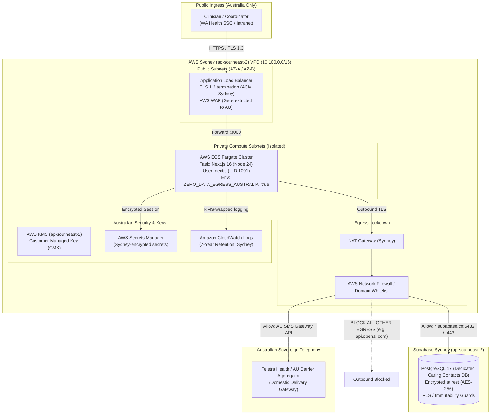

# Caring Contacts — Sovereign Australian Deployment Specification

> **REGULATORY STATUS & CLINICAL SAFETY CONTEXT (HAZARD H-36 / #NCAWAF)**
>
> **Issue Identifier:** `#NCAWAF` (ULID: `01M0B6WFEPNCAWAFRW03H3WSDY`)  
> **Clinical Hazard Reference:** `Hazard H-36` (Cross-Border Data Transit & Incompatible Jurisdiction)  
> **Applicability:** Mandatory for all real-patient pilots, hospital integration, and production clinical deployments.  
> **Synthetic Build Exemption:** The current synthetic prototype (`caring_contacts_sovereign_workspace`) operating with synthetic patients in development and isolated CI does not hold real Protected Health Information (PHI) and remains operable under local and offline fixtures. Any promotion to real patient data requires immediate activation of this sovereign blueprint.

---

## 1. Executive Summary & Legal Framework

### 1.1 The Hazard H-36 Mandate

In `docs/outstanding-issues.md` (issue `#NCAWAF`) and the Caring Contacts decision lock, Hazard H-36 is defined as follows:

> _"Railway has no Australian region, so the current app tier cannot host a real-patient Caring Contacts deployment. docs/deployment-architecture.md records Railway regions as US West, US East, Amsterdam and Singapore; the app tier runs in Singapore against Supabase in ap-southeast-2 Sydney. The Caring Contacts decision lock requires identifiers, message content, application data, backups, logs and provider processing to remain in Australia. A real-patient pilot therefore needs a separately contracted Australian PHI-capable environment, not the current Clinical KB deployment."_

Operating a suicide-aftercare intervention requires clinicians to record, manage, and dispatch communications to highly vulnerable individuals who have recently presented to emergency departments or acute psychiatric wards with suicidal crises. Identifiers (patient names, preferred names, Australian mobile numbers, Unique Master Record Numbers [UMRN], hospital admission/discharge dates, care team attributions, and contact dispatch logs) constitute sensitive health information of the highest tier.

### 1.2 Legislative and Regulatory Requirements

Deploying this system for real Australian patients demands strict compliance with:

1. **Privacy Act 1988 (Cth) & Australian Privacy Principles (APPs):**
   - **APP 8 (Cross-border disclosure of personal information):** Personal health information must not be disclosed to an overseas recipient unless strict exceptions or binding offshore agreements with comparable privacy protections are established. In suicide aftercare, offshore transmission of real patient contact logs or message content is clinically and legally unacceptable.
   - **APP 11 (Security of personal information):** Reasonable steps must be taken to protect information from misuse, interference, loss, unauthorized access, modification, or disclosure.
2. **My Health Records Act 2012 (Cth):**
   - Section 77 imposes criminal and civil penalties for holding or transferring My Health Record system health information outside Australia.
3. **Western Australian Health Services Act 2016 & Information Governance Policy (OD 0658/16):**
   - Mandates sovereign data containment for patient health information generated within public health service providers (e.g., North Metropolitan Health Service, East Metropolitan Health Service, South Metropolitan Health Service, WA Country Health Service).
4. **Australian Cyber Security Centre (ACSC) Information Security Manual (ISM):**
   - OFFICIAL: Sensitive / PROTECTED classification controls: Data at rest and data in transit must be cryptographically protected within the sovereign territory of the Commonwealth of Australia.

---

## 2. Hard Separation from Shared Tiers

The general PsychSift application tier operates in **Railway (Singapore — `asia-southeast1-eqsg3a`)** and connects over public CDN infrastructure to Supabase (`ap-southeast-2` Sydney), relying on US-hosted LLM inference (OpenAI) for medical guideline retrieval.

**Under no circumstances may Caring Contacts real-patient operations share this infrastructure.**

```
+-------------------------------------------------------------------------------+
|                       EXISTING SHARED TIER (PsychSift)                        |
|  Railway (Singapore) + US OpenAI API + Public Edge Ingress                    |
|  [FORBIDDEN FOR REAL PATIENT CARING CONTACTS DATA]                           |
+-------------------------------------------------------------------------------+
                                      ||  HARD FIREWALL & CODE BOUNDARY
                                      \/
+-------------------------------------------------------------------------------+
|                 SOVEREIGN AUSTRALIAN DEPLOYMENT TIER (H-36)                   |
|  AWS Sydney (ap-southeast-2) / Azure Australia East (australiaeast)           |
|  - Dedicated Sydney Supabase Database (Isolated project ref)                  |
|  - In-country Container Runtimes (ECS Fargate / Azure Container Apps)         |
|  - Zero Data Egress (Strict outbound filtering: No US LLM processing)         |
|  - Australian Telemetry & Strict PII Scrubbing                                |
+-------------------------------------------------------------------------------+
```

### 2.1 Code-Level Enforcement of Database Separation

The repository explicitly prevents accidental connection of Caring Contacts to the shared PsychSift database via `src/lib/caring-contacts-server/config.ts`:

- The variable `CARING_CONTACTS_DATABASE_URL` is parsed independently of `DATABASE_URL` or `SUPABASE_DB_URL`.
- The function `assertNotClinicalKbProject(url)` asserts:
  1. The connection string **cannot contain** the PsychSift reference `sjrfecxgysukkwxsowpy` (case-insensitive check).
  2. The connection string **cannot be byte-identical** to `SUPABASE_DB_URL` or `DATABASE_URL`.
- A violation immediately raises a fatal `CaringContactsProjectSeparationError`, aborting server startup.

---

## 3. Sovereign Infrastructure Architecture

The sovereign deployment profile specifies two reference cloud container implementations pinned to Sydney:

- **Profile A (Primary):** Amazon Web Services (AWS) — Region `ap-southeast-2` (Sydney).
- **Profile B (Alternative):** Microsoft Azure — Region `australiaeast` (Sydney).

### 3.1 Profile A: AWS Sydney (`ap-southeast-2`) Blueprint



#### AWS Component Specifications

1. **Compute (ECS Fargate):**
   - Architecture: `linux/amd64` or `linux/arm64`.
   - OS Base: Debian 12 (Bookworm) Slim (`node:24-bookworm-slim`).
   - Sizing: Minimum 2 vCPU, 4096 MiB RAM per replica (minimum 2 replicas across Availability Zones `ap-southeast-2a` and `ap-southeast-2b`).
   - Execution Context: Read-only root filesystem where possible, writable ephemeral tmpfs at `/tmp` and `/app/.next/cache`, non-root user `nextjs` (UID 1001, GID 1001).
2. **Networking & Security Groups:**
   - ECS Tasks deployed in private subnets with **no public IP addresses** (`assign_public_ip = DISABLED`).
   - Ingress Security Group: Port 3000 allowed _only_ from the ALB Security Group.
   - Egress Security Group: Restricted to outbound HTTPS (443) and PostgreSQL (5432) to authorized Sydney CIDRs / VPC Endpoints.
3. **AWS Network Firewall (Egress Filtering):**
   - Stateful domain-filtering rules allow exclusively:
     - `*.supabase.co` (restricted to the dedicated Sydney Supabase tenant).
     - Approved Australian SMS gateway API endpoints.
     - Internal AWS VPC endpoints (Secrets Manager, KMS, CloudWatch, ECR).
   - Strict `DROP` default rule for all non-whitelisted destinations (specifically preventing any packet from reaching US OpenAI, Anthropic, or offshore clouds).

---

### 3.2 Profile B: Azure Australia East (`australiaeast`) Blueprint

#### Azure Component Specifications

1. **Compute (Azure Container Apps - ACA):**
   - Environment: Internal Azure Container Apps Environment deployed into a custom Virtual Network (`australiaeast`).
   - Scaling: Minimum 2 replicas, maximum 10 replicas based on HTTP concurrent request triggers.
   - Workload profile: Dedicated D4s_v5 or Consumption workload profile pinned to `australiaeast`.
2. **Ingress & Security:**
   - Azure Application Gateway v2 with WAF enabled (OWASP Core Rule Set 3.2).
   - Ingress restricted to Australian public IP ranges and WA Health GovNext private network interconnects.
   - Azure Key Vault (`australiaeast`) holding connection strings and keys with Azure Managed Identity access.
3. **Azure Firewall (Force Tunneling):**
   - Route Table with `0.0.0.0/0` next-hop to Azure Firewall.
   - Application rules statefully inspect FQDNs. All traffic to global AI endpoints is denied with explicit alerts sent to the sovereign SIEM.

---

## 4. Zero Data Egress Contract (AI & Telephony)

### 4.1 Total Prohibition of Offshore AI / LLM Processing

The general knowledge-base application utilizes OpenAI (`src/lib/rag/rag.ts`, `src/lib/openai.ts`) for query generation and synthesis.

**In the Caring Contacts sovereign deployment, real patient data must never touch foreign AI APIs:**

1. **Deterministic Message Policy:** Caring Contacts messages are synthesized via governed templates and strict deterministic rules:
   - `validateGovernedMessage` (`src/lib/caring-contacts/message-policy.ts`)
   - `resolveAuthorisedMessageCopy` (`src/lib/caring-contacts/message-copy.ts`)
   - `message-rules.ts`
     No LLM is utilized or permitted in the generation, validation, or dispatch of caring contacts messages to patients.
2. **Runtime Egress Lock (`ZERO_DATA_EGRESS_AUSTRALIA=true`):**
   - The environment variable `ZERO_DATA_EGRESS_AUSTRALIA=true` is injected at container boot.
   - Outbound DNS resolvers and network firewalls actively block `api.openai.com`, `api.anthropic.com`, and any offshore endpoints.
   - If auxiliary clinical summarization is requested in future phases, it must route exclusively to **AWS Bedrock in `ap-southeast-2`** or **Azure OpenAI in `australiaeast`** under an Australian BAA / State Health Data Agreement with zero prompt logging and zero cross-region inference fallback.

### 4.2 Sovereign Telephony Gateway

1. **Carrier Interconnect:** Dispatches to Australian mobile numbers (`+61 4xx xxx xxx` / `04xx xxx xxx`) must traverse a carrier physically located in Australia.
2. **Aggregator Constraints:**
   - The SMS service provider must contractually guarantee in-country transit (e.g., Telstra Health Messaging API or Australian-domiciled aggregator).
   - Webhook acknowledgements and Delivery Receipts (DLRs) must terminate at the sovereign Australian container endpoint (`/api/caring-contacts/delivery/webhook`).

---

## 5. Dedicated Sovereign Database Tier

### 5.1 Project Isolation

- Target: Dedicated Supabase Postgres project in AWS Sydney (`ap-southeast-2`).
- Project Ref: Must be a unique identifier distinct from `sjrfecxgysukkwxsowpy`.
- Roles & Privileges:
  - Role `postgres` executes sovereign migrations.
  - Dedicated connection role with least privilege for runtime service operations.
  - Transparent data encryption (TDE) enabled with customer-managed keys.

### 5.2 Schema Migrations and History

- All caring contacts database objects (schema tables `caring_contacts_episodes`, `caring_contacts_contacts`, `caring_contacts_events`, `caring_contacts_audit_log`, RLS policies, audit guards) are applied directly to the sovereign Sydney database.
- The sovereign database does not replicate to or from any offshore instance.

---

## 6. Observability, Telemetry & Strict PII Scrubbing

### 6.1 Sentry Configuration

The application uses Sentry for exception tracking (`src/sentry.server.config.ts`). For the Australian sovereign deployment:

1. **Data Residency:** Sentry must be configured with an Australian data ingestion endpoint or an internal Sentry Relay deployed within the Sydney VPC.
2. **PII Scrubbing Directives (`SENTRY_PII_SCRUBBING=true`):**
   - `sendDefaultPii: false`
   - `dataCollection.databaseQueryData: false`
   - `includeLocalVariables: false`
   - `maxBreadcrumbs: 0`
   - All error events pass through `privacySafeErrorEvent()` which scrubs:
     - Australian mobile phone numbers (GSM-7 matching `(?:\+?61|0)4\d{2}[\s.-]?\d{3}[\s.-]?\d{3}`).
     - Patient UMRNs / MRNs (matching hospital record patterns).
     - Contact message strings and personalized tokens (`patient_first_name`, `preferred_name`).
     - Session cookies (`caring-contacts-demo-role`, WA Health SSO tokens).

### 6.2 Application & Audit Logging

1. **Local Formatting:** Logs are written as structured JSON to `stdout` with patient identifiers replaced with irreversible cryptographic pseudo-identifiers (`patient_id` UUIDv4).
2. **Retention Policy:**
   - In accordance with `src/lib/caring-contacts/retention.ts` and the 7-year legal requirement for adult clinical records under the Health Services Act 2016 (WA), logs must be stored in Amazon CloudWatch / Azure Log Analytics in `ap-southeast-2` with an immutable 7-year retention policy and KMS CMK encryption.

---

## 7. Container Security & Hardening Profile

The container is built from `deploy/australia/Dockerfile.australia`:

1. **Base Image:** Node 24 on Debian Bookworm Slim, pinned to exact digest.
2. **User Privilege:** Non-root user `nextjs` (UID 1001, GID 1001). No `sudo` or root capabilities permitted (`cap_drop: ALL`).
3. **Execution Guard:**
   - In production, Next.js telemetry is disabled (`NEXT_TELEMETRY_DISABLED=1`).
   - Server binds exclusively to `0.0.0.0:${PORT:-3000}`.
   - Deep health probe `/api/health/ready` evaluates local database readiness.

---

## 8. Hazard H-36 Verification & Acceptance Matrix

| Verification Item | Requirement             | Verification Method                         | Acceptance Standard                                                                           |
| :---------------- | :---------------------- | :------------------------------------------ | :-------------------------------------------------------------------------------------------- |
| **V-H36-01**      | Compute Hosting Region  | AWS / Azure Resource Descriptor Inspection  | Container cluster physically provisioned in Sydney (`ap-southeast-2` / `australiaeast`).      |
| **V-H36-02**      | Database Separation     | `src/lib/caring-contacts-server/config.ts`  | Startup throws `CaringContactsProjectSeparationError` if PsychSift project ref is configured. |
| **V-H36-03**      | Zero Data Egress        | Network Egress Rules & DNS Inspection       | Egress to US IP blocks dropped; calls to `api.openai.com` fail with network unreachable.      |
| **V-H36-04**      | Telemetry PII Scrubbing | Sentry Event Inspection & Integration Tests | Test events contain zero raw mobile numbers, preferred names, or message bodies.              |
| **V-H36-05**      | Read-Only Hardening     | Container Security Context Check            | Container runs as non-root `nextjs` with no privilege escalation (`no-new-privileges:true`).  |
| **V-H36-06**      | Local Health Readiness  | `GET /api/health/ready`                     | HTTP 200 returned within 500ms when connected to Sydney Supabase.                             |
