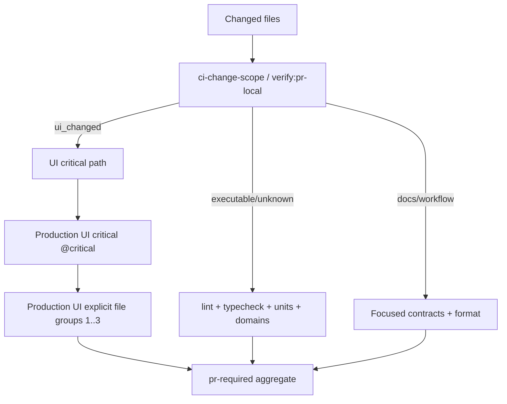

# Site testing speed — perfected plan

**Status:** plan only — **do not push, merge, amend, or continue implementing on PR #1686 / `cursor/site-testing-speed-08c1` until the user re-authorizes.**  
**Inputs:** original “Site testing speed and regression strategy” plan; adversarial reviews of PR #1686 (code review + bug hunt); grounded in `docs/guides/testing.md`, `docs/guides/process-hardening.md`, `AGENTS.md` verification sections, `.github/workflows/ci.yml` UI jobs, and `package.json` verify/e2e scripts.  
**Draft artifact (not merge-ready):** [PR #1686](https://github.com/BigSimmo/Database/pull/1686) — treat as salvageable draft input only.

---

## Verdict / goal

**Goal:** cut local and PR Chromium wall time without weakening fail-closed gates, flake policy, or provider boundaries.

**Verdict on #1686:** **NOT PERFECTED / not merge-ready.** Useful pieces landed in draft (playbook, phone-chrome KEEP root, `#167` exit 76, explicit shards, viewport trim, standalone `#255` check), but adversarial review proved the `#255` launch path still auto-binds mismatched `/opt/pw-browsers`, shard↔config parity is substring-weak, KEEP is oversold as rebuild-skip, and process hygiene (docs inventory, `#250` stale `#167`) remains open. Static PR on the draft head failed (`docs:check-inventory` stale for new scripts).

**How to resume later:** when the user re-authorizes implementation, open a **new** feature branch from fresh `origin/main` (or cherry-pick salvageable commits from `#1686` after rebasing). Do not silently continue the stopped PR.

---

## Hard constraints (never relax)

| Constraint | Why |
| ---------- | --- |
| Playwright `workers: 1`, `fullyParallel: false`, `retries: 0` | Load-dependent `#093` duplicate-page-root / strict-mode |
| Fail-closed path scoping (`ci-change-scope` / `verify:pr-local`) | Docs-only stays cheap; unknown stays heavy |
| No renaming specs to game alphabetical `--shard` | Encodes scheduler in filenames |
| No persistent `actions/cache` for Next webpack | Refuted (~34s, ~804 MB, evicts browser cache) — keep run-scoped artifact only |
| Provider gates approval-gated | OpenAI/Supabase/live evals stay explicit |
| `cancel-in-progress` + PR bundling remain higher-ROI process wins | ~40% UI-hour waste from mid-run cancels (#1406 sample) |

---

## Current architecture (unchanged target)

Production UI remains ~85% of UI-scoped PR wall clock. Process discipline (assemble before push; one late main-sync; bundle append-only docs) still beats another shard.

---

## What already exists on main vs draft #1686

### On `main` today (keep)

- Path-scoped CI; `@critical` fail-fast; count-balanced `--shard=i/3` + run-scoped webpack cache artifact (`PLAYWRIGHT_BUILD_ROOT_ID` / `PLAYWRIGHT_KEEP_BUILD_ROOT`)
- `verify:phone-chrome` owner/journey selection before optional `verify:ui`
- Browser preflight before heavy lock/build (`assertPlaywrightBrowsersReady`) — **but** still auto-sets `PLAYWRIGHT_CHROMIUM_EXECUTABLE_PATH` from newest preinstalled `/opt/pw-browsers` shell when managed Chromium is missing
- `workers:1` / `fullyParallel:false` / `retries:0` in `playwright.config.ts`
- Advisory visual/lighthouse; Firefox/WebKit on release matrix only

### Draft on PR #1686 (salvage, do not merge as-is)

| Landed in draft | Incomplete / incorrect |
| --------------- | ---------------------- |
| Testing-speed playbook in `docs/guides/testing.md` + process-hardening pointer | KEEP language/logs still read like skip-build |
| Phone-chrome shared `PLAYWRIGHT_BUILD_ROOT_ID` across browser stages + cleanup | Always runs `next build`; “reusing” oversells |
| `#167`: guard exit `76` + `verify:pr-local` closing summary | Unit mock only in PR; Windows npm→`&&` chain proven in bug hunt — **must** be a required verification artifact |
| Explicit duration-aware shard groups (`scripts/playwright-pr-shards.mjs`) + CI `test:e2e:pr:shard` | Pattern duplicated vs `playwright.config.ts`; substring “alignment” test insufficient |
| Viewport trim in `ui-smoke` / `ui-tools` | Dropped tablet `768` in tools search-route matrix without md vs lg proof |
| `check:playwright-browser-revision` script + unit tests; `#255` archived in outstanding-issues | **Not wired** into preflight / `run-playwright` / phone-chrome — launch still binds mismatched shell |
| `check:playwright-pr-shards` npm script | Not in static/`ui_changed` CI path |
| First CI measurement on draft head (run `31180331910`) | Static PR red on docs inventory; PR required red |

### Measured shard wall time (draft run `31180331910`, 2026-08-07)

Decisive Playwright lines (post-regroup):

| Shard | Result line | Approx prior count-balanced |
| ----- | ----------- | --------------------------- |
| 1 | `142 passed (5.3m)` | shard 1 `9m36` |
| 2 | `122 passed (3.7m)` | shard 2 `6m54` |
| 3 | `134 passed (2.3m)` | shard 3 `6m20` |

Largest-shard drop ≈ **4.1 minutes** ≫ original **≥90s** stop rule. **Re-confirm once** after P1 fixes on a green Static PR head; do not re-tune groups unless a later suite growth re-imbalances wall time.

---

## Locked defaults (no Option A/B)

1. **`#255`:** Wire `playwrightBrowserRevisionCheck` into `assertPlaywrightBrowsersReady` / `run-playwright` / phone-chrome path. **Fail closed** when designated container root (`PLAYWRIGHT_BROWSERS_PATH` ≡ `/opt/pw-browsers` + skip-download) lacks the lockfile revision. **Never** auto-set `PLAYWRIGHT_CHROMIUM_EXECUTABLE_PATH` to a mismatched shell.
2. **Shard source of truth:** Derive the production file matcher from `playwright.config.ts` `productionSpecPattern` (export/shared module or parse+assert equivalent alt lists). Validate group membership against **config collection** (or disk ∩ config pattern), not a second hand-maintained regex alone. Substring tests are forbidden as the sole parity guard.
3. **KEEP:** Document and log as **webpack-cache / root retention that still always runs `next build`**. Do **not** implement skip-build in the first perfected ship. Optional later skip-build only if separately authorized and gated on warm dist + same `BUILD_ROOT_ID` + explicit source fingerprint — out of scope for the default path.
4. **Tablet 768:** Restore `768` in the `ui-tools` search-route composer matrix until a focused proof shows md (`768`) and lg (`1280`) are equivalent for that ownership assertion. Do not keep the drop “because it was faster.”
5. **Exit 76:** Keep `BUILD_REFUSED_DEV_SERVER = 76`. Require an end-to-end verification that `76` survives `npm run build` → `run-heavy` → `build:internal` `&&` chain (Windows proof already exists from bug hunt; capture as a checked script/fixture or documented required gate step). Unit mock alone is insufficient for handoff.
6. **`#250`:** Remove stale open `#167` from Wave 1B text when `#167` is closed/archived.
7. **`check:playwright-pr-shards`:** Run in an appropriate static path when `ui_changed` (preferred: `static-pr` conditional or `verify:cheap` / CI safety lane that already sees UI diffs). Vitest-only coverage is not enough for CI that skips full units on light scopes that still touch UI workflows.

---

## Phased implementation

### Phase 0 — Stop / hygiene (no product gate change)

**Intent:** freeze bad merge pressure; record truth.

| Action | Files / notes |
| ------ | ------------- |
| Do not push/merge/amend `#1686` | User stop order |
| Keep plan as this doc | `docs/plans/site-testing-speed-perfected-plan.md` |
| When authorized later: `npm run docs:update` for new scripts | Fixes draft Static PR `docs/scripts-index.md` inventory drift |

**Acceptance:** plan committed or reviewed; no further commits on `cursor/site-testing-speed-08c1` unless user asks.

---

### Phase 1 — P1 correctness (merge blockers)

#### 1A. Wire `#255` into browser preflight (fail closed)

**Files:**

- `scripts/check-playwright-browser-revision.mjs` (reuse)
- `scripts/playwright-browser-preflight.mjs` — call revision check before resolving/auto-binding preinstalled Chromium
- `scripts/run-playwright.mjs` — remove or gate auto-set of `PLAYWRIGHT_CHROMIUM_EXECUTABLE_PATH` so mismatch cannot launch
- `scripts/verify-phone-chrome.mjs` — inherits via `run-playwright` / shared assert
- `tests/playwright-browser-preflight.test.ts`, `tests/check-playwright-browser-revision.test.ts`
- `docs/guides/testing.md`, `docs/codex/codex-cloud.md` — state that preflight enforces revision; remote sessions delegate browser proof to CI when image lags

**Acceptance:**

- With `PLAYWRIGHT_BROWSERS_PATH=/opt/pw-browsers`, `PLAYWRIGHT_SKIP_BROWSER_DOWNLOAD=1`, and only wrong revision present → preflight exits non-zero **and** does not set `PLAYWRIGHT_CHROMIUM_EXECUTABLE_PATH`
- Managed `~/.cache/ms-playwright` matching lock → green
- Docs no longer claim `#255` “closed” via an opt-in-only script

#### 1B. Single source of truth for production spec ↔ shards

**Files:**

- Prefer: extract shared `productionSpecPattern` (or basename alt list) used by both `playwright.config.ts` and `scripts/playwright-pr-shards.mjs`
- `scripts/playwright-pr-shards.mjs` — `listProductionSpecFiles` / validate against that source; groups remain explicit membership
- `tests/playwright-pr-shards.test.ts` — assert: (1) every config-matched production file is in exactly one group; (2) no group orphan/extra; (3) empty group fails; **delete** substring-only “alignment” as the sole check
- `.github/workflows/ci.yml` — keep `test:e2e:pr:shard -- --shard N` (no `--shard=i/3`)
- Wire the `check:playwright-pr-shards` script into CI when `ui_changed` (and/or `verify:cheap` if cheap already covers UI tooling)

**Acceptance:**

- Adding a new file that matches config `productionSpecPattern` but is missing from groups fails `check:playwright-pr-shards` / unit contract
- Changing only the shared pattern updates both collection and disk listing
- CI still applies `--grep-invert "@quarantine|@mockup"`; no `--pass-with-no-tests` on required shards

#### 1C. KEEP honesty (docs + logs; always rebuild)

**Files:**

- `scripts/verify-phone-chrome.mjs` — replace “reusing” / skip-build implication with “retaining build root for webpack cache; next build still runs”
- `docs/guides/testing.md` playbook — local KEEP recipe = cache retention, rebuild on every Playwright invoke; rebuild after product source changes still required for correctness
- `docs/guides/process-hardening.md` — same wording if it oversells

**Acceptance:**

- No log/doc claims skip-build or “save a rebuild” for KEEP
- `test-runner-safety` (or equivalent) still asserts unconditional `next build` spawn under KEEP

**Gate for Phase 1:** `npm run test:focused -- --files <touched scripts/tests>` + `check:playwright-pr-shards` + `check:playwright-browser-revision` + `npm run verify:pr-local -- --dry-run --files …` then focused/real pr-local as classified. No provider gates.

---

### Phase 2 — P2 completion (ship with or immediately after Phase 1)

#### 2A. Re-confirm explicit-shard ≥90s win

**Action:** On the first green UI-scoped CI head that includes Phase 1, paste decisive `N passed (Xm)` lines for shards 1–3 into the PR body / ledger.

**Stop rule:** If largest shard does **not** improve ≥90s vs the last count-balanced baseline (`9m36` for former shard 1), revert to `--shard=i/3` or rebalance groups with a new measurement — do not merge blind regroup.

**Note:** Draft run `31180331910` already showed `5.3m / 3.7m / 2.3m`. Treat as **preview evidence**; one confirmation on the perfected head is required because P1 changes preflight/shard scripts.

#### 2B. Restore tablet `768` (or prove equivalence)

**Files:** `tests/ui-tools.spec.ts` search-route composer matrix.

**Default:** restore `768`. Only re-drop after a written proof that the assertion is layout-owner-identical at md and lg (DOM/contract or dual-viewport Playwright once).

#### 2C. Exit `76` end-to-end proof (required verification)

**Files:** prefer a small offline fixture under `tests/` or `scripts/` that spawns the real `npm run build:internal`-style `&&` chain with a stub guard exiting `76` (mirroring bug-hunt Windows proof), **or** a documented `node` harness checked in CI/unit.

**Acceptance:**

- Proof shows status `76` (not remapped silently away) and chain does not continue
- `verify:pr-local` still maps `76` → `BUILD_REFUSED_DEV_SERVER` summary when the real guard refuses
- Capture Windows result in PR test plan (already proven); Linux/CI unit covers the same spawn semantics where feasible

#### 2D. Outstanding-issues hygiene

**Files:** `docs/outstanding-issues.md` open `#250` — drop stale `#167` from Wave 1B if `#167` remains archived/closed.

**Acceptance:** `npm run check:outstanding-issues` green; `#250` text matches archive state.

#### 2E. Docs inventory + scripts index

**Files:** `docs/scripts-index.md` via `npm run docs:update`.

**Acceptance:** `npm run docs:check-inventory` green (fixes the draft Static PR failure class).

**Gate for Phase 2:** focused tests for touched specs + `verify:pr-local` as classified; UI-scoped CI for shard confirmation. No `verify:release` / live providers.

---

### Phase 3 — Process playbook (no further gate invention)

Already intended by the original plan; keep as ongoing operating procedure (docs already started on draft):

| Change type | Run | Avoid |
| ----------- | --- | ----- |
| Lib/helper, no UI | `test:focused` / one Vitest file | `verify:ui` |
| Component interaction | `.dom.test.tsx` + focused Vitest | full Chromium |
| Phone chrome / scroll | `verify:phone-chrome` (`--dry-run` first) | immediate `verify:ui` |
| Shared shell / header / `globals.css` | phone-chrome then `verify:ui` at handoff | stacking cheap+pr-local+ui |
| Docs / ledger only | `verify:pr-local -- --dry-run` (docs route) | full unit + UI |
| PR ready | `format` committed + `verify:pr-local` once | mid-CI pushes |

Local KEEP: `PLAYWRIGHT_BUILD_ROOT_ID` + `PLAYWRIGHT_KEEP_BUILD_ROOT=true` for a session = **cache retention**, not skip-build.

---

### Phase 4 — Explicit non-goals / refuted levers

| Idea | Status |
| ---- | ------ |
| Persistent `actions/cache` for Next webpack | Refuted |
| Split/rename phone-scroll files to rebalance `--shard` | Refuted / forbidden |
| Raise Playwright workers / enable retries on blocking tests | Out of plan (`#093`) |
| Drop Production UI from PR for “most” UI paths | Rejected |
| Firefox/WebKit on every PR | Keep release/main matrix only |
| Skip-build under KEEP in v1 | Deferred; honesty first |
| Closing `#1686` without user ask | Forbidden (stop ≠ close) |
| Provider-backed evals / `verify:release` as part of this work | Approval-gated; not required for this plan |

---

## Verification gates per phase

| Phase | Smallest gate | Decisive evidence |
| ----- | ------------- | ----------------- |
| 0 | Docs-only / none | This plan path; no `#1686` commits |
| 1A | Focused Vitest on preflight + revision | Mismatch fixture fails closed; no auto exec path |
| 1B | `check:playwright-pr-shards` + Vitest + CI wiring dry-run | Orphan/dup fails; config is SoT |
| 1C | Grep/docs + safety test | No “skip rebuild” claims |
| 2A | Hosted Production UI shards | Paste `N passed (Xm)` per shard; ≥90s largest-shard rule |
| 2B | Focused Playwright or DOM for tools search-route | `768` restored or equivalence proof linked |
| 2C | Exit-76 spawn harness | Status 76 through npm/`&&` |
| 2D–2E | `check:outstanding-issues` + `docs:check-inventory` | Green lines |
| Handoff | `npm run format` (committed) + `verify:pr-local` | Classifier output + decisive pass lines |

Do **not** stack `verify:cheap` + `verify:ui` + `verify:release` by default. Do **not** run provider gates without confirmation.

---

## Success metrics

| Metric | Target |
| ------ | ------ |
| Largest Production UI shard Playwright time | ≥90s faster than prior count-balanced largest (`9m36`), ideally ≤ ~6m (draft achieved `5.3m`) |
| UI PR critical path | Median ≤ ~11–12 min end-to-end when UI-scoped (process + shards), without raising workers |
| `#255` bypass | Impossible via preflight auto-bind on designated container root |
| Shard orphans | Zero — fail closed before merge |
| KEEP messaging | Accurate (cache reuse, always rebuild) |
| Gate honesty | Refused selected build never reports green (`#167`) |
| Flake policy | Unchanged (`retries: 0`; quarantine rules intact) |

---

## Residual risks

- **Suite growth** can re-imbalance explicit groups — re-measure before changing membership; keep parity contract mandatory.
- **Restoring `768`** adds a small matrix cell — accepted cost vs silent md/lg gap.
- **Fail-closed `#255`** will block remote/Cloud browser gates until the image matches the lock — that is intended; docs must say delegate browser proof to CI (already partially documented).
- **Always-rebuild KEEP** leaves phone-chrome double-build cost — honesty over false wins; optional skip-build is a separate, later design.
- **Process gains evaporate** if agents keep stacking broad gates or mid-CI pushing — playbook must stay linked from testing/process-hardening.
- **Draft `#1686` drift** — do not merge the stopped branch; re-apply perfected phases on a fresh authorization.

---

## Suggested PR slicing (when user re-authorizes)

1. **PR-A (P1):** `#255` preflight wiring + shard SoT + KEEP doc/log honesty + docs inventory.  
2. **PR-B (P2):** restore `768`, exit-76 e2e harness, `#250` text fix, shard timing confirmation on green CI.  

Bundle only if both stay independently revertible commits and neither mixes operationalRisk with unrelated clinical UI product changes beyond testing infra. Prefer one testing-infra PR if small.

Clinical Governance / RAG impact: **N/A** for pure verification tooling — still fill template accurately (`RAG impact: no retrieval behaviour change — …`) if any path classifier flags otherwise.

---

## Executive summary (for operators)

1. Stop `#1686` — useful draft, **not** merge-ready; perfected work resumes only on explicit ask.  
2. Must wire `#255` into preflight so mismatched `/opt/pw-browsers` cannot auto-launch.  
3. Must derive shard membership from config `productionSpecPattern` (substring parity is insufficient).  
4. KEEP = webpack-cache retention that **always rebuilds**; fix docs/logs; skip-build deferred.  
5. Explicit shards already beat the ≥90s rule in draft CI (`5.3m/3.7m/2.3m`); re-confirm after P1, restore tablet `768`, prove exit `76` through npm/`&&`, clean `#250` / docs inventory.
