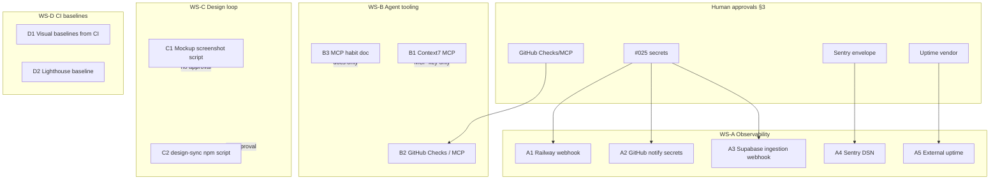
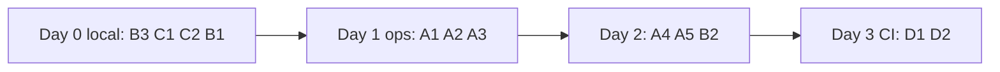

# Tooling activation — implementation plan

**Status:** local workstreams (WS-B, WS-C) implemented 2026-08-01; WS-A / B2 / WS-D still need operator approvals (§3)  
**Repo:** Clinical KB (`BigSimmo/Database`)  
**Related ledger:** `#025`, `#027`, `#028` (text stale — SDK already landed), redesign `#162`–`#164`  
**Created:** 2026-08-01  
**Local progress:** Context7 remote MCP in `.cursor/mcp.json` (`https://mcp.context7.com/mcp`, optional `CONTEXT7_API_KEY` via `${env:…}`); `context7-plugin` in `.cursor/settings.json`; habit doc in `docs/agents-guide.md` + `.env.example`; `npm run design-sync`; `npm run mockups:capture`

---

## 1. Summary

Activate observability you already shipped (webhooks, Sentry SDK, notify-ci), add the agent/docs MCPs that stop framework hallucination and PR-check blindness, and automate the design loop (mockup PNG packs + design-sync) plus CI visual/Lighthouse baselines that exist as scaffolding but have no adopted baselines.

Out of scope: Figma/Storybook/Linear, Trivy, Python OCR lockfiles, claim-entailment, Serena, Cursor Automations, RAG ranking surfaces, source-map upload to Sentry, and any rewrite of production search chrome beyond screenshot capture.

Execution model: four parallel workstreams (WS-A…D) after human approvals for secrets/providers; local code/docs tasks can start immediately.

---

## 2. Success criteria

| ID    | Criterion                                                                      | Proof                                                                                                         |
| ----- | ------------------------------------------------------------------------------ | ------------------------------------------------------------------------------------------------------------- |
| SC-A1 | Railway deploy webhook authenticates and can forward to chat                   | Controlled deploy or signed test → chat message; no more `503 webhook_not_configured` for authenticated calls |
| SC-A2 | GitHub CI-failure notifier can post on protected-branch red                    | Fail a non-prod workflow or dry-run per `docs/webhooks.md`; Slack/Discord receives ping                       |
| SC-A3 | Supabase document-change → ingestion path has Vault secret + base-URL GUC      | Receiver no longer `503` for missing secret; one approved reindex event enqueues idempotently                 |
| SC-A4 | Production Sentry receives scrubbed synthetic exception only                   | Event in Sentry matches `docs/error-tracking.md` allowlist (no clinical text/URL/body)                        |
| SC-A5 | Off-platform uptime hits `/api/health` and alerts independently of GitHub      | Vendor monitor green + one intentional fail/recovery alert                                                    |
| SC-B1 | Context7 available in project MCP for Tailwind 4 / Zod 4 / Playwright / Vitest | `.cursor/mcp.json` (or documented user MCP) lists Context7; agent can `query-docs` those libs                 |
| SC-B2 | GitHub PR check visibility works (Checks:read and/or Actions API / GitHub MCP) | Agent/operator can list failing required checks without empty `total:0`                                       |
| SC-B3 | Railway + Supabase MCP “default read path” documented                          | Short runbook in `docs/agents-guide.md` or sibling; agents prefer MCP over dashboard                          |
| SC-C1 | One command captures mockup desktop+phone PNGs after `ensure`                  | Script writes to `public/mockups/.../current/` at 1280×900 and 390×844                                        |
| SC-C2 | `npm run design-sync` (or equivalent) rebuilds CSS + resyncs primitives        | Documented script; NOTES.md friction steps folded in                                                          |
| SC-D1 | Visual baselines committed from **CI** artifact for declared targets           | `npm run test:e2e:visual` compares; no laptop-only baselines                                                  |
| SC-D2 | Lighthouse budget has non-null baseline; enforce policy decided                | `lighthouse-budget.json` `baseline` set; `enforce` flipped only after soak                                    |

---

## 3. Approvals required (human gate)

Do **not** run ops/provider steps until the matching box is explicitly approved in chat.

### Ops secrets / chat (#025)

- [ ] Generate and set `RAILWAY_WEBHOOK_SECRET` (≥16 chars) on Railway **Database** app service
- [ ] Add Railway project webhook URL: `https://psychiatry.tools/api/webhooks/railway?token=<secret>`
- [ ] Set `SLACK_WEBHOOK_URL` and/or `DISCORD_WEBHOOK_URL` on **Railway app server env** (deploy alerts)
- [ ] Set the **same** chat webhook URL(s) as **GitHub repo secrets** (CI failure notifier)
- [ ] Set `SUPABASE_INGESTION_WEBHOOK_SECRET` on Railway app env **and** matching Supabase Vault `ingestion_webhook_secret`
- [ ] Set DB GUC `app.ingestion_webhook_base_url` to deployed app origin (per `docs/webhooks.md`)
- [ ] Confirm accountable chat channel owner for alerts

### Sentry (#028 envelope — SDK already in repo)

- [ ] Approve vendor/project, **region**, retention, access roles, sampling, cost budget, alert destination (`docs/error-tracking.md`)
- [ ] Approve setting **server-only** `SENTRY_DSN` on Railway production (never `NEXT_PUBLIC_*`)
- [ ] Approve non-production synthetic exception first, then production alerts
- [ ] Update/close `#028` text after activation (SDK claim is stale)

### External uptime (#027)

- [ ] Choose vendor (UptimeRobot / Better Stack / Checkly / …), cost, privacy, owner
- [ ] Approve monitor URL `https://psychiatry.tools/api/health` (non-PHI)
- [ ] Approve alert webhook into the **same** chat path as `docs/webhooks.md`

### GitHub visibility

- [ ] Grant fine-grained PAT / GitHub App **Checks: Read** (and Actions read if needed) **or** approve official GitHub MCP with scoped toolsets (PRs + Actions)
- [ ] Confirm no bot `update-branch` / no broadening beyond Checks/Actions read

### MCP installs (low risk, still confirm if pinning into repo)

- [x] Add Context7 to project or user MCP config — done 2026-08-01; remote URL + docs in `docs/agents-guide.md` / `.env.example`; optional `CONTEXT7_API_KEY` remains operator-local
- [x] Confirm Next 16 docs stay **local** (`node_modules/next/dist/docs/`) — Context7 for peers only — acknowledged in agents-guide

### CI baselines (writes committed artifacts)

- [ ] Approve adopting visual baselines from **CI Linux** artifact (not local Windows)
- [ ] Approve first Lighthouse baseline commit + later `enforce: true` soak

---

## 4. Workstreams (parallel after approvals)



| Stream | Can start without §3?                         | Needs                                       |
| ------ | --------------------------------------------- | ------------------------------------------- |
| WS-A   | No (except drafting checklists)               | Secrets + Sentry + uptime approvals         |
| WS-B   | Partially — **B1** + **B3** done (2026-08-01) | **B2** needs §3 GitHub Checks/MCP approval  |
| WS-C   | **Yes** — pure local scripts                  | `ensure` + Playwright                       |
| WS-D   | Partially — dry-run/update scripts            | CI artifact adoption approval before commit |

---

## 5. Task breakdown

### WS-A — Observability activation

#### A1 — Railway deploy → chat

|                 |                                                                                                                                                                                                                                           |
| --------------- | ----------------------------------------------------------------------------------------------------------------------------------------------------------------------------------------------------------------------------------------- |
| **Goal**        | End `503 webhook_not_configured` for Railway path; chat on SUCCESS/FAILED/CRASHED/REMOVED                                                                                                                                                 |
| **Kind**        | `ops-secrets`                                                                                                                                                                                                                             |
| **Files**       | None (ops). Reference: `docs/webhooks.md` §1, `src/app/api/webhooks/railway`, `.env.example`                                                                                                                                              |
| **Steps**       | 1) Generate secret ≥16 chars. 2) Set `RAILWAY_WEBHOOK_SECRET` on Railway **Database** service. 3) Set chat URL(s) on **same** Railway server env. 4) Add Railway webhook with `?token=`. 5) Trigger controlled deploy or documented test. |
| **Verify**      | Authenticated POST no longer 503; chat receives notable status; transient phases skip with `200 skipped`                                                                                                                                  |
| **Deps**        | §3 #025 boxes                                                                                                                                                                                                                             |
| **Risk / stop** | Token in URL — rotate if leaked. No chat URL → `forwarded: false` (silent). Pair with A5 for hard-down.                                                                                                                                   |
| **Parallel**    | With A2 (same chat secrets), not with rotating the same secret mid-flight                                                                                                                                                                 |

#### A2 — GitHub CI failure → chat

|                 |                                                                                                       |
| --------------- | ----------------------------------------------------------------------------------------------------- |
| **Goal**        | `notify-ci-failure.yml` can post when protected-branch workflows fail                                 |
| **Kind**        | `ops-secrets`                                                                                         |
| **Files**       | None. Reference: `.github/workflows/notify-ci-failure.yml`, `docs/webhooks.md` §2                     |
| **Steps**       | Set `SLACK_WEBHOOK_URL` / `DISCORD_WEBHOOK_URL` as **GitHub repo secrets** (same destinations as A1). |
| **Verify**      | Workflow log shows notify path (or approved fail test on `main`/`release/*`)                          |
| **Deps**        | §3 chat secrets                                                                                       |
| **Risk / stop** | Do not spam by failing production CI casually — prefer documented dry path                            |
| **Parallel**    | With A1                                                                                               |

#### A3 — Supabase document-change → ingestion

|                 |                                                                                                                                                                        |
| --------------- | ---------------------------------------------------------------------------------------------------------------------------------------------------------------------- |
| **Goal**        | Activate Vault secret + `app.ingestion_webhook_base_url`; receiver leaves fail-closed                                                                                  |
| **Kind**        | `ops-secrets` + `provider-approval`                                                                                                                                    |
| **Files**       | Ops only if trigger migration already landed (PR #1100 / `#026` done). Follow `docs/webhooks.md` §3 exactly                                                            |
| **Steps**       | 1) Matching secret in Railway `SUPABASE_INGESTION_WEBHOOK_SECRET` + Vault. 2) Set GUC base URL. 3) One approved reindex_requested event. 4) Confirm worker claims job. |
| **Verify**      | No 503 for missing secret; enqueue idempotent; no loop on worker UPDATEs                                                                                               |
| **Deps**        | A1 chat optional; Vault/GUC required                                                                                                                                   |
| **Risk / stop** | Never raw-edit live trigger SQL (drift). Stop if owner_id missing. No production clinical bulk reindex in this task.                                                   |
| **Parallel**    | After secrets ready; serialize with other Supabase mutations                                                                                                           |

#### A4 — Sentry DSN

|                 |                                                                                                                                                                                                                                                                |
| --------------- | -------------------------------------------------------------------------------------------------------------------------------------------------------------------------------------------------------------------------------------------------------------- |
| **Goal**        | Production exceptions visible under privacy envelope                                                                                                                                                                                                           |
| **Kind**        | `provider-approval` then `ops-secrets`                                                                                                                                                                                                                         |
| **Files**       | Possibly refresh `#028` in `docs/outstanding-issues.md` only. Code: already `@sentry/nextjs` + scrubbing                                                                                                                                                       |
| **Steps**       | 1) Complete envelope approval. 2) Set `SENTRY_DSN` (+ `SENTRY_ENVIRONMENT`) on Railway. 3) Synthetic non-PHI exception in staging/non-prod if available, else carefully scoped prod probe. 4) Inspect event scrubbing. 5) Wire alert → chat. 6) Update `#028`. |
| **Verify**      | Event fields ⊆ allowlist in `docs/error-tracking.md`; remove DSN = no calls                                                                                                                                                                                    |
| **Deps**        | §3 Sentry boxes                                                                                                                                                                                                                                                |
| **Risk / stop** | Stop if clinical text/identifiers appear. No browser SDK, no replay, no source maps in this plan.                                                                                                                                                              |
| **Parallel**    | Independent of A1–A3 once envelope approved                                                                                                                                                                                                                    |

#### A5 — External uptime (#027)

|                 |                                                          |
| --------------- | -------------------------------------------------------- |
| **Goal**        | Monitor `/api/health` off GitHub/Railway                 |
| **Kind**        | `provider-approval`                                      |
| **Files**       | None                                                     |
| **Steps**       | Create monitor → alert to same chat → prove one recovery |
| **Verify**      | Alert on forced fail; clear on recovery                  |
| **Deps**        | §3 uptime; ideally A1 chat channel live                  |
| **Risk / stop** | Health endpoint must stay non-PHI                        |
| **Parallel**    | With A4                                                  |

---

### WS-B — Agent tooling

#### B1 — Context7 MCP

**Status:** done 2026-08-01

|                 |                                                                                                                                                                                                     |
| --------------- | --------------------------------------------------------------------------------------------------------------------------------------------------------------------------------------------------- |
| **Goal**        | Versioned docs for Tailwind 4, Zod 4, Playwright, Vitest                                                                                                                                            |
| **Kind**        | `local` (+ optional API key)                                                                                                                                                                        |
| **Files**       | `.cursor/mcp.json` (remote `https://mcp.context7.com/mcp`, header `CONTEXT7_API_KEY: ${env:CONTEXT7_API_KEY}`); `.cursor/settings.json` (`context7-plugin`); `docs/agents-guide.md`; `.env.example` |
| **Steps**       | Done: remote Context7 MCP + plugin enabled; agents-guide + `.env.example` document optional operator-local key. **Next 16 = local docs only** (`node_modules/next/dist/docs/`).                     |
| **Verify**      | Agent resolves Tailwind/Zod docs without inventing v3 APIs                                                                                                                                          |
| **Deps**        | None required — optional `CONTEXT7_API_KEY` for higher limits                                                                                                                                       |
| **Risk / stop** | Token bloat — do not enable every library; keep ≤5 active MCPs                                                                                                                                      |
| **Parallel**    | With B3, C*, D*                                                                                                                                                                                     |

#### B2 — GitHub Checks:read / Actions MCP

|                 |                                                                                                                                     |
| --------------- | ----------------------------------------------------------------------------------------------------------------------------------- |
| **Goal**        | Reliable PR check visibility for Run PR / babysit                                                                                   |
| **Kind**        | `provider-approval`                                                                                                                 |
| **Files**       | Optional: document preferred path in `docs/agents-guide.md`                                                                         |
| **Steps**       | Prefer: official GitHub MCP toolsets PRs+Actions. Alt: PAT Checks:Read. Prefer Actions API over broken `gh pr checks` empty totals. |
| **Verify**      | List failing jobs on an open PR with real names/conclusions                                                                         |
| **Deps**        | §3 GitHub                                                                                                                           |
| **Risk / stop** | No write scopes beyond what’s already authorized for Run PR; no bot update-branch                                                   |
| **Parallel**    | With B1 after approval                                                                                                              |

#### B3 — Railway + Supabase MCP habit

|                 |                                                                                                                                                                                  |
| --------------- | -------------------------------------------------------------------------------------------------------------------------------------------------------------------------------- |
| **Goal**        | Agents default to registered MCPs for read ops                                                                                                                                   |
| **Kind**        | `local`                                                                                                                                                                          |
| **Files**       | `docs/agents-guide.md` (add Railway MCP row — currently under-documented vs Supabase)                                                                                            |
| **Steps**       | Document: Supabase read-only MCP for advisors/docs/SQL; Railway MCP for deploy/logs/env **names**; writes confirmation-gated; Auth connection cap still dashboard-only (`#011`). |
| **Verify**      | Doc merged; one dry session uses MCP before dashboard                                                                                                                            |
| **Deps**        | None                                                                                                                                                                             |
| **Risk / stop** | Never dump secret values into chat                                                                                                                                               |
| **Parallel**    | Yes — start immediately                                                                                                                                                          |

---

### WS-C — Design loop automation

#### C1 — Mockup screenshot pack

|                 |                                                                                                                                                                                                                                                                                                                                               |
| --------------- | --------------------------------------------------------------------------------------------------------------------------------------------------------------------------------------------------------------------------------------------------------------------------------------------------------------------------------------------- |
| **Goal**        | Replace ad-hoc `.cursor-tmp` captures with a scripted pack                                                                                                                                                                                                                                                                                    |
| **Kind**        | `local`                                                                                                                                                                                                                                                                                                                                       |
| **Files**       | New script e.g. `scripts/capture-mockup-screenshots.mjs` + `package.json` script; writes under `public/mockups/mode-page-redesign-2026-07/current/` (or route-specific `current/`)                                                                                                                                                            |
| **Steps**       | 1) `npm run ensure` → use printed URL + `/api/local-project-id`. 2) Capture **1280×900** and **390×844** (per comps README; visual suite also uses 390×820/1280×900 — prefer README for redesign comps). 3) Targets: tools/services/favourites mockup routes + production baselines as needed for `#162`–`#164`. 4) Document in comps README. |
| **Verify**      | PNGs land in `current/`; script idempotent                                                                                                                                                                                                                                                                                                    |
| **Deps**        | Dev server via `ensure`; mockups enabled in env                                                                                                                                                                                                                                                                                               |
| **Risk / stop** | Do not commit PHI; demo/mockup only. Do not import mockups into production.                                                                                                                                                                                                                                                                   |
| **Parallel**    | With B3, C2, D dry-runs                                                                                                                                                                                                                                                                                                                       |

#### C2 — design-sync npm script

|                 |                                                                                                                                                                            |
| --------------- | -------------------------------------------------------------------------------------------------------------------------------------------------------------------------- |
| **Goal**        | One command: ensure `.ds-sync` deps → `buildCmd` → converter/resync                                                                                                        |
| **Kind**        | `local`                                                                                                                                                                    |
| **Files**       | `package.json` script; optionally thin `scripts/design-sync.mjs`; update `.design-sync/NOTES.md`                                                                           |
| **Steps**       | Encode NOTES.md: `npm ci` in worktrees; install `.ds-sync` packages; run `cfg.buildCmd`; run existing resync entry; remind `[TOKENS_MISSING]` expected for runtime tokens. |
| **Verify**      | Script exits 0 on clean tree; primitives still 10/10 render expectation unchanged                                                                                          |
| **Deps**        | None                                                                                                                                                                       |
| **Risk / stop** | Do not expand scope to ClinicalDashboard/mockups. Do not “fix” accepted validator noise.                                                                                   |
| **Parallel**    | With C1                                                                                                                                                                    |

---

### WS-D — CI quality baselines

#### D1 — Visual baselines from CI

|                 |                                                                                                                                                                                 |
| --------------- | ------------------------------------------------------------------------------------------------------------------------------------------------------------------------------- |
| **Goal**        | Adopt Linux CI baselines for `tests/ui-visual-baseline.spec.ts` targets                                                                                                         |
| **Kind**        | `local` + CI artifact (`provider-approval` only if triggering hosted CI)                                                                                                        |
| **Files**       | `tests/__screenshots__/` (or path from `playwright.visual.config.ts`); clear `AWAITING_BASELINE` as targets gain baselines                                                      |
| **Steps**       | 1) Run/host `test:e2e:visual` on CI. 2) Download candidate PNGs. 3) Commit platform-suffixed baselines. 4) Re-run visual job green. **Never** update from Windows laptop alone. |
| **Verify**      | `npm run test:e2e:visual` in CI compares; local may still differ fonts — that is expected                                                                                       |
| **Deps**        | §3 CI baseline approval                                                                                                                                                         |
| **Risk / stop** | fullPage forbidden; demo mode only; clipped locators only                                                                                                                       |
| **Parallel**    | With D2 after CI runs available                                                                                                                                                 |

#### D2 — Lighthouse baseline

|                 |                                                                                                                                                                                                                                                       |
| --------------- | ----------------------------------------------------------------------------------------------------------------------------------------------------------------------------------------------------------------------------------------------------- |
| **Goal**        | Replace `"baseline": null` with committed known-good; soak before `enforce: true`                                                                                                                                                                     |
| **Kind**        | `local`                                                                                                                                                                                                                                               |
| **Files**       | `lighthouse-budget.json`                                                                                                                                                                                                                              |
| **Steps**       | 1) `npm run verify:lighthouse` / `check:lighthouse-budget -- --update` on intentional good run. 2) Commit baseline. 3) Leave `enforce: false` until 2–3 green CI soaks. 4) Flip `enforce: true` in a follow-up. Distinct from live-web-vitals `#017`. |
| **Verify**      | Budget check passes against baseline; version pin stays `12.8.2`                                                                                                                                                                                      |
| **Deps**        | Stable local prod harness                                                                                                                                                                                                                             |
| **Risk / stop** | Do not treat absolute LCP as merge gate; relative only                                                                                                                                                                                                |
| **Parallel**    | With D1                                                                                                                                                                                                                                               |

---

## 6. Suggested execution order

**Critical path (ops):**  
`§3 approvals` → **A1+A2** (chat secrets once) → **A3** → **A5** → **A4** (can overlap A5)

**Parallel fan-out (same day, no secrets):**  
**B3** + **C1** + **C2** + **B1** (completed 2026-08-01)

**After GitHub approval:** **B2**

**After next green CI window:** **D1** + **D2** (adopt artifacts together)



---

## 7. Verification matrix

| Criterion | Command / check                   | Owner                  |
| --------- | --------------------------------- | ---------------------- |
| SC-A1     | Railway webhook + chat message    | Operator               |
| SC-A2     | `notify-ci-failure` path          | Operator               |
| SC-A3     | Ingestion enqueue once            | Operator + worker logs |
| SC-A4     | Sentry event scrub audit          | Operator + privacy     |
| SC-A5     | Vendor uptime alert               | Operator               |
| SC-B1     | MCP tool list + sample query-docs | Dev                    |
| SC-B2     | List PR checks via MCP/API        | Dev                    |
| SC-B3     | Doc exists; agents-guide updated  | Dev                    |
| SC-C1     | Screenshot script + PNG paths     | Dev                    |
| SC-C2     | `npm run design-sync` (name TBD)  | Dev                    |
| SC-D1     | CI `test:e2e:visual`              | Dev                    |
| SC-D2     | `check:lighthouse-budget`         | Dev                    |

Ledger hygiene after ops: archive/update `#025`, `#027`, `#028` via `/issues` — **only** `docs/outstanding-issues.md`, no drive-by docs.

---

## 8. Rollback / fail-closed

| Change                           | Rollback                                                                             |
| -------------------------------- | ------------------------------------------------------------------------------------ |
| Webhook secrets                  | Remove Railway webhook URL; unset secrets → receivers return `503` (fail closed)     |
| Chat URLs                        | Unset → notify skips / `forwarded: false`                                            |
| Sentry DSN                       | Unset + restart → no provider calls                                                  |
| Uptime                           | Disable monitor in vendor UI                                                         |
| Context7 / GitHub MCP            | Remove from mcp.json                                                                 |
| Visual/Lighthouse baselines      | Revert committed JSON/PNGs; set visual targets back to `AWAITING_BASELINE` if needed |
| design-sync / screenshot scripts | Revert script; no runtime impact                                                     |

---

## 9. Out of scope (do not creep)

- Figma MCP, Storybook, Chromatic SaaS (unless later replacing CI baselines deliberately)
- Linear / Notion as eng tracker
- Trivy/Grype, Dependabot docker/pip, Python OCR lockfile
- Claim-level prose entailment, Langfuse/Helicone
- Serena MCP, Cursor Automations, Bugbot rule packs (separate plan)
- `OPENAI_PRICE_*` / `eval:trend` automation (pass-2; not in user table)
- RAG / retrieval / ranking edits
- Physical iPhone Safari acceptance (still manual per phone-chrome docs)
- CodeRabbit `#150` budget decision

---

## 10. Handoff prompts (copy-paste for parallel agents)

### WS-A — Observability (ops; confirmation-gated)

```text
You are executing WS-A of docs/plans/tooling-activation-implementation-plan.md.
ONLY perform steps whose §3 approval boxes the user has explicitly checked in this chat.
Follow docs/webhooks.md and docs/error-tracking.md exactly.
Never print secret values. Never touch RAG ranking. Never apply raw SQL triggers to live.
Tasks: A1 Railway webhook, A2 GitHub notify secrets, A3 Supabase ingestion webhook inputs,
A4 Sentry DSN under privacy envelope, A5 external /api/health uptime.
After each: record proof (status codes, “message received”, Sentry event field list).
Update #025/#027/#028 via /issues only when a criterion is met.
Return: checklist of done/blocked + evidence lines.
```

### WS-B — Agent tooling

```text
You are executing WS-B of docs/plans/tooling-activation-implementation-plan.md.
B3: done 2026-08-01 — Railway + Supabase MCP habit in docs/agents-guide.md; do not redo unless stale.
B1: done 2026-08-01 — remote Context7 in .cursor/mcp.json (https://mcp.context7.com/mcp); context7-plugin enabled; agents-guide + .env.example; Next 16 stays in node_modules/next/dist/docs/. Do not redo.
B2: only if user approved — wire GitHub MCP (PRs+Actions toolsets) and/or Checks:Read; verify listing PR checks works.
Keep active MCP count small.
Do not mutate GitHub repo settings without approval. Return: diff summary + verify steps run.
```

### WS-C — Design loop

```text
You are executing WS-C of docs/plans/tooling-activation-implementation-plan.md.
C1: add a Playwright/Node script that runs after `npm run ensure`, captures 1280×900 and 390×844
PNGs into public/mockups/mode-page-redesign-2026-07/current/ (see that folder’s README),
using the ensure-printed URL and confirming /api/local-project-id.
C2: add npm run design-sync that installs .ds-sync deps, runs .design-sync/config.json buildCmd,
and invokes the existing resync path; update .design-sync/NOTES.md.
Mockups only — no production route rewrites. No Figma. Return: script names + sample command output.
```

### WS-D — CI baselines

```text
You are executing WS-D of docs/plans/tooling-activation-implementation-plan.md.
Read tests/ui-visual-baseline.spec.ts and lighthouse-budget.json.
D1: adopt visual baselines ONLY from CI Linux artifacts (never Windows laptop); respect AWAITING_BASELINE,
clipped locators, demo mode, no fullPage.
D2: produce lighthouse-budget.json baseline via check:lighthouse-budget --update; leave enforce:false
until soak; do not confuse with live-web-vitals.yml.
Do not change RAG. Return: files committed (or ready to commit) + CI job names to watch.
```

---

## Appendix — key references

| Topic           | Path                                                                                                                 |
| --------------- | -------------------------------------------------------------------------------------------------------------------- |
| Webhooks setup  | `docs/webhooks.md`                                                                                                   |
| Sentry envelope | `docs/error-tracking.md`                                                                                             |
| Issues          | `docs/outstanding-issues.md` `#025` `#027` `#028` `#162`–`#164`                                                      |
| MCP             | `.mcp.json` (Railway), `.cursor/mcp.json` (Supabase read-only + Context7 remote)                                     |
| Env names       | `.env.example` (`RAILWAY_WEBHOOK_SECRET`, `SUPABASE_INGESTION_WEBHOOK_SECRET`, `SLACK_*`, `DISCORD_*`, `SENTRY_DSN`) |
| Mockup comps    | `public/mockups/mode-page-redesign-2026-07/README.md`                                                                |
| Visual suite    | `tests/ui-visual-baseline.spec.ts`, `npm run test:e2e:visual`                                                        |
| Lighthouse      | `lighthouse-budget.json`, `npm run verify:lighthouse`                                                                |
| design-sync     | `.design-sync/NOTES.md`, `.design-sync/config.json`                                                                  |
| Ensure URL      | `npm run ensure`                                                                                                     |
